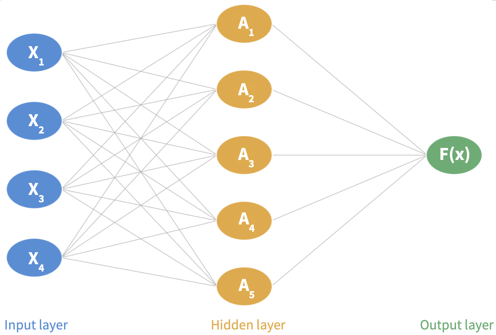
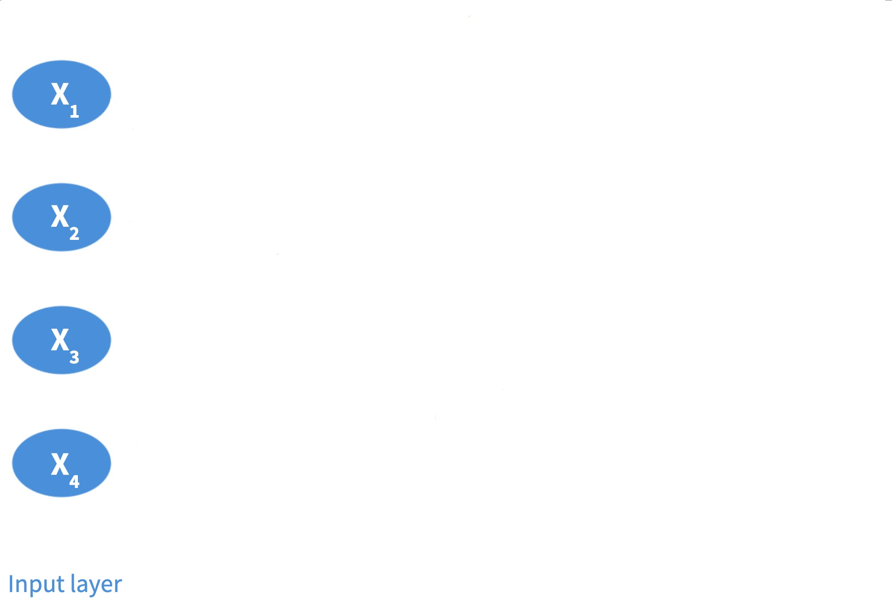
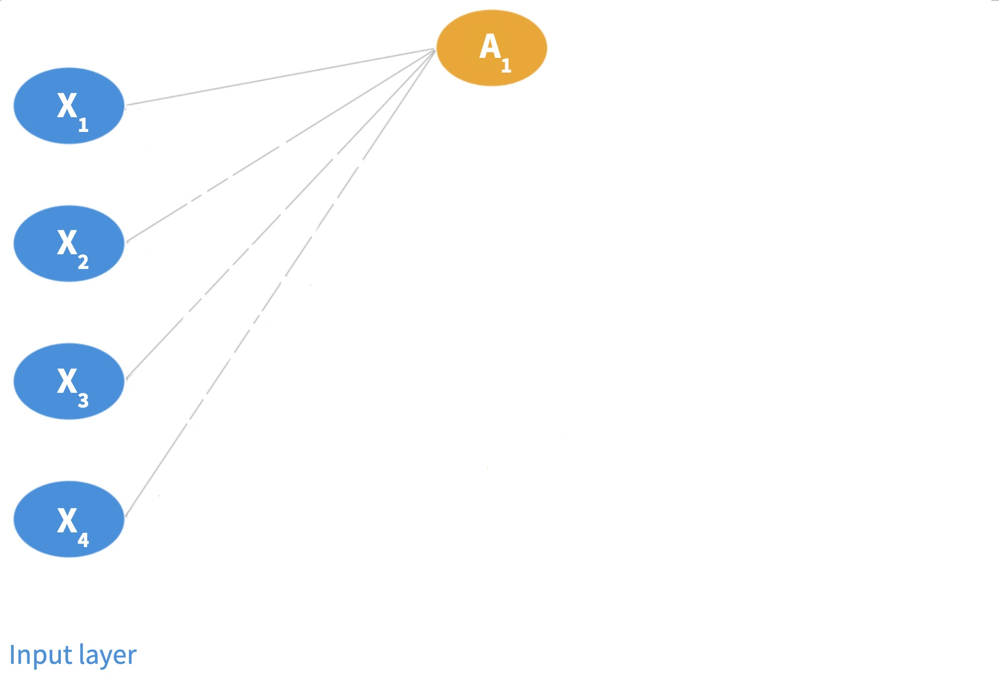
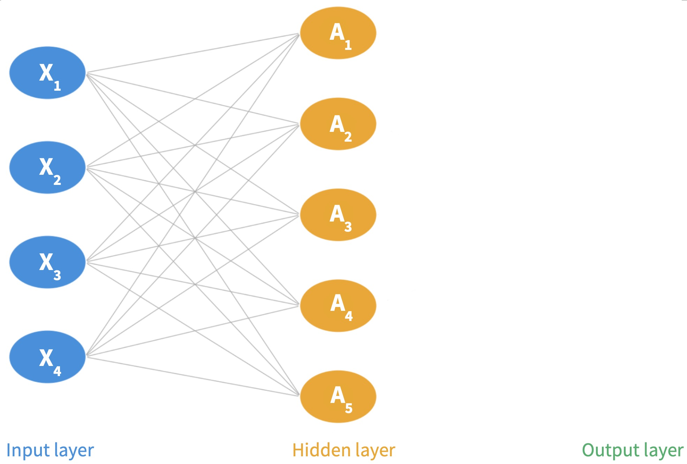
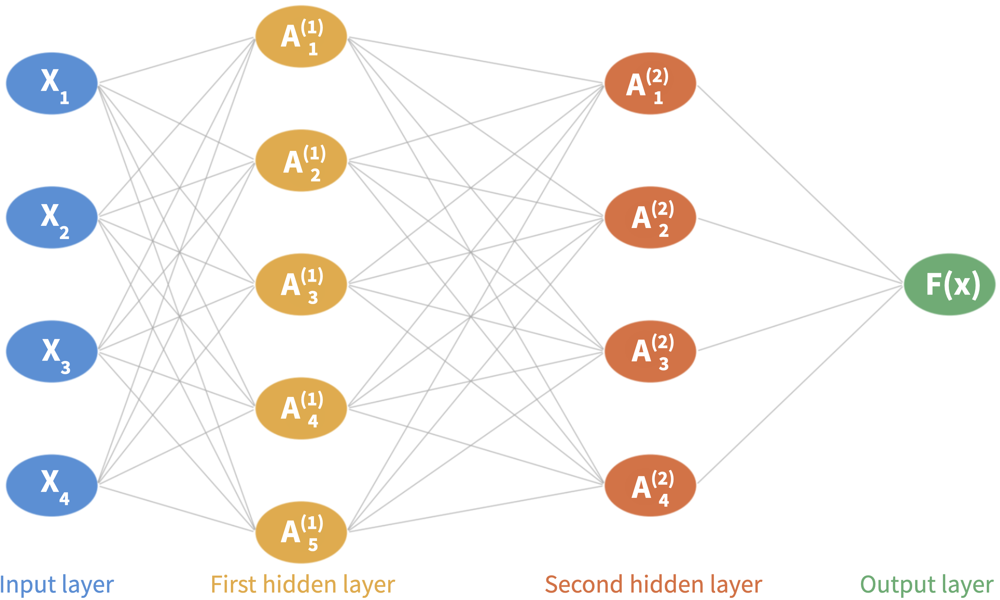
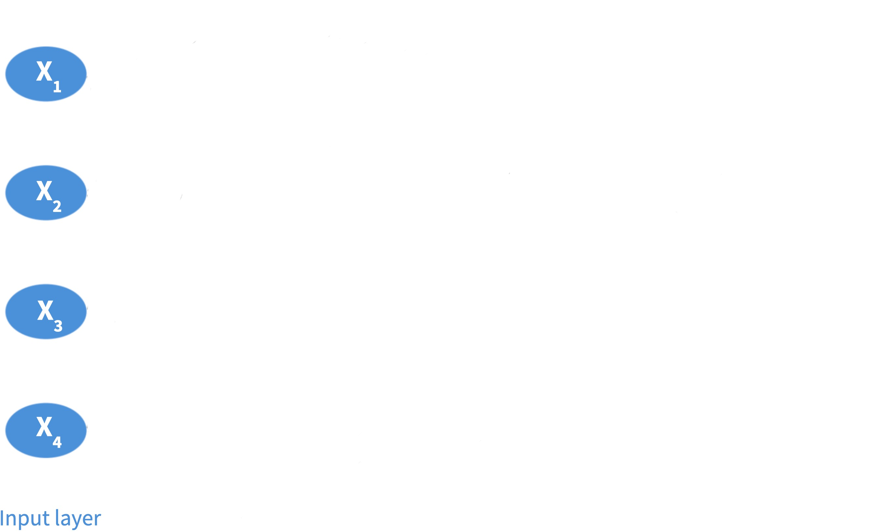
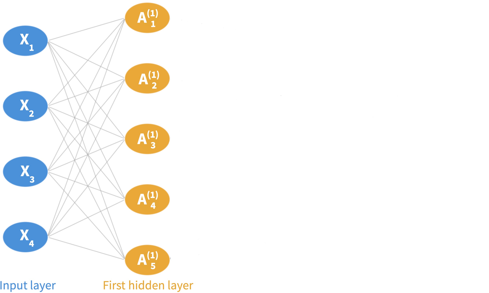
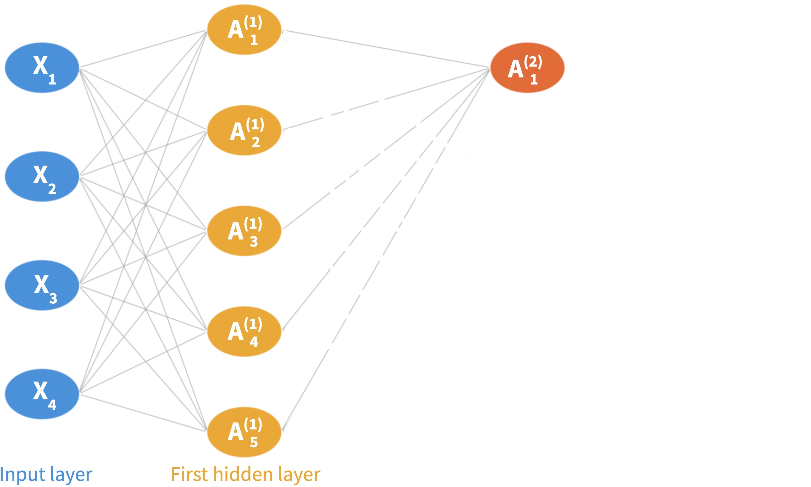
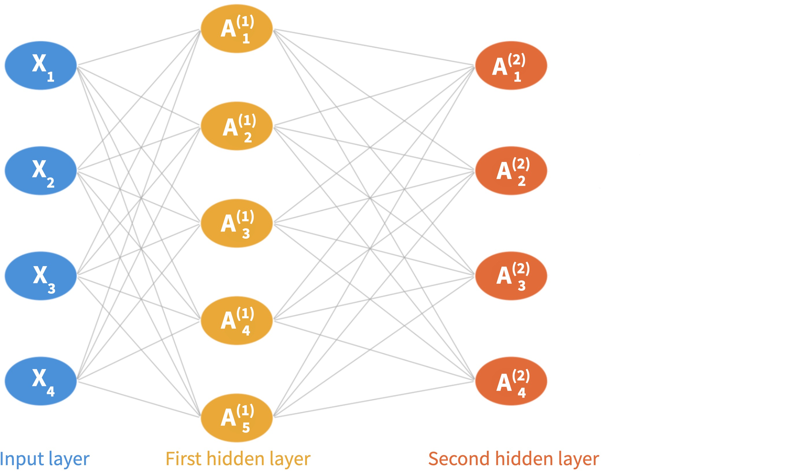

---
format:
    revealjs:
        theme: ../../styles/meds-slides-styles.scss
        slide-number: true
        chalkboard: true
        title-slide: false
jupyter: eds232-env
---

```{python}
#| echo: false
import numpy as np
import matplotlib.pyplot as plt
import pandas as pd
from sklearn.neural_network import MLPClassifier
from sklearn.model_selection import train_test_split
from sklearn.metrics import accuracy_score
from sklearn.preprocessing import StandardScaler

plt.style.use('default')
fig_size_x = 8
fig_size_y = 4
plt.rcParams['font.size'] = 11
plt.rcParams['legend.fontsize'] = 'large'

# ── HAB Synthetic Dataset ─────────────────────────────────────────────────────
np.random.seed(42)
n = 400

sst  = np.random.normal(0.5, 1.2, n)
chl  = np.random.normal(5.0, 2.0, n)
phos = np.random.normal(1.5, 0.5, n)

log_odds   = -2 + 1.5*sst + 0.4*chl - 1.0*phos + 0.8*sst*chl - 0.5*sst**2
prob_bloom = 1 / (1 + np.exp(-log_odds))
bloom      = np.random.binomial(1, prob_bloom, n)

df = pd.DataFrame({
    'sst':         sst,
    'chlorophyll': chl,
    'bloom':       bloom,
    'bloom_label': np.where(bloom == 1, 'bloom', 'no bloom'),
})

X      = df[['sst', 'chlorophyll']].values
y      = df['bloom'].values
scaler = StandardScaler()
X_sc   = scaler.fit_transform(X)

X_train, X_test, y_train, y_test = train_test_split(
    X_sc, y, test_size=0.25, random_state=42, stratify=y
)

col_map   = {1: 'tomato', 0: 'steelblue'}
label_map = {1: 'bloom', 0: 'no bloom'}

x1_r = np.linspace(X_sc[:,0].min()-0.5, X_sc[:,0].max()+0.5, 300)
x2_r = np.linspace(X_sc[:,1].min()-0.5, X_sc[:,1].max()+0.5, 300)
xx1, xx2 = np.meshgrid(x1_r, x2_r)

# ── Convolution example data ──────────────────────────────────────────────────
image = np.array([
    [1, 1, 1, 0, 0],
    [0, 1, 1, 1, 0],
    [0, 0, 1, 1, 1],
    [0, 0, 1, 1, 0],
    [0, 1, 1, 0, 0],
], dtype=float)

kernel = np.array([
    [1, 0, 1],
    [0, 1, 0],
    [1, 0, 1],
], dtype=float)

h, w   = image.shape
kh, kw = kernel.shape
out_h, out_w = h - kh + 1, w - kw + 1
feature_map  = np.zeros((out_h, out_w))
for i in range(out_h):
    for j in range(out_w):
        feature_map[i, j] = np.sum(image[i:i+kh, j:j+kw] * kernel)

fm = np.array([
    [1, 3, 2, 4],
    [5, 6, 1, 2],
    [3, 2, 4, 1],
    [1, 0, 5, 3],
], dtype=float)

pool_out = np.zeros((2, 2))
for i in range(2):
    for j in range(2):
        pool_out[i, j] = fm[i*2:i*2+2, j*2:j*2+2].max()
```

## {#title-slide data-menu-title="Title Slide" background="#053660"}

[EDS 232]{.custom-title}

<hr class="hr-teal">

[Lesson 11]{.custom-subtitle}

[*Neural Networks*]{.custom-subtitle}

---

## {#in-this-lesson data-menu-title="In this lesson"}

[In this lesson]{.slide-title}

<hr>

<br>

- The structure of a single-layer neural network
- How activations are computed (weights, biases, and activation functions)
- How multilayer (deep) neural networks work
- Convolutional neural networks (CNNs) for image data

---

## {#section-history data-menu-title="# Neural network applications #" background="#047C90"}

<div class="page-center vertical-center">
<p class="custom-subtitle bottombr">Neural network applications</p>
</div>

---

## {#nn-history data-menu-title="A brief history"}

[A brief history]{.slide-title}

<hr>

- **Early excitement**: neural networks appeared early in the history of machine learning (going back to the 1960s), generating significant enthusiasm

. . .

- **Decline**: interest faded as other methods (SVMs, random forest)— outperformed them on structured tasks.

. . .

- **The 2010s revival**: two forces brought them back:
    - *New architectures* (deep networks with many hidden layers)
    - *Massive datasets* that made training those architectures feasible

::: {.center-text .teal-text .body-text-m}
This comeback is what brought up the field of **deep learning**
:::

---

## {#nn-applications data-menu-title="Applications"}

[Applications]{.slide-title}

<hr>

Deep neural networks are at the heart of many contemporary technological advancements:

- **Large language models**: used for text and code generation (ChatGPT, Claude). These are neural networks with likely *trillions* of parameters

- **Image recognition**: identifying objects in images, with applications from autonomous vehicles to medical imaging

. . .

::: {.body-text-m}
Many **environmental applications**: anywhere regression, classification, text analysis, or image processing can be applied.
:::

- [Yu et al. 2025](https://www.nature.com/articles/s41467-025-60091-y): inequities in EV charging station access for disadvantaged communities
- [Wunsch et al. 2022](https://www.nature.com/articles/s41467-022-28770-2): projected groundwater levels under climate change in Germany
- [Hopkinson et al. 2020](https://journals.plos.org/plosone/article?id=10.1371/journal.pone.0230671): classifying coral reef 3D models into species and substrates

---

## {#section-single data-menu-title="# Single-layer neural network #" background="#047C90"}

<div class="page-center vertical-center">
<p class="custom-subtitle bottombr">Single-layer neural network</p>
</div>

---

## {#nn-setup data-menu-title="Setup"}

[Single-layer Neural Network]{.slide-title}

<hr>

Given a vector of features $\mathbf{X} = (X_1, \ldots, X_p)$ and a response variable $Y$, our goal is to learn a function $F(\mathbf{X})$ to predict $Y$: same goal as throughout the course.

For now, $Y$ is quantitative, so we will think first about the regression scenario. 

. . .


:::: {.columns}

::: {.column width="40%"}

::: {.body-text-s}
A **single-layer neural network** (a network with one hidden layer) has three core components:


1. **Input layer**: the $p$ features $X_1, \ldots, X_p$ form the input layer

2. **Hidden layer**: made up of $K$ **neurons**

3. **Output layer**: the final model output $F(\mathbf{X})$

In the diagram, $p=4$ and $K=5$. 
:::


:::


::: {.column width="60%"}

:::

:::


---

## {#nn-process data-menu-title="The process"}

[The prediction process]{.slide-title}

<hr>

**Step 1: Input layer.** An observation $(X_1, \ldots, X_p)$ is fed through the network left to right.


**Step 2: Hidden layer.** Each neuron computes an **activation** $A_k$ in two steps:

- Form a linear combination using a **bias** $w_{k0}$ and **weights** $w_{k1}, \ldots, w_{kp}$:
$$w_{k0} + w_{k1} X_1 + \cdots + w_{kp} X_p.$$


- Pass through an **activation function** $g(z)$:

$$A_k = g(w_{k0} + w_{k1} X_1 + \cdots + w_{kp} X_p).$$


**Step 3: Output layer.** Final prediction is a linear combination of all $K$ activations:

$$F(X_1, \ldots, X_p) = \beta_0 + \beta_1 A_1 + \cdots + \beta_K A_K$$

using $K+1$ new parameters $\beta_0, \ldots, \beta_K$. 

---

## {#nn-process-step1 data-menu-title="The process"}

[Step 1: Input layer]{.slide-title}

<hr>

An observation $(X_1, \ldots, X_p)$ is fed through the network left to right.

. 



---

## {#nn-process-step2 data-menu-title="The process"}

[Step 2: Activations at each neuron]{.slide-title}

<hr>

At each neuron, form a linear combination of the features $X_i$ using a **bias** and **weights**, and pass it through an **activation function**.



---

## {#nn-process-step25 data-menu-title="The process"}

[Step 2: Activations at each neuron]{.slide-title}

<hr>

At each neuron, form a linear combination of the features $X_i$ using a **bias** and **weights**, and pass it through an **activation function**. Each neuron in the layer gives an **activation**. 



---

## {#nn-process-step3 data-menu-title="The process"}

[Step 3: Output layer]{.slide-title}

<hr>

Final prediction is a linear combination of all $K$ activations.

. 


---

## {#nn-fitting data-menu-title="Fitting"}

[Fitting a neural network]{.slide-title}

<hr>

**Fitting a neural network** means estimating all weights $w_{kj}$, biases $w_{k0}$, and output coefficients $\beta_0, \ldots, \beta_K$ from the training data.

. . .

<br>

To find these parameters we look for the parameters that minimize a **loss function** that measures prediction error:

- **Regression**: commonly mean squared error.
- **Classification**: [cross-entropy](https://en.wikipedia.org/wiki/Cross-entropy)

. . .

<br>

This is done via **stochastic gradient descent** + **backpropagation**. 

We'll treat this as a black box.

::: {.body-text-s .center-text}
*(See ISLP §10.7 for details on the fitting algorithm)*
:::

---

## {#activation-intro data-menu-title="Why activation functions?"}

[What about the activation function?]{.slide-title}

<hr>

The activation function introduces the **nonlinearity** that gives neural networks their modeling power.
Two of the most common choices:

::: {.body-text-s}
- **Sigmoid**: $\displaystyle g(z) = \frac{e^z}{1 + e^z}$: squashes any input to $(0, 1)$

- **ReLU** (Rectified Linear Unit): $g(z) = \max(0, z)$: zero for negative inputs, identity for positive (most commonly used)

:::

```{python}
#| label: activation-functions-slides
#| echo: false
#| fig-align: center
#| out-width: "50%"

z       = np.linspace(-4, 4, 300)
sigmoid = 1 / (1 + np.exp(-z))
relu    = np.maximum(0, z)

fig, axes = plt.subplots(1, 2, figsize=(fig_size_x * 1.4, fig_size_y + 0.5))

axes[0].plot(z, sigmoid, color='steelblue', linewidth=2.5)
axes[0].axhline(0, color='gray', linewidth=0.5)
axes[0].axvline(0, color='gray', linewidth=0.5)
axes[0].set_title('Sigmoid: $g(z) = e^z\\,/\\,(1 + e^z)$', fontsize=12)
axes[0].set_xlabel('$z$')
axes[0].set_ylabel('$g(z)$')
axes[0].set_ylim(-0.1, 1.1)
axes[0].grid(True, alpha=0.3)

axes[1].plot(z, relu, color='tomato', linewidth=2.5)
axes[1].axhline(0, color='gray', linewidth=0.5)
axes[1].axvline(0, color='gray', linewidth=0.5)
axes[1].set_title('ReLU: $g(z) = \\max(0,\\, z)$', fontsize=12)
axes[1].set_xlabel('$z$')
axes[1].set_ylabel('$g(z)$')
axes[1].grid(True, alpha=0.3)

plt.tight_layout()
plt.show()
plt.close()
```

---

## {#section-multilayer data-menu-title="# Multilayer neural networks #" background="#047C90"}

<div class="page-center vertical-center">
<p class="custom-subtitle bottombr">Multilayer neural networks</p>
</div>

---

## {#multilayer-intro data-menu-title="Multilayer neural networks"}

[Multilayer neural networks]{.slide-title}

<hr>

In practice, neural networks have **more than one hidden layer** and many neurons per layer (often hundreds). This is what makes them *deep* networks. As the network grows deeper, it can represent increasingly complex functions.


. . .

:::: {.columns}

::: {.column width="40%"}

::: {.body-text-s}
The multilayer network now has:

1. **Input layer**: the $p$ features $X_1, \ldots, X_p$ form the input layer

2. **Multiple hidden layer**: made up of a constant or decreasing number of **neurons**

3. **Output layer**: the final model output $F(\mathbf{X})$
:::


:::


::: {.column width="60%"}

:::

:::

---

## {#multilayer-prediction data-menu-title="Multilayer neural networks"}

[The prediction process]{.slide-title}

<hr>

**Step 1: Input layer.** An observation $(X_1, \ldots, X_p)$ is fed through the network left to right.


**Step 2: First hidden layer.** There are $K_1$ neurons in it. Each neuron computes an **activation** $A^{(1)}_k$ using the fatures as input (same as before):

$$A_k^{(1)} = g\!\left(w_{k0}^{(1)} + \sum_{j=1}^{p} w_{kj}^{(1)} X_j\right)$$

**Step 3: Second hidden layer** There are $K_2$ neurons in it. Each neuron takes the previous layer's activations as input to compute its activations:

$$A_k^{(2)} = g\!\left(w_{k0}^{(2)} + \sum_{j=1}^{K_1} w_{kj}^{(2)} A_j^{(1)}\right)$$


**Step 4: Output layer.** Final prediction is a linear combination of all $K$ activations:

$$F(X_1, \ldots, X_p) = \beta_0 + \beta_1 A^{(2)}_1 + \cdots + \beta_{K_2} A^{(2)}_{K_2}$$

---

## {#dnn-process-step1 data-menu-title="The process"}

[Step 1: Input layer]{.slide-title}

<hr>

An observation $(X_1, \ldots, X_p)$ is fed through the network left to right.

. 



---

## {#dnn-process-step2 data-menu-title="The process"}

[Step 2: Activations in the first layer]{.slide-title}

<hr>

Each neuron in the first layer computes an **activation** $A^{(1)}_k$ using the fatures as input (same as before).



---

## {#dnn-process-step3 data-menu-title="The process"}

[Step 3: Activations in the second layer]{.slide-title}

<hr>

Each neuron in the second layer takes the first layer's activations as input to compute its activations  $A^{(2)}_k$.



---

## {#dnn-process-step4 data-menu-title="The process"}

[Step 3: Activations in the second layer]{.slide-title}

<hr>

Each neuron in the second layer takes the first layer's activations as input to compute its activations  $A^{(2)}_k$.



---

## {#dnn-process-step5 data-menu-title="The process"}

[Step 4: Output layer]{.slide-title}

<hr>

Final prediction is a linear combination of all activations in the last layer.

. 


---

## {#multilayer-depth data-menu-title="Depth and representations"}

[Depth and representations]{.slide-title}

<hr>


**Early layers** tend to capture simple, low-level patterns.

**Deeper layers** combine them into progressively abstract representations.

To build an intuitive understanding of how deep networks work and cover the classification case we will, watch:

::: {.center-text .body-text-m}
[3Blue1Brown — *But what is a neural network?*](https://www.youtube.com/watch?v=aircAruvnKk)
:::

---

## {#section-cnn data-menu-title="# Convolutional neural networks #" background="#047C90"}

<div class="page-center vertical-center">
<p class="custom-subtitle bottombr">Convolutional neural networks</p>
</div>

---

## {#cnn-motivation data-menu-title="CNNs: motivation"}

[Convolutional neural networks]{.slide-title}

<hr>

The networks we have studied treat the input as a **flat vector of features**, where each pixel goes through the network independntly wihtout using the  spatial structure when the input is an image.


**CNNs** are designed specifically for image data. Intuitively:

- Rather than connecting every input to every neuron, CNNs first identify **low-level features** (small edges, patches of color, textures)
- These are combined into **higher-level features** (shapes, objects, patterns) in later layers
- The presence of high-level features determines the predicted class

. . .

<br>

::: {.center-text .teal-text}
In environmental science CNN applications come usually from image classification and analysis of remotely sensed data. 
:::

---

## {#cnn-architecture data-menu-title="CNNs: motivation"}

[CNN architecture]{.slide-title}

<hr>

::: {.body-text-s}

A complete CNN combines:

1. **Convolution layers**: learn low-level features (edges, textures, patches of color)
2. **Pooling layers**: progressively reduce spatial dimensions
3. **Flattening**: convert final feature maps into a flat vector
4. **Fully connected layers**: combine high-level features to produce the final prediction
:::

](CNN-edited.jpeg)


---

## {#convolution-filter data-menu-title="Convolution filters"}

[Convolution filters]{.slide-title}

<hr>

A **convolution filter** (kernel) is a small matrix that acts as a feature detector.

We slide the filter across the image, computing a convolution product at each position.

[Convolution diagrams](https://docs.google.com/presentation/d/1kKWaRg8aVLyWXAJ6a_TBbRW7h7LRaG-hN86gwTwOGMg/edit?usp=sharing)
<!-- 
```{python}
#| label: convolution-example-slides
#| echo: false
#| fig-align: center
#| out-width: "85%"

fig, axes = plt.subplots(1, 3, figsize=(fig_size_x * 1.3, fig_size_y))

axes[0].imshow(image, cmap='Blues', vmin=0, vmax=1)
for i in range(h):
    for j in range(w):
        axes[0].text(j, i, int(image[i, j]), ha='center', va='center', fontsize=13)
axes[0].set_title('Input image (5×5)', fontsize=11)
axes[0].axis('off')

axes[1].imshow(kernel, cmap='Oranges', vmin=0, vmax=1)
for i in range(kh):
    for j in range(kw):
        axes[1].text(j, i, int(kernel[i, j]), ha='center', va='center', fontsize=13)
axes[1].set_title('Convolution filter (3×3)', fontsize=11)
axes[1].axis('off')

im = axes[2].imshow(feature_map, cmap='Greens')
for i in range(out_h):
    for j in range(out_w):
        axes[2].text(j, i, int(feature_map[i, j]), ha='center', va='center', fontsize=13)
axes[2].set_title('Feature map (3×3)', fontsize=11)
axes[2].axis('off')
fig.colorbar(im, ax=axes[2], shrink=0.7, label='activation')

plt.suptitle('Convolution: sliding the filter over the image', fontsize=11)
plt.tight_layout()
plt.show()
plt.close()
```

 -->

::: {.body-text-s .center-text}
Filters are **learned from training data**, the network discovers the most useful features automatically.
:::

---

## {#pooling-slide data-menu-title="Pooling layer"}

[Pooling layer]{.slide-title}

<hr>

A **pooling layer** reduces the spatial size of feature maps making the fatures more compact.

**Generally use max pooling**: divide into non-overlapping blocks, retain only the **maximum** value per block.

```{python}
#| label: max-pooling-slides
#| echo: false
#| fig-align: center
#| out-width: "55%"

fig, axes = plt.subplots(1, 2, figsize=(fig_size_x * 0.7, fig_size_y * 0.85))

axes[0].imshow(fm, cmap='Greens', vmin=0, vmax=6)
for i in range(4):
    for j in range(4):
        axes[0].text(j, i, int(fm[i, j]), ha='center', va='center', fontsize=13)
axes[0].axhline(1.5, color='tomato', lw=2)
axes[0].axvline(1.5, color='tomato', lw=2)
axes[0].set_title('Feature map (4×4)', fontsize=11)
axes[0].axis('off')

axes[1].imshow(pool_out, cmap='Greens', vmin=0, vmax=6)
for i in range(2):
    for j in range(2):
        axes[1].text(j, i, int(pool_out[i, j]), ha='center', va='center',
                     fontsize=14, fontweight='bold')
axes[1].set_title('After max pooling (2×2)', fontsize=11)
axes[1].axis('off')

plt.suptitle('Max pooling: take the maximum in each 2×2 block', fontsize=11)
plt.tight_layout()
plt.show()
plt.close()
```


---

## {#cnn-architecture-bis data-menu-title="CNNs: motivation"}

[CNN architecture]{.slide-title}

<hr>


](CNN-edited.jpeg)
