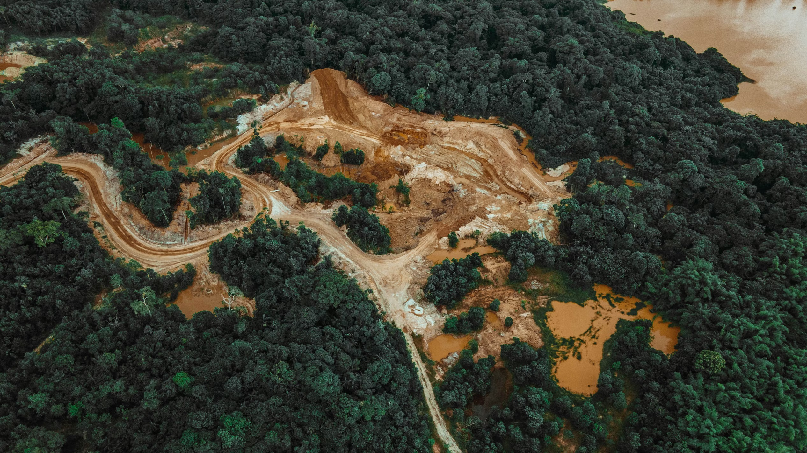

## {#title-slide data-menu-title="Title Slide" background="#053660"}

[EDS 232]{.custom-title}

[Lesson 1]{.custom-subtitle}

[*What is Machine Learning?*]{.custom-subtitle}

---

## {#in-this-lesson data-menu-title="In this lesson"}

[In this lesson]{.slide-title}

- What machine learning is and how it differs from traditional programming

 

- The relationship between AI, machine learning, and deep learning

 

- Examples and limitations of machine learning applied to environmental problems

---

## {#section-what-is-ml data-menu-title="# What is machine learning? #" background="#047C90"}

What is machine learning?

---

## {#what-is-ml data-menu-title="What is machine learning?"}

[What is machine learning?]{.slide-title}

 

::: {.body-text-m}
**Machine learning (ML)** is a branch of computer science focused on building systems that can *learn from data* to make predictions or decisions, without being explicitly programmed with rules.
:::

 

::: {.center-text .body-text-m .teal-text}
Instead of a human writing down rules, 

an algorithm *discovers* the rules from examples.
:::

---

## {#two-approaches data-menu-title="Two approaches"}

[Two approaches to the same problem]{.slide-title}

::: {.body-text-m .gray-text}
Predicting whether a kelp forest has been degraded based on water temperature and sea urchin density.
:::

 

. . .

**Traditional programming**

> *If temperature > 18°C and urchin density > 50/m², then: degraded*

 

. . .

**Machine learning**

> *Give the algorithm many examples and let it figure out the rules itself.*

---

## {#how-machines-learn data-menu-title="How does a machine learn?"}

[How does a machine learn?]{.slide-title}

 

At its core, a machine learning algorithm does the following:

 

1. Take a set of data examples that is used to *train* the model
2. Find a function $\hat{f}$ that maps inputs to outputs well on those examples
3. Use $\hat{f}$ to make predictions on new, unseen data

 

::: {.center-text .body-text-m .teal-text}
"Learning" means adjusting $\hat{f}$ to minimize error on the *training data*.
:::

---

## {#checkin-1 data-menu-title="Check-in 1" background="#053660"}

 Check-in

Think of a task in environmental science that would be very hard to solve with hand-written rules, but where you might have a lot of labeled data. 

 What are the inputs and outputs?

---

## {#section-ai-ml-dl data-menu-title="# AI, ML, and Deep Learning #" background="#047C90"}

AI, Machine Learning, and Deep Learning

---

## {#three-terms data-menu-title="Three related terms"}

[Three related terms]{.slide-title}

 

::: {.teal-text .body-text-m}
**Artificial intelligence (AI)**
:::
The broadest term — any technique enabling machines to mimic human intelligence, including rule-based systems and search algorithms.

 

. . .

::: {.teal-text .body-text-m}
**Machine learning**
:::
A *subset* of AI — systems that learn from data rather than hand-coded rules.

 

. . .

::: {.teal-text .body-text-m}
**Deep learning**
:::
A *subset* of ML — methods based on neural networks with many layers, behind breakthroughs like image recognition and large language models.

---

## {#ai-diagram data-menu-title="AI hierarchy diagram" background-image="images/The-Core-Technical-Hierarchy-Deconstructing-AI--Machine-Learning--and-Deep-Learning.png" background-size="contain" background-position="center"}

---

## {#this-course data-menu-title="This course"}

[This course]{.slide-title}

 

::: {.center-text .body-text-m}
We will focus on **machine learning**, primarily the classical methods:
:::

 

::: {.center-text .body-text-m .teal-text}
Regression · Support vector machines · Decision trees · Clustering · Dimension reduction
:::

 

Probably some deep learning in the last two weeks.

---

## {#env-apps-1 data-menu-title="Applications (1)"}

[ML in environmental science]{.slide-title}

:::: {.columns}

::: {.column width="50%"}
::: {.teal-text .body-text-m}
**Species distribution modeling**
:::
Algorithms like MaxEnt and random forests predict where species are likely to be found using occurrence records and environmental covariates.

 for illustration purposes.](images/maxent.png){fig-align="center" width="90%"}
:::

::: {.column width="50%"}
::: {.teal-text .body-text-m}
**Remote sensing & land cover**
:::
Satellite imagery is classified into land cover types (forest, wetland, urban) to track deforestation, wetland loss, and wildfire burn severity at continental scales.

{fig-align="center" width="90%"}
:::

::::

---

## {#env-apps-2 data-menu-title="Applications (2)"}

[ML in environmental science]{.slide-title}

:::: {.columns}

::: {.column width="50%"}
::: {.teal-text .body-text-m}
**Climate downscaling**
:::
Deep learning methods trained on high-resolution commercial satellite imagery have been used to map and track permafrost covered in the Arctic at sub-meter scale. 

](images/permafrost.jpg){fig-align="center" width="90%"}
:::

::: {.column width="50%"}
::: {.teal-text .body-text-m}
**Whale detection from acoustics**
:::
Deep learning models trained on underwater recordings detect and classify marine mammal calls, enabling passive acoustic monitoring at scale.

{fig-align="center" width="90%"}
:::

::::

---

## {#section-limitations data-menu-title="# Limitations #" background="#047C90"}

We need to be aware of ML limitations

---

## {#limitations data-menu-title="Limitations"}

[Limitations]{.slide-title}

- [**Data hungry**]{.teal-text} — many methods need large amounts of data to "learn" 

 

- [**Extrapolation risk**]{.teal-text} — a model trained in one region or time period may fail under novel conditions

 

- [**Interpretability**]{.teal-text} — flexible models may predict well but be hard to interpret

 

- [**Bias in training data**]{.teal-text} — unrepresentative data produces biased models

. . .

 

::: {.center-text}
These are not reasons to avoid ML — they are reasons to use it carefully!
:::

---

## {#checkin-2 data-menu-title="Check-in 2" background="#053660"}

Check-in

Construct a scenario in which developing and using a machine learning model with one or more of these limitations would be particularly consequential.

