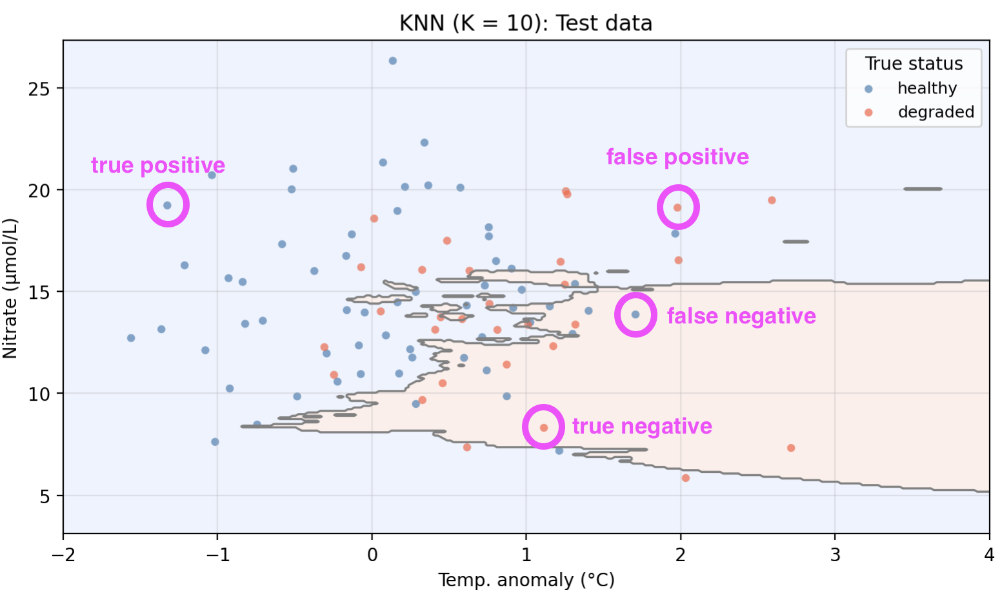

```{python}
import numpy as np
import matplotlib.pyplot as plt
import pandas as pd
from sklearn.neighbors import KNeighborsClassifier
from sklearn.model_selection import train_test_split
from sklearn.metrics import (confusion_matrix, precision_score,
                              recall_score, f1_score, accuracy_score)

plt.style.use('default')
fig_size_x = 8
fig_size_y = 4
plt.rcParams['font.size'] = 10

# ── KelpWatch synthetic dataset ────────────────────────────────────────────────
# 300 coastal monitoring stations, each characterized by:
#   temp_anomaly – sea surface temperature anomaly (°C)
#   nitrate      – nitrate concentration (μmol/L)
#   upwelling    – whether upwelling was detected (yes / no)
#   status       – kelp forest condition: 'healthy' or 'degraded'
#
# True data-generating model (logistic):
#   log-odds(healthy) = -0.8 − 1.5·temp_anomaly + 0.10·nitrate + 1.8·upwelling
# ──────────────────────────────────────────────────────────────────────────────
np.random.seed(42)
n = 300

temp_anomaly = np.random.normal(0.4, 1.0, n)
nitrate      = np.random.normal(14, 4, n)
upwelling    = np.random.binomial(1, 0.5, n)

log_odds     = -0.8 + (-1.5 * temp_anomaly) + (0.10 * nitrate) + (1.8 * upwelling)
prob_healthy = 1 / (1 + np.exp(-log_odds))
status_num   = np.random.binomial(1, prob_healthy, n)
status       = np.where(status_num == 1, 'healthy', 'degraded')

df = pd.DataFrame({
    'temp_anomaly':    temp_anomaly,
    'nitrate':         nitrate,
    'upwelling':       upwelling,
    'upwelling_label': np.where(upwelling == 1, 'yes', 'no'),
    'status':          status,
    'status_num':      status_num,
})

# Train/test split used throughout this lesson
X = df[['temp_anomaly', 'nitrate']].values
y = df['status'].values

X_train, X_test, y_train, y_test = train_test_split(
    X, y, test_size=0.3, random_state=42, stratify=y
)

# Decision boundary grid (reused across several plots)
x1_range = np.linspace(-2, 4, 300)
x2_range = np.linspace(X[:, 1].min() - 1, X[:, 1].max() + 1, 300)
xx1, xx2 = np.meshgrid(x1_range, x2_range)
```

[📊 Slides](4_1_classification-SLIDES.qmd) / [📊 Blank slides](4_1_classification-SLIDES-BLANK.qmd)

In this lesson we introduce:

- The classification setting and how it differs from regression
- Nearest Neighbors (KNN) as a simple, intuitive classification method
- Accuracy assessment for classifiers: the confusion matrix, precision, recall, and $F_1$ score
- Overfitting in classification and the bias-variance tradeoff for classifiers

These notes are based on chapters 2.2.3 and 4 of *An Introduction to Statistical Learning with Applications in Python* [@islp_2023]. The example data is synthetic and was generated with the aid of Claude Code for the purpose of this lesson.

## From regression to classification

So far we have studied regression methods, which assume the response variable is **quantitative**: a number that can take a continuous range of values. In many situations, however, the response is **qualitative** (also called **categorical**): it takes values in one of a discrete set of categories, or *classes*.

**Classifying** means predicting the qualitative response for an observation. Examples from environmental science include:

- Predicting whether a habitat is *healthy* or *degraded* based on environmental conditions
- Determining whether a water sample *exceeds* or *does not exceed* a contamination threshold
- Predicting whether a species is *present* or *absent* at a given location

## A guiding example: kelp forest monitoring

In this lesson we use a synthetic dataset that tracks 300 coastal monitoring stations. For each station we record:

- **`temp_anomaly`** — sea surface temperature anomaly (°C); positive values indicate warmer-than-average conditions
- **`nitrate`** — nitrate concentration (μmol/L); higher values generally support kelp growth
- **`status`** — observed kelp forest condition: *healthy* or *degraded*

The central question is: *can we predict whether a kelp forest site is healthy or degraded from its oceanographic conditions?*

```{python}
#| label: initial-data-plotting

colors  = {'healthy': 'steelblue', 'degraded': 'tomato'}
markers = {1: 'o', 0: 's'}

fig, ax = plt.subplots(figsize=(fig_size_x * 0.75, fig_size_y + 0.5))

for up_val in [1, 0]:
    for status_val, col in colors.items():
        mask = (df['upwelling'] == up_val) & (df['status'] == status_val)
        ax.scatter(
            df.loc[mask, 'temp_anomaly'], df.loc[mask, 'nitrate'],
            c=col, s=20, alpha=0.5, edgecolors='none'
        )

# Legend 1: kelp status (colors)
status_handles = [
    plt.scatter([], [], c=col, s=50, label=lab)
    for lab, col in colors.items()
]
leg1 = ax.legend(handles=status_handles, title='Status', fontsize=9, loc='upper left')
ax.add_artist(leg1)

ax.set_xlabel('Temp. anomaly (°C)')
ax.set_ylabel('Nitrate (μmol/L)')
ax.set_title(
    'KelpWatch: kelp status vs. oceanographic conditions\n'
    '*Synthetic data generated for educational purposes only*'
)
ax.grid(True, alpha=0.3)
plt.tight_layout()
plt.show()
plt.close()
```

## K-Nearest Neighbors (KNN)

**K-Nearest Neighbors (KNN)** is one of the simplest classification methods. The intuition is straightforward: classify a new observation by majority vote among its nearest neighbors in the training data.


### The algorithm

Given a training set and a new test observation $x_0$:

1. Choose an integer $K \geq 1$.
2. **Identify the $K$ points** in the training data that are closest to $x_0$ (typically using Euclidean distance).
3. **Identify the majority class** among those $K$ nearest neighbors.
4. **Assign that majority class** as the predicted class for $x_0$.


```{python}
#| label: knn-illustration

# Small illustrative dataset for the manual KNN exercise
np.random.seed(14)
n_ill = 18
x1_ill = np.random.uniform(0.5, 5.5, n_ill)
x2_ill = np.random.uniform(0.5, 5.5, n_ill)
# healthy = 1 roughly in the upper-left; degraded = 0 roughly lower-right
y_ill = ((-0.8 * x1_ill + x2_ill + np.random.normal(0, 0.5, n_ill)) > 0.5).astype(int)
y_ill_label = np.where(y_ill == 1, 'healthy', 'degraded')

# Test point
x0 = np.array([2.8, 2.8])

# K = 3 neighborhood
dists  = np.sqrt((x1_ill - x0[0])**2 + (x2_ill - x0[1])**2)
k3_idx = np.argsort(dists)[:3]
radius = dists[k3_idx[-1]] + 0.07

fig, ax = plt.subplots(figsize=(4.5, 4.5))

col_map = {'healthy': 'steelblue', 'degraded': 'tomato'}
for label, col in col_map.items():
    mask = y_ill_label == label
    ax.scatter(x1_ill[mask], x2_ill[mask], c=col, s=90,
               edgecolors='k', linewidths=0.6, label=label, zorder=3)

ax.scatter(*x0, c='gold', s=200, marker='*', edgecolors='k',
           linewidths=0.8, label='test point $x_0$', zorder=4)

circle = plt.Circle(x0, radius, color='dimgray', fill=False,
                    linestyle='--', linewidth=1.8, label='K = 3 neighborhood')
ax.add_patch(circle)

ax.set_xlim(0, 6)
ax.set_ylim(0, 6)
ax.set_xlabel('Temp. anomaly (normalized)')
ax.set_ylabel('Nitrate (normalized)')
ax.legend(fontsize=8, loc='upper left')
ax.set_title('KNN illustration (K = 3)')
ax.set_aspect('equal')
ax.grid(True, alpha=0.3)
plt.tight_layout()
plt.show()
plt.close()
```


:::{.callout-tip}
## Check-in

In the figure above, the star $\star$ marks a new test observation $x_0$. The dashed circle encloses its $K = 3$ nearest neighbors.

1. Look at the three points inside the circle. What class would KNN assign to $x_0$?
2. What would change if we used $K = 1$ instead? 
3. What would change if we used $K=$ number of observations in the training set?
:::

:::{.callout-tip collapse="true"}
## Discussion

1. We can see that two out of the three training points inside the dashed circle belong to the healthy class (blue points). Since healthy is the majority class within the neighborhood, we predict that the test point $x_0$ is in the healthy class too. 

2. With $K = 1$ the prediction is determined entirely by the single closest training point. Highly sensitive to local noise. 

3. If we use the whole dataset to compute the vote, we will just assign the majority class to every test point.

<!-- 3. Small $K$: the classifier can capture complex, irregular boundaries but is sensitive to individual training points and prone to overfitting. Large $K$ (high bias, low variance): the boundary is smoother and more stable, but may miss real patterns in the data. This is the same bias-variance tradeoff we saw in regression. -->
:::


### Example

We now apply KNN to our example data using `temp_anomaly` and `nitrate` as predictors. To do so, we use a 70-30 split in our observations and obtain a training set with 210 points and a test set with 90 points. The plot below shows the training and test sets along with the **decision boundary** learned by KNN with $K = 10$.

```{python}
#| label: knn-decision-boundary

knn10 = KNeighborsClassifier(n_neighbors=10)
knn10.fit(X_train, y_train)

grid_pred = knn10.predict(np.c_[xx1.ravel(), xx2.ravel()]).reshape(xx1.shape)
grid_num  = (grid_pred == 'healthy').astype(int)

col_map  = {'healthy': 'steelblue', 'degraded': 'tomato'}
datasets = [('Training data', X_train, y_train), ('Test data', X_test, y_test)]

fig, axes = plt.subplots(2, 1, figsize=(fig_size_x * 0.7, (fig_size_y + 0.5) * 1.4), sharex=True)

for ax, (title, X_data, y_data) in zip(axes, datasets):
    ax.contourf(xx1, xx2, grid_num, alpha=0.15,
                cmap='coolwarm_r', levels=[-0.5, 0.5, 1.5])
    ax.contour(xx1, xx2, grid_num, colors='gray', linewidths=1.2, levels=[0.5])
    for label, col in col_map.items():
        mask = y_data == label
        ax.scatter(X_data[mask, 0], X_data[mask, 1],
                   c=col, s=20, alpha=0.7, label=label, edgecolors='none')
    ax.set_xlim(-2, 4)
    ax.set_ylabel('Nitrate (μmol/L)')
    ax.set_title(f'KNN (K = 10): {title}')
    ax.legend(title='True status', fontsize=9)
    ax.grid(True, alpha=0.3)

axes[1].set_xlabel('Temp. anomaly (°C)')
plt.tight_layout()
plt.show()
plt.close()
```

The shaded regions show where the model predicts *healthy* (blue) and *degraded* (red). Points plotted on top are the true labels. A point is misclassified if it appears in the "wrong" shaded region.

### Pros and cons of KNN

There are several pros and cons to using the KNN algorithm:

**Pros:**

- Non-parametric: makes no assumptions about the shape of the decision boundary.
- Simple and intuitive: there's no explicit model to train, just store the training data.
- It naturally handles multi-class problems.

**Cons:**

- Slow at prediction time: classifying each new point requires computing its distance to every training point.
- Sensitive to the scale of predictors: variables with large ranges dominate the distance calculation, so features typically need to be standardized before applying KNN.
- The choice of $K$ requires cross-validation and has a large impact on performance.
- Its performance degrades as the number of predictors grows (the *curse of dimensionality*).

<!-- TODO: I would like to include an activity on exercise 4.8-4 in ISLP. -->

## Accuracy assessment for classifiers

To assess how well a classifier performs, we compare its predictions on the **test set** to the true labels. For a **binary classifier** with two possible classes we call the classes **positive** and **negative**. Given an observation $(x_0, y_0)$ in the test set, we have the following possibilities depending on what prediction was given to $x_0$ and what class $y_0$ it is really associated with:

- **True Positive**: the observation is positive and we correctly predicted positive.
- **True Negative**: the observation is negative and we correctly predicted negative.
- **False Positive**: the observation is negative but we incorrectly predicted positive.
- **False Negative**: the observation is positive but we incorrectly predicted negative.


<!-- 
|  | $x_0$ predicted positive | $x_0$ predicted negative |
|---|---|---|
| $y_0$ is positive class | True positive | False negative |
| $y_0$ is negative class | False positive  | True negative  | -->

So each of our observations in the test set can be classified as true/false positive or true/false negative.

:::{.callout-tip}
## Check-in

Consider the following predictions for five test observations:

| Observation | True status | Predicted status |
|---|---|---|
| A | healthy   | healthy   |
| B | degraded  | healthy   |
| C | healthy   | degraded  |
| D | degraded  | degraded  |

We will treat healthy as the positive class and degraded as the negative class.
Classify each observation as true positive, false positive, true negative, or false negative, using `healthy` as the positive class.
:::

:::{.callout-tip collapse="true"}
## Discussion

- A: True status = healthy (positive), predicted = healthy (positive) → **TP**
- B: True status = degraded (negative), predicted = healthy (positive) → **FP**
- C: True status = healthy (positive), predicted = degraded (negative) → **FN**
- D: True status = degraded (negative), predicted = degraded (negative) → **TN**
:::

:::{.callout-tip}
## Check-in
Identify one true positive point, one true negative point, one false positive point, and one false negative point. 

```{python}
#| label: identify-points
fig, ax = plt.subplots(figsize=(fig_size_x * 0.7, (fig_size_y + 1) * 0.7))
ax.contourf(xx1, xx2, grid_num, alpha=0.15,
            cmap='coolwarm_r', levels=[-0.5, 0.5, 1.5])
ax.contour(xx1, xx2, grid_num, colors='gray', linewidths=1.2, levels=[0.5])

for label, col in {'healthy': 'steelblue', 'degraded': 'tomato'}.items():
    mask = y_test == label
    ax.scatter(X_test[mask, 0], X_test[mask, 1],
               c=col, s=25, alpha=0.7, label=label, edgecolors='none')

ax.set_xlim(-2, 4)
ax.set_xlabel('Temp. anomaly (°C)')
ax.set_ylabel('Nitrate (μmol/L)')
ax.set_title('KNN decision boundary (K = 10) — test observations shown')
ax.legend(title='True status', fontsize=9)
ax.grid(True, alpha=0.3)
plt.tight_layout()
plt.show()
plt.close()
```
:::

:::{.callout-tip collapse="true"}
## Discussion
You may have identified other points, these are some examples!


:::

### The confusion matrix

Once we have predicted the class for every point in our test set and compared it t its true class, we can count the total number of true/false positives and true/false negatives we obtained. We use the notation:

- TP = total number of true positives
- TN = total number of true negatives
- FP = total number of false positives
- FN = total number of false negatives

These four counts are organized into a **confusion matrix**, which gives a concise summary of where the classifier is correct and what types of errors it makes:


|  | Predicted positive | Predicted negative |
|---|---|---|
| **True positive** | TP | FN |
| **True negative** | FP | TN |


:::{.callout-tip}
## Check-in

The confusion matrix for our KNN model is

```{python}
#| label: confusion-matrix

y_pred = knn10.predict(X_test)
cm     = confusion_matrix(y_test, y_pred, labels=['healthy', 'degraded'])
TP, FN, FP, TN = cm[0, 0], cm[0, 1], cm[1, 0], cm[1, 1]

cm_df = pd.DataFrame(
    [[f'TP = {TP}', f'FN = {FN}'],
     [f'FP = {FP}', f'TN = {TN}']],
    index   = ['True: healthy',  'True: degraded'],
    columns = ['Predicted: healthy', 'Predicted: degraded']
)
print(cm_df.to_string())
```

Using the confusion matrix above:

1. How many healthy sites were correctly identified?
2. How many degraded sites were incorrectly classified as healthy? What type of error is this: false positive or false negative?
3. From an ecological monitoring perspective, which type of error do you think could be more costly? Why?
:::

:::{.callout-tip collapse="true"}
## Discussion

1. That is the True Positive count: the top-left cell of the confusion matrix.

2. The bottom-left cell gives the count of degraded sites predicted as healthy, these are False Positives. The classifier declared a site healthy when it was actually degraded.

3. One could argue that False Positives (predicting *healthy* when the site is *degraded*) are likely more costly: a truly degraded site would go undetected and receive no intervention. A False Negative (predicting *degraded* when the site is actually healthy) might trigger unnecessary action, but the ecological harm is lower than missing real degradation. The relative cost always depends on the specific application!
:::

### Accuracy metrics

Given the confusion matrix counts, we can compute several summary metrics.

**Overall accuracy** is the fraction of test observations correctly classified:

$$\text{accuracy} = \frac{TP + TN}{TP + FP + TN + FN}.$$

**Precision** answers: *of the observations predicted as positive, what fraction are truly positive?* It is given by

$$\text{precision} = \frac{TP}{TP + FP}.$$

**Recall** (also called *sensitivity*) answers: *of all the truly positive observations, what fraction did we correctly identify?* It is defined as

$$\text{recall} = \frac{TP}{TP + FN}.$$

All of these accuracy metrics take on values between 0 and 1, with 1 being the highest accuracy and 0 the lowest.

:::{.callout-tip}
## Check-in
1. Imagine you use a classifier that always predicts positive. What would recall be like? What about precision?
2. Imagine you use a classifier that rarely predicts positive but, when it does, it is spot on. What would recall be like? What about precision?
3. If you are a conservation manager who needs to allocate resources to degraded sites, which metric would you prioritize? 
:::

:::{.callout-tip collapse="true"}
## Discussion
1. A classifier that always predicts positive will have *perfect recall* (it never misses a positive) but *low precision* (many of its positive predictions are wrong).
2. A classifier that rarely predicts positive will have *high precision* (when it does predict positive, it is usually right) but *low recall* (it misses many true positives).
3. A conservation manager should likely prioritize *recall*: the goal is to correctly identify as many truly degraded sites as possible so they can receive intervention. Missing a degraded site (False Negative) could have direct ecological consequences. 
:::

Precision and recall capture different aspects of classifier performance and often trade off against each other.
The right balance depends on the application and the relative costs of false positives and false negatives.

### The $F_1$ score

When we want to summarize both precision and recall in a single number, we can use the **$F_1$ score**, defined as their harmonic mean:

$$F_1 = \frac{2 \cdot \text{precision} \times \text{recall}}{\text{precision} + \text{recall}}$$

Some properties of the $F_1$ score:

- Ranges from 0 (worst) to 1 (best).
- It **favors classifiers with balanced precision and recall**: a model with high precision but very low recall (or vice versa) receives a low $F_1$ score.
- It is a simple way to compare classifiers with one number, but you should always examine precision and recall individually to understand the underlying trade-off.


:::{.callout-tip}
## Check-in

Back in our kelp forest health classification, suppose we also implement a **null classifier** which always predicts the majority class regardless of the predictors. The table below compares all four metrics for the null classifier and the KNN model:

```{python}
#| label: accuracy-metrics

majority_class = pd.Series(y_test).value_counts().idxmax()
null_preds     = np.full(len(y_test), majority_class)

null_acc  = accuracy_score(y_test, null_preds)
null_prec = precision_score(y_test, null_preds, pos_label='healthy', zero_division=0)
null_rec  = recall_score(y_test, null_preds, pos_label='healthy', zero_division=0)
null_f1   = f1_score(y_test, null_preds, pos_label='healthy', zero_division=0)

acc  = accuracy_score(y_test, y_pred)
prec = precision_score(y_test, y_pred, pos_label='healthy')
rec  = recall_score(y_test, y_pred, pos_label='healthy')
f1   = f1_score(y_test, y_pred, pos_label='healthy')

metrics_df = pd.DataFrame({
    'Model':     ['Null classifier', 'KNN (K = 10)'],
    'Accuracy':  [f'{null_acc:.3f}',  f'{acc:.3f}'],
    'Precision': [f'{null_prec:.3f}', f'{prec:.3f}'],
    'Recall':    [f'{null_rec:.3f}',  f'{rec:.3f}'],
    'F₁ score':  [f'{null_f1:.3f}',  f'{f1:.3f}'],
})
print(metrics_df.to_string(index=False))
```

Looking at the comparison table:

1. The null classifier always predicts *`{python} majority_class`*. Why does it have a recall of `{python} f"{null_rec:.3f}"` but a lower $F_1$ score?
2. KNN achieves accuracy `{python} f"{acc:.3f}"` vs. the null's `{python} f"{null_acc:.3f}"`. Is accuracy alone a good summary to assess whether KNN is no better than the null classifier?
3. Is this KNN model with K=10 good enough or would it be worth it to explore other alternatives?
:::

:::{.callout-tip collapse="true"}
## Discussion

1. Because the null classifier always predicts *`{python} majority_class`* (positive), it never produces a false negative. Every truly positive site gets predicted as positive, so recall is perfect. However, it also misclassifies every negative site as positive, which drives down precision and therefore $F_1$.

2. No. The two classifiers have similar accuracy (`{python} f"{null_acc:.3f}"` vs. `{python} f"{acc:.3f}"`), yet KNN has some evidence of distinguishing between classes rather than blindly predicting the majority. 

3. Definitely explore other alternatives!
:::

The null classifier is a useful baseline. Its accuracy equals the proportion of the most common class in the test set. Any useful model should outperform this trivial baseline. Looking at precision, recall, and $F_1$ together gives a much fuller picture than accuracy alone.

## Overfitting in classification


In classification we can consdider the overall **error rate** as a simple metric to compare model performance across models:

$$\text{error rate} = \frac{\text{number of misclassified observations}}{\text{total observations}} = \frac{FP + FN}{TP + FP + TN + FN}.$$

We get the **training and test error rates** for a classifier when we calculate the error rate of the classifier on the training and test sets, respectively. 

As in regression, classifiers can also **overfit** the training data. Recall that:

> A model is overfitting when it has a small training error but a large test error. 

:::{.callout-tip}
## Check-in

The parameter $K$ directly controls the flexibility of the KNN classifier. The plot below shows training and test error across a range of $K$ values. 

```{python}
#| label: train-test-error-curve

k_range      = list(range(1, 151, 2))
train_errors = []
test_errors  = []

for k in k_range:
    knn_k = KNeighborsClassifier(n_neighbors=k)
    knn_k.fit(X_train, y_train)
    train_errors.append(1 - knn_k.score(X_train, y_train))
    test_errors.append(1 - knn_k.score(X_test,  y_test))

null_error = 1 - null_acc

fig, ax = plt.subplots(figsize=(fig_size_x, fig_size_y))
ax.plot(k_range, train_errors, 'b-o', markersize=3, label='Training error')
ax.plot(k_range, test_errors,  'r-o', markersize=3, label='Test error')
ax.axhline(null_error, color='gray', linestyle='--', linewidth=1.5,
           label=f'Null classifier error ({null_error:.3f})')
ax.set_xlabel('K (number of neighbors)')
ax.set_ylabel('Classification error rate')
ax.set_title('KNN: training and test error vs. K')
ax.legend()
ax.grid(True, alpha=0.3)
plt.tight_layout()
plt.show()
plt.close()
```

Looking at the error curves:

1. At $K = 1$, what is the training error and why?
2. Identify the region of the plot where the classifier is overfitting. What features of the curve indicate this?
3. Where would you choose $K$ to get the best generalization performance?
:::

:::{.callout-tip collapse="true"}
## Discussion

1. At $K = 1$ the training error is 0 . With a single nearest neighbor, every training point's closest neighbor is itself, so it is always classified correctly. This is the clearest possible sign of overfitting.


2. Overfitting occurs on the left side of the plot (small $K$). Here training error is very low but test error is notably higher. The gap between the two curves is the signature of overfitting: the model has learned the noise in the training data rather than the true underlying pattern.

3. The best generalization performance is near the value of $K$ where test error is minimized, before it rises again for very large $K$ (where the model underfits). In practice this optimal $K$ is selected via cross-validation rather than by looking at the test set directly.
:::

### The Bias-Variance tradeoff

Recall  that **model variance** refers to how much our model would change if we trained it on a different data set. 

In the figure below we examine the variance of a KNN classifier with different values of $k$ when applied to two training sets from the same population:

```{python}
#| label: variance-bias-knn

# Generate a second training set from the same data-generating process
np.random.seed(99)
n2           = len(X_train)
temp2        = np.random.normal(0.4, 1.0, n2)
nit2         = np.random.normal(14, 4, n2)
up2          = np.random.binomial(1, 0.5, n2)
log_odds2    = -0.8 + (-1.5 * temp2) + (0.10 * nit2) + (1.8 * up2)
prob2        = 1 / (1 + np.exp(-log_odds2))
status2      = np.where(np.random.binomial(1, prob2, n2) == 1, 'healthy', 'degraded')
X_train2     = np.column_stack([temp2, nit2])
y_train2     = status2

k_bv       = [1, 30]
train_sets = [('Training set A', X_train,  y_train,  'o'),
              ('Training set B', X_train2, y_train2, '^')]
col_map    = {'healthy': 'steelblue', 'degraded': 'tomato'}

fig, axes = plt.subplots(2, 2,
                         figsize=(fig_size_x * 0.91, (fig_size_y + 0.5) * 1.4),
                         sharex=True, sharey=True)

for row, k in enumerate(k_bv):
    for col, (set_name, X_tr, y_tr, mkr) in enumerate(train_sets):
        ax = axes[row, col]
        knn_bv = KNeighborsClassifier(n_neighbors=k)
        knn_bv.fit(X_tr, y_tr)
        gp = knn_bv.predict(np.c_[xx1.ravel(), xx2.ravel()]).reshape(xx1.shape)
        gn = (gp == 'healthy').astype(int)
        ax.contourf(xx1, xx2, gn, alpha=0.15, cmap='coolwarm_r', levels=[-0.5, 0.5, 1.5])
        ax.contour(xx1, xx2, gn, colors='gray', linewidths=1.0, levels=[0.5])
        for label, c in col_map.items():
            mask = y_tr == label
            ax.scatter(X_tr[mask, 0], X_tr[mask, 1],
                       color=c, marker=mkr, s=12, alpha=0.5, edgecolors='none')
        ax.set_xlim(-2, 4)
        ax.set_title(f'K = {k} — {set_name}', fontsize=10)
        ax.grid(True, alpha=0.2)
        if col == 0:
            ax.set_ylabel('Nitrate (μmol/L)')
        if row == 1:
            ax.set_xlabel('Temp. anomaly (°C)')

fig.suptitle(
    'Decision boundaries across two training sets for k=1 and k=30',
     y=1.02
)
plt.tight_layout()
plt.show()
plt.close()
```

:::{.callout-tip}
## Check-in
Looking at the plots above, which value of $k$ do you think gives a model with higher variance? Why?
:::
:::{.callout-tip collapse="true"}
## Discussion
The decision boundaries created by both models ($K=1$ and $K=10$) change when trained on different datasets. However, we could say that the $k=1$ KNN model exhibits higher variance since there's a lot of small classiffication regions (fitting noise) that change substantially as we move from training set A to B. 
:::

On the other hand, **model bias** refers to the error introduced by the assumptions built into the model. Models with high bias will be systematically wrong, no matter how much training data we give it. In our example, when $k$ is really big, all points will be classified as the majority class. If both training sets are sampled from the same popuplation, we expect this model to remain constant across training sets. 

```{python}
#| label: high-bias-knn

fig, axes = plt.subplots(1, 2,
                         figsize=(fig_size_x * 0.91, (fig_size_y + 0.5) * 0.7),
                         sharex=True, sharey=True)

k = 120
for col, (set_name, X_tr, y_tr, mkr) in enumerate(train_sets):
    ax = axes[col]
    knn_bv = KNeighborsClassifier(n_neighbors=k)
    knn_bv.fit(X_tr, y_tr)
    gp = knn_bv.predict(np.c_[xx1.ravel(), xx2.ravel()]).reshape(xx1.shape)
    gn = (gp == 'healthy').astype(int)
    ax.contourf(xx1, xx2, gn, alpha=0.15, cmap='coolwarm_r', levels=[-0.5, 0.5, 1.5])
    ax.contour(xx1, xx2, gn, colors='gray', linewidths=1.0, levels=[0.5])
    for label, c in col_map.items():
        mask = y_tr == label
        ax.scatter(X_tr[mask, 0], X_tr[mask, 1],
                   color=c, marker=mkr, s=12, alpha=0.5, edgecolors='none')
    ax.set_xlim(-2, 4)
    ax.set_title(f'K = {k} — {set_name}', fontsize=10)
    ax.set_xlabel('Temp. anomaly (°C)')
    ax.grid(True, alpha=0.2)
    if col == 0:
        ax.set_ylabel('Nitrate (μmol/L)')

fig.suptitle('Decision boundaries across two training sets', y=1.02)
plt.tight_layout()
plt.show()
plt.close()
```


The same bias-variance tradeoff discussed for regression in [previous notes](/notes/2_2_assessing_model_accuracy/2_2_assessing_model_accuracy-NOTES.qmd) applies here:

- A high flexibility model often shows low bias and high variance. The flexible boundary can capture complex patterns but changes a lot from one training sample to another.
- A low flexibility model often shows high bias and low variance. The rigid boundary is stable but may systematically miss real structure in the data.

Increasing model flexibility always reduces training error, but test error has a characteristic U-shape we'd seen previously. 
