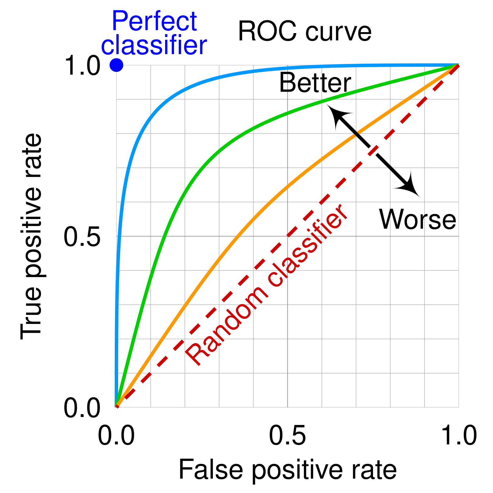

---
format:
    revealjs:
        theme: ../../styles/meds-slides-styles.scss
        slide-number: true
        chalkboard: true
        title-slide: false
jupyter: eds232-env
---

```{python}
#| echo: false
import numpy as np
import matplotlib.pyplot as plt
import pandas as pd
from scipy import stats
from sklearn.linear_model import LogisticRegression
from sklearn.model_selection import train_test_split
from sklearn.metrics import (confusion_matrix, precision_score, recall_score,
                              f1_score, accuracy_score, roc_curve, auc)
from sklearn.metrics import ConfusionMatrixDisplay

plt.style.use('default')
fig_size_x = 8
fig_size_y = 4
plt.rcParams['font.size'] = 11
plt.rcParams['legend.fontsize'] = 'large'

# ── KelpWatch synthetic dataset ────────────────────────────────────────────────
np.random.seed(42)
n = 300

temp_anomaly = np.random.normal(0.4, 1.0, n)
nitrate      = np.random.normal(14, 4, n)
upwelling    = np.random.binomial(1, 0.5, n)

log_odds_gen = -0.8 + (-1.5 * temp_anomaly) + (0.10 * nitrate) + (1.8 * upwelling)
prob_healthy = 1 / (1 + np.exp(-log_odds_gen))
status_num   = np.random.binomial(1, prob_healthy, n)
status       = np.where(status_num == 1, 'healthy', 'degraded')

df = pd.DataFrame({
    'temp_anomaly': temp_anomaly,
    'nitrate':      nitrate,
    'upwelling':    upwelling,
    'status':       status,
    'status_num':   status_num,
})

X = df[['temp_anomaly', 'nitrate']].values
y = df['status'].values

X_train, X_test, y_train, y_test = train_test_split(
    X, y, test_size=0.3, random_state=42, stratify=y
)

col_map = {'healthy': 'steelblue', 'degraded': 'tomato'}

# Decision boundary grid
x1_range = np.linspace(-2, 4, 300)
x2_range = np.linspace(X[:, 1].min() - 1, X[:, 1].max() + 1, 300)
xx1, xx2 = np.meshgrid(x1_range, x2_range)

# ── Fit models ─────────────────────────────────────────────────────────────────
# Simple model: temp_anomaly only, full dataset (for inference/illustration)
X_simple  = df[['temp_anomaly']].values
y_simple  = df['status_num'].values
lr_simple = LogisticRegression()
lr_simple.fit(X_simple, y_simple)
beta0_s   = lr_simple.intercept_[0]
beta1_s   = lr_simple.coef_[0][0]

temp_range = np.linspace(-3, 4, 300)
prob_curve = lr_simple.predict_proba(temp_range.reshape(-1, 1))[:, 1]

# Multiple model: temp_anomaly + nitrate, training set (for performance eval)
lr_multi  = LogisticRegression(max_iter=1000)
lr_multi.fit(X_train, (y_train == 'healthy').astype(int))
grid_prob = lr_multi.predict_proba(np.c_[xx1.ravel(), xx2.ravel()])[:, 1].reshape(xx1.shape)

# Single-predictor model on training set (for fair accuracy comparison)
lr_single_train = LogisticRegression(max_iter=1000)
lr_single_train.fit(X_train[:, [0]], (y_train == 'healthy').astype(int))

y_pred_s       = lr_single_train.predict(X_test[:, [0]])
y_pred_s_label = np.where(y_pred_s == 1, 'healthy', 'degraded')
y_pred_m       = lr_multi.predict(X_test)
y_pred_m_label = np.where(y_pred_m == 1, 'healthy', 'degraded')

y_test_num  = (y_test == 'healthy').astype(int)
y_prob_test = lr_multi.predict_proba(X_test)[:, 1]

# ── Precompute reused values ───────────────────────────────────────────────────
# Decision boundary
x_star = -beta0_s / beta1_s

# Log-odds plot values
log_odds_vals = beta0_s + beta1_s * temp_range
def logistic_fn(x, b0, b1):
    return 1 / (1 + np.exp(-(b0 + b1 * x)))
prob_vals = logistic_fn(temp_range, beta0_s, beta1_s)

# Hypothesis test table
X_mat    = np.column_stack([np.ones(n), df['temp_anomaly']])
beta_hat = np.concatenate([[lr_simple.intercept_[0]], lr_simple.coef_[0]])
p_hat    = lr_simple.predict_proba(df[['temp_anomaly']])[:, 1]
W        = np.diag(p_hat * (1 - p_hat))
cov_mat  = np.linalg.inv(X_mat.T @ W @ X_mat)
se       = np.sqrt(np.diag(cov_mat))
z_stats  = beta_hat / se
p_vals   = 2 * (1 - stats.norm.cdf(np.abs(z_stats)))
ht_results = pd.DataFrame({
    'Coefficient': ['Intercept', 'temp_anomaly'],
    'Estimate':    np.round(beta_hat, 4),
    'Std. Error':  np.round(se, 4),
    'Z-statistic': np.round(z_stats, 3),
    'p-value':     [f'{p:.4f}' for p in p_vals],
})

# Accuracy comparison table
def metrics_row(y_true, y_pred):
    acc  = accuracy_score(y_true, y_pred)
    prec = precision_score(y_true, y_pred, pos_label='healthy', zero_division=0)
    rec  = recall_score(y_true, y_pred, pos_label='healthy', zero_division=0)
    f1   = f1_score(y_true, y_pred, pos_label='healthy', zero_division=0)
    return acc, 1 - acc, prec, rec, f1

s_acc, s_err, s_prec, s_rec, s_f1 = metrics_row(y_test, y_pred_s_label)
m_acc, m_err, m_prec, m_rec, m_f1 = metrics_row(y_test, y_pred_m_label)
recap_df = pd.DataFrame({
    'Model':            ['Logistic (temp_anomaly only)', 'Logistic (temp_anomaly + nitrate)'],
    'OA':               [f'{s_acc:.3f}', f'{m_acc:.3f}'],
    'Err. rate':        [f'{s_err:.3f}', f'{m_err:.3f}'],
    'Precision':        [f'{s_prec:.3f}', f'{m_prec:.3f}'],
    'Recall':           [f'{s_rec:.3f}', f'{m_rec:.3f}'],
    'F₁':               [f'{s_f1:.3f}', f'{m_f1:.3f}'],
})

# Threshold sweep
thresholds = np.linspace(0.01, 0.99, 200)
precisions_t, recalls_t, accuracies_t = [], [], []
for t in thresholds:
    y_hat = (y_prob_test >= t).astype(int)
    precisions_t.append(precision_score(y_test_num, y_hat, zero_division=0))
    recalls_t.append(recall_score(y_test_num, y_hat, zero_division=0))
    accuracies_t.append(accuracy_score(y_test_num, y_hat))

# ROC data (multiple predictor model)
fpr, tpr, roc_thresholds = roc_curve(y_test_num, y_prob_test)
roc_auc = auc(fpr, tpr)
```

## {#title-slide data-menu-title="Title Slide" background="#053660"}

[EDS 232]{.custom-title}

<hr class="hr-teal">

[Lesson 6]{.custom-subtitle}

[*Logistic regression and ROC curves*]{.custom-subtitle}

---

## {#in-this-lesson data-menu-title="In this lesson"}

[In this lesson]{.slide-title}

<hr>

<br>

- Logistic regression and how it is used for classification
- Interpreting logistic regression coefficients through log-odds
- Adjusting the classification threshold and its effect on precision and recall
- ROC curves and the AUC as tools for evaluating classifier performance across thresholds

---

## {#section-example data-menu-title="# A guiding example #" background="#047C90"}

<div class="page-center vertical-center">
<p class="custom-subtitle bottombr">A guiding example</p>
</div>

---

## {#kelpwatch data-menu-title="The KelpWatch dataset"}

[Our example dataset]{.slide-title}

<hr>

The same synthetic dataset from the previous lesson — 300 coastal monitoring stations:

<br>

::: {.body-text-m}
- **`temp_anomaly`** — sea surface temperature anomaly (°C): deviation from long-term average
- **`nitrate`** — nitrate concentration (μmol/L)
- **`status`** — kelp forest condition: *healthy* or *degraded*
:::

<br>

::: {.center-text .teal-text .body-text-m}
*Can we predict whether a site is healthy or degraded*

*based on its oceanographic conditions?*
:::

---

## {#kelpwatch-plot data-menu-title="KelpWatch: data overview"}

[Data overview]{.slide-title}

<hr>

```{python}
#| label: example-data-plot
#| echo: false
#| fig-align: center
#| out-width: "100%"

colors = {'healthy': 'steelblue', 'degraded': 'tomato'}
fig, ax = plt.subplots(figsize=(fig_size_x * 1.5, fig_size_y + 1.5))

for status_val, col in colors.items():
    mask = df['status'] == status_val
    ax.scatter(df.loc[mask, 'temp_anomaly'], df.loc[mask, 'nitrate'],
               c=col, s=25, alpha=0.6, edgecolors='none')

counts = df['status'].value_counts()
legend_labels = {s: f'{s} (n={counts[s]})' for s in colors}
handles = [plt.scatter([], [], c=col, s=50, label=legend_labels[s]) for s, col in colors.items()]
ax.legend(handles=handles, title='Status', fontsize=10, loc='upper left')
ax.set_xlabel('Temp. anomaly (°C)')
ax.set_ylabel('Nitrate (μmol/L)')
ax.grid(True, alpha=0.3)
plt.tight_layout()
plt.show()
plt.close()
```

::: {.center-text .body-text-s}
*Synthetic data generated for educational purposes only*
:::

---

## {#section-logistic data-menu-title="# Logistic regression #" background="#047C90"}

<div class="page-center vertical-center">
<p class="custom-subtitle bottombr">Logistic regression</p>
</div>

---

## {#logistic-intro data-menu-title="Logistic regression"}

[Logistic regression]{.slide-title}

<hr>

Rather than predicting the class directly, logistic regression models the **probability** that an observation belongs to the positive class:

$$P(Y = 1 \mid X) = p(X).$$

<br>

Once we have $p(X)$, we classify $X$ using a **classification threshold** $\alpha$:

$$
\text{the class of $X$ is} = \begin{cases} \text{class } 1, & \text{if } p(X) \geq \alpha \\ \text{class } 0, & \text{if } p(X) < \alpha \end{cases}.
$$

<br>

The choice of threshold is something we control.

---

## {#logistic-example data-menu-title="Logistic regression"}

[Logistic regression: example data]{.slide-title}

<hr>

In our example:

- **Predictor**: `temp_anomaly`
- **Response**: `status`:  *healthy* (class 1/positive) or *degraded* (class 0/negative)

Using logistic regression we can model

$$P(\text{status} = \text{healthy} \mid \text{temp_anomaly}) = p(\text{temp_anomaly}),$$

the probability of a site having a healthy status given a certain temperature anomaly.

Then, we select a threshold to classify a site as healthy or degraded. E.g., using $\alpha=0.5$:

- If $p(\text{temp}) \geq 0.5$, then predict the site is *healthy*.
- If $p(\text{temp}) < 0.5$, then predict the site is *degraded*.

---

## {#logistic-intro-checkin-1 data-menu-title="The logistic function"}

[Check-in]{.slide-title}

<hr>


::: {.teal-text}
1. A new site has `temp_anomaly` = 3°C. Walk through the steps to predict its class using $p(X)$ with threshold $\alpha = 0.7$.

2. If we used `nitrate` as the predictor instead, what would $p(X)$ be modeling?
:::

. . .

<br>

1. After having the model $p(X)$, we would plug in $X = 3$ to calculate $p(3)$. If $p(3)<0.7$ then we would predict the site is degraded and if $p(3)\geq0.7$ we would predict the site is healthy. 

<br>

2. $p(X)$ would model $P(\text{status} = \text{healthy} \mid \text{nitrate})$. This is the probability that a site is healthy given its nitrate concentration.


---

## {#logistic-function data-menu-title="The logistic function"}

[The logistic function]{.slide-title}

<hr>

<div style="text-align: center;">

Logistic regression models $p(X)$ using the **logistic (sigmoid) function**:

$$p(X) = \frac{e^{\beta_0 + \beta_1 X}}{1 + e^{\beta_0 + \beta_1 X}}.$$

- Always returns values **between 0 and 1**: a valid probability model
- $\beta_0$ and $\beta_1$ are coefficients to be estimated to fit the model

</div>

---

## {#mle data-menu-title="MLE"}

[Maximum likelihood estimation]{.slide-title}

<hr>

Logistic function: $p(X) = \frac{e^{\beta_0 + \beta_1 X}}{1 + e^{\beta_0 + \beta_1 X}}$

. . .

Training data: $(x_1, y_1), \ldots, (x_n, y_n)$, where each $y_i \in \{0, 1\}$

. . .

Idea: estimate coefficients $\hat{\beta}_0$ and $\hat{\beta}_1$ that make the observed data as probable as possible:

- For a training point $x_i$ where $y_i = 1$ (positive class), we want $p(x_i)$ to be **close to 1**.
- For a training point $x_i$ where $y_i = 0$ (negative class), we want $p(x_i)$ to be **close to 0**.

To find such $\hat\beta_0$, $\hat\beta_1$ we maximize the **likelihood function**:

$$\mathcal{L}(\beta_0, \beta_1) = \prod_{i:\, y_i = 1} p(x_i) \cdot \prod_{i:\, y_i = 0} \bigl(1 - p(x_i)\bigr).$$


---

## {#logistic-curve-slide data-menu-title="Fitted logistic curve"}

[Fitted probability curve]{.slide-title}

<hr>

```{python}
#| label: logistic-curve
#| echo: false
#| fig-align: center
#| out-width: "90%"

fig, ax = plt.subplots(figsize=(fig_size_x * 1.3, fig_size_y))
ax.scatter(df['temp_anomaly'], df['status_num'],
           c=[col_map[s] for s in df['status']], alpha=0.25, s=15, edgecolors='none')
ax.plot(temp_range, prob_curve, color='black', linewidth=2,
        label='p(healthy | temp_anomaly)')
ax.axhline(0.5, color='gray', linestyle='--', linewidth=1, label='threshold = 0.5')
for s, col in col_map.items():
    ax.scatter([], [], c=col, s=30, label=s, edgecolors='none')
ax.set_yticks([0, 0.5, 1])
ax.set_yticklabels(['degraded (0)', '0.5', 'healthy (1)'])
ax.set_xlabel('Temp. anomaly (°C)')
ax.set_ylabel('P(status = healthy)')
ax.set_title('Logistic regression: fitted probability curve')
ax.legend(fontsize=9)
ax.grid(True, alpha=0.3)
plt.tight_layout()
plt.show()
plt.close()
```

::: {.body-text-s .center-text}
- Points overlappin near the boundary reflects uncertainty in the data.
- Probability is higher in regions where healthy sites are dense 
- As temperature anomaly increases, the probability of a healthy site decreases. 
- Notice the characteristic S-shape of the logistic function!
:::

---

## {#checkin-logistic-q data-menu-title="Check-in: predict class"}

[Check-in]{.slide-title}

<hr>

:::: {.columns}

::: {.column width="55%"}

```{python}
#| echo: false
#| fig-align: center
#| out-width: "100%"

fig, ax = plt.subplots(figsize=(fig_size_x * 0.9, fig_size_y))
ax.scatter(df['temp_anomaly'], df['status_num'],
           c=[col_map[s] for s in df['status']], alpha=0.25, s=15, edgecolors='none')
ax.plot(temp_range, prob_curve, color='black', linewidth=2)
ax.axhline(0.5, color='gray', linestyle='--', linewidth=1, label='α = 0.5')
ax.set_xlabel('Temp. anomaly (°C)')
ax.set_ylabel('P(status = healthy)')
ax.legend(fontsize=13)
ax.set_title('Logistic regression: fitted probability curve')
ax.grid(True, alpha=0.3)
plt.tight_layout()
plt.show()
plt.close()
```

:::

::: {.column width="45%"}

::: {.teal-text .body-text-m}
Using the fitted logistic model, 

what is the predicted status of a site with `temp_anomaly` = 0.5°C? Use the threshold $\alpha = 0.5$.
:::

:::

::::

---

## {#checkin-logistic-a data-menu-title="Check-in: predict class (answers)"}

[Check-in]{.slide-title}

<hr>

:::: {.columns}

::: {.column width="55%"}

```{python}
#| echo: false
#| fig-align: center
#| out-width: "100%"

fig, ax = plt.subplots(figsize=(fig_size_x * 0.9, fig_size_y))
ax.scatter(df['temp_anomaly'], df['status_num'],
           c=[col_map[s] for s in df['status']], alpha=0.25, s=15, edgecolors='none')
ax.plot(temp_range, prob_curve, color='black', linewidth=2)
ax.axhline(0.5, color='gray', linestyle='--', linewidth=1, label='α = 0.5')
ax.set_xlabel('Temp. anomaly (°C)')
ax.set_ylabel('P(status = healthy)')
ax.legend(fontsize=13)
ax.set_title('Logistic regression: fitted probability curve')
ax.grid(True, alpha=0.3)
plt.tight_layout()
plt.show()
plt.close()
```

:::

::: {.column width="45%"}

::: {.teal-text .body-text-m}
Using the fitted logistic model, 

what is the predicted status of a site with `temp_anomaly` = 0.5°C? Use the threshold $\alpha = 0.5$.
:::
Using the probability function we obtain $p(0.5) = 0.6722$. Since this is above the classification threshold of 0.5, the site is predicted as 'healthy'.
:::

::::

---

## {#section-coefficients data-menu-title="# Interpreting coefficients #" background="#047C90"}

<div class="page-center vertical-center">
<p class="custom-subtitle bottombr">Interpreting the coefficients</p>
</div>

---

## {#log-odds-slide-1 data-menu-title="Log-odds and the logit"}

[Log-odds]{.slide-title}

<hr>

- Logistic regression allows us to do both prediction and inference. 
- Once we have fitted our model and estimated the coefficients $\hat{\beta}_i$, we can interpret them to understand relations between predictor variables and response.

Starting from the logistic function

$$p(X) = \frac{e^{\beta_0 + \beta_1 X}}{1 + e^{\beta_0 + \beta_1 X}},$$

rearrange it to get the **odds**:

$$\frac{p(X)}{1 - p(X)} = e^{\beta_0 + \beta_1 X}.$$

Take the natural logarithm to get the **log-odds**:

$$\log\left(\frac{p(X)}{1 - p(X)}\right) = \beta_0 + \beta_1 X.$$


---

## {#log-odds-slide-2 data-menu-title="Log-odds and the logit"}

[Log-odds]{.slide-title}

<hr>

The **log-odds** are defined by

$$\log\left(\frac{p(X)}{1 - p(X)}\right) = \beta_0 + \beta_1 X.$$

Notice the **log-odds is linear in** $X$. 

. . .

In addition, $p(X)$ changes in teh same direction as the log-odds. 

This helps us understand the relationship between $X$ and $p(X)$:

- $\hat\beta_1 > 0$: increasing $X$ $\Rightarrow$ higher log-odds  $\Rightarrow$ higher $p(X)$
- $\hat\beta_1 < 0$: increasing $X$  $\Rightarrow$ lower log-odds  $\Rightarrow$ lower $p(X)$


---

## {#log-odds-plot-slide data-menu-title="Log-odds vs. probability"}

[Log-odds and probability]{.slide-title}

<hr>

```{python}
#| label: log-odds-plot
#| echo: false
#| fig-align: center
#| out-width: "95%"

fig, axes = plt.subplots(1, 2, figsize=(fig_size_x * 1.5, fig_size_y), sharex=True)

axes[0].plot(temp_range, log_odds_vals, color='steelblue', linewidth=2)
axes[0].axhline(0, color='gray', linestyle='--', linewidth=1)
axes[0].set_xlabel('Temp. anomaly (°C)')
axes[0].set_ylabel('Log-odds')
axes[0].set_title('Log-odds: linear in X')
axes[0].grid(True, alpha=0.3)

axes[1].plot(temp_range, prob_vals, color='steelblue', linewidth=2)
axes[1].axhline(0.5, color='gray', linestyle='--', linewidth=1, label='p = 0.5')
axes[1].set_xlabel('Temp. anomaly (°C)')
axes[1].set_ylabel('P(status = healthy)')
axes[1].set_title('Probability: nonlinear S-curve')
axes[1].legend(fontsize=9)
axes[1].grid(True, alpha=0.3)

plt.tight_layout()
plt.show()
plt.close()
```

::: {.body-text-s .center-text}
The log-odds scale is linear; the probability scale is the familiar S-curve. 

Both representations contain the same information.
:::

---

## {#checkin-beta-q data-menu-title="Check-in: sign of β₁"}

[Check-in]{.slide-title}

<hr>

::: {.teal-text .body-text-m}


The fitted model has $\hat{\beta}_0 =$ `{python} f"{beta0_s:.3f}"` and $\hat{\beta}_1 =$ `{python} f"{beta1_s:.3f}"`.

<br>

What does the sign of $\hat{\beta}_1$ tell us about the relationship between temperature anomaly and kelp forest health?

:::

. . .

<br>

A **negative** $\hat\beta_1$ means that as temperature anomaly increases (warmer ocean conditions), the log-odds of a healthy site decrease, which implies the probability of healthy status decreases.

So warmer-than-average temperatures are associated with degraded kelp forests.


---

## {#section-hypothesis data-menu-title="# Hypothesis testing #" background="#047C90"}

<div class="page-center vertical-center">
<p class="custom-subtitle bottombr">Hypothesis testing</p>
</div>

---

## {#hypothesis-testing-slide data-menu-title="Hypothesis testing"}

[Is there evidence for a relationship between X and Y?]{.slide-title}

<hr>

If $\beta_1 = 0$, then:

::: {.body-text-s}
$$p(X) = \frac{e^{\beta_0}}{1 + e^{\beta_0}} = \text{constant}$$
:::

meaning the probability of the positive class does not depend on $X$ at all. 

::: {.body-text-s}

Our hypotheses thus are:

- **Null hypothesis** $H_0$: there is no relationship between $X$ and $Y$, i.e., $\beta_1 = 0$.
- **Alternative hypothesis** $H_a$: there is some relationship between $X$ and $Y$, i.e., $\beta_1 \neq 0$.

:::

. . .

We test this using the **Z-statistic** (analogue of the t-statistic in linear regression):

$$Z = \frac{\hat{\beta}_1}{\text{SE}(\hat{\beta}_1)}$$

A large $|Z|$ provides evidence against $H_0$. The **p-value** quantifies how likely we would observe a Z-statistic this extreme if $H_0$ were true.

---

## {#checkin-hypothesis-q data-menu-title="Check-in: hypothesis test"}

[Check-in]{.slide-title}

<hr>

::: {.teal-text .body-text-m}
The table below shows the results for the logistic regression of `status` on `temp_anomaly`. What does the $p$-value for `temp_anomaly` tell us?
:::

```{python}
#| label: hypothesis-test
#| echo: false

print(ht_results.to_string(index=False))
```

. . .

<br>

Very small $p$-value for `temp_anomaly`: strong evidence against $H_0$: temperature anomaly is significantly associated with kelp forest status.

We reject $H_0: \beta_1 = 0$: there is a real relationship between temperature anomaly and the probability of a site being healthy.

---

## {#section-multiple data-menu-title="# Multiple logistic regression #" background="#047C90"}

<div class="page-center vertical-center">
<p class="custom-subtitle bottombr">Multiple logistic regression</p>
</div>

---

## {#multiple-logistic-slide data-menu-title="Multiple logistic regression"}

[Multiple logistic regression]{.slide-title}

<hr>

The logistic model extends naturally to multiple predictors $X_1, X_2, \ldots, X_p$:

$$p(X) = \frac{e^{\beta_0 + \beta_1 X_1 + \cdots + \beta_p X_p}}{1 + e^{\beta_0 + \beta_1 X_1 + \cdots + \beta_p X_p}}.$$

The log-odds remain **linear in all predictors**:

$$\log\left(\frac{p(X)}{1 - p(X)}\right) = \beta_0 + \beta_1 X_1 + \cdots + \beta_p X_p.$$

. . .

<br>

INSERT NOTE ABOUT INTERPRETING COEFFICIENTS HERE

---

## {#multi-logistic-fit-slide data-menu-title="Multiple logistic regression: decision boundary"}

[Log regression with two predictors]{.slide-title}

<hr>

```{python}
#| label: multi-logistic-fit
#| echo: false
#| fig-align: center
#| out-width: "95%"

fig, ax = plt.subplots(figsize=(fig_size_x * 1.5, fig_size_y + 0.5))
cf = ax.contourf(xx1, xx2, grid_prob, levels=50, cmap='coolwarm_r', alpha=0.25, vmin=0, vmax=1)
ax.contour(xx1, xx2, grid_prob, levels=[0.5], colors='gray', linewidths=1.5)
for label, col in col_map.items():
    mask = y_train == label
    ax.scatter(X_train[mask, 0], X_train[mask, 1],
               c=col, s=15, alpha=0.7, label=label, edgecolors='none')
ax.set_xlim(-2, 4)
ax.set_xlabel('Temp. anomaly (°C)')
ax.set_ylabel('Nitrate (μmol/L)')
ax.set_title('Training data (210 pts)')
ax.legend(title='True status', fontsize=9)
ax.grid(True, alpha=0.3)
fig.colorbar(cf, ax=ax, label='P(healthy)', shrink=0.8)
plt.tight_layout()
plt.show()
plt.close()
```

::: {.body-text-s .center-text}
Shading = predicted probability of healthy. 

Gray line = decision boundary ($p = 0.5$). The boundary is always a straight line.
:::

---

## {#section-accuracy data-menu-title="# Accuracy assessment #" background="#047C90"}

<div class="page-center vertical-center">
<p class="custom-subtitle bottombr">Accuracy assessment</p>
</div>

---

## {#checkin-accuracy-q data-menu-title="Check-in: accuracy metrics"}

[Check-in]{.slide-title}

<hr>

::: {.teal-text .body-text-m}
Both models use `healthy` as the positive class and the default threshold $\alpha = 0.5$. How does performance change when we add `nitrate` as a second predictor?
:::

<br>

```{python}
#| label: accuracy-recap
#| echo: false

print(recap_df.to_string(index=False))
```

---

## {#checkin-accuracy-a data-menu-title="Check-in: accuracy metrics (answer)"}

[Check-in]{.slide-title}

<hr>

:::: {.columns}

::: {.column width="55%"}

```{python}
#| echo: false
print(recap_df.to_string(index=False))
```

:::

::: {.column width="45%"}

Adding `nitrate` as a second predictor improves performance across all metrics. Both overall accuracy and $F_1$ score increase, and the gains in precision and recall suggest the model is better at separating healthy from degraded sites when both temperature and nutrient conditions are considered.

:::

::::

---

## {#section-threshold data-menu-title="# Adjusting the threshold #" background="#047C90"}

<div class="page-center vertical-center">
<p class="custom-subtitle bottombr">Adjusting the classification threshold</p>
</div>

---

## {#threshold-concept data-menu-title="Classification threshold"}

[Adjusting the classification threshold]{.slide-title}

<hr>

The default threshold $\alpha = 0.5$ is just a convention. We can choose **any** value between 0 and 1.

<br>

:::: {.columns}

::: {.column width="50%"}
**Raising** $\alpha$ (e.g., $\alpha = 0.9$):

- Fewer sites predicted healthy
- **Precision ↑**, **Recall ↓**
- More false negatives
:::

::: {.column width="50%"}
**Lowering** $\alpha$ (e.g., $\alpha = 0.2$):

- More sites predicted healthy
- **Recall ↑**, **Precision ↓**
- More false positives
:::

::::

. . .

<br>

The right threshold depends on the **domain** and the **cost of each error type** — not just overall accuracy.

---

## {#checkin-threshold-q data-menu-title="Check-in: threshold effect"}

[Check-in]{.slide-title}

<hr>

```{python}
#| label: threshold-effect
#| echo: false
#| fig-align: center
#| out-width: "85%"

fig, ax = plt.subplots(figsize=(fig_size_x * 1.3, fig_size_y * 0.9))
ax.plot(thresholds, precisions_t,  label='Precision',        color='steelblue', linewidth=2)
ax.plot(thresholds, recalls_t,     label='Recall',           color='tomato',    linewidth=2)
ax.plot(thresholds, accuracies_t,  label='Overall accuracy', color='seagreen',  linewidth=2, linestyle='--')
ax.axvline(0.5, color='gray', linestyle=':', linewidth=1.2, label='Default threshold (0.5)')
ax.set_xlabel('Classification threshold')
ax.set_ylabel('Metric value')
ax.set_title('Kelp forest status multiple logistic regression classifier\nPrecision, recall, and accuracy vs. threshold')
ax.legend(fontsize=9)
ax.grid(True, alpha=0.3)
plt.tight_layout()
plt.show()
plt.close()
```

::: {.teal-text .body-text-s}
1. What would we miss by evaluating performance using only overall accuracy?   2. You can only intervene at sites predicted as degraded — should the threshold be high or low?   3. Around what threshold do precision and recall intersect?
:::

---

## {#checkin-threshold-a data-menu-title="Check-in: threshold effect (answers)"}

[Check-in]{.slide-title}

<hr>

:::: {.columns}

::: {.column width="55%"}

```{python}
#| echo: false
#| fig-align: center
#| out-width: "100%"

fig, ax = plt.subplots(figsize=(fig_size_x * 0.9, fig_size_y * 0.9))
ax.plot(thresholds, precisions_t,  label='Precision',        color='steelblue', linewidth=2)
ax.plot(thresholds, recalls_t,     label='Recall',           color='tomato',    linewidth=2)
ax.plot(thresholds, accuracies_t,  label='Overall accuracy', color='seagreen',  linewidth=2, linestyle='--')
ax.axvline(0.5, color='gray', linestyle=':', linewidth=1.2, label='Default (0.5)')
ax.set_xlabel('Classification threshold')
ax.set_ylabel('Metric value')
ax.legend(fontsize=8)
ax.grid(True, alpha=0.3)
plt.tight_layout()
plt.show()
plt.close()
```

:::

::: {.column width="45%"}

::: {.body-text-s}
1. Overall accuracy barely changes across thresholds, yet precision and recall shift dramatically — accuracy alone gives a misleading picture.

2. A **lower** threshold flags more sites as degraded → fewer missed degraded sites → higher **recall**. The ecological cost of a false negative is high.

3. The intersection is where precision = recall, the threshold that maximizes the $F_1$ score.
:::

:::

::::

---

## {#section-roc data-menu-title="# ROC curves #" background="#047C90"}

<div class="page-center vertical-center">
<p class="custom-subtitle bottombr">ROC curves</p>
</div>

---

## {#roc-intro data-menu-title="TPR and FPR"}

[ROC curves: performance across all thresholds]{.slide-title}

<hr>

The **ROC curve** plots two metrics against each other across all possible thresholds:

<br>

:::: {.columns}

::: {.column width="50%"}
**True Positive Rate (TPR)** = Recall

$$TPR = \frac{TP}{TP + FN}$$

*Of all truly healthy sites, what fraction did we correctly identify?*
:::

::: {.column width="50%"}
**False Positive Rate (FPR)**

$$FPR = \frac{FP}{FP + TN}$$

*Of all truly degraded sites, what fraction did we incorrectly flag as healthy?*
:::

::::

. . .

<br>

::: {.center-text .teal-text}
Each point on the ROC curve = one threshold value.

Lowering the threshold moves **up and to the right** along the curve.
:::

---

## {#checkin-roc-q data-menu-title="Check-in: ROC by hand"}

[Check-in]{.slide-title}

<hr>

:::: {.columns}

::: {.column width="58%"}

```{python}
#| label: roc-checkin-cms
#| echo: false
#| fig-align: center
#| out-width: "100%"

thresholds_cm = [0.7, 0.3]
fig, axes = plt.subplots(1, 2, figsize=(fig_size_x * 0.85 * 0.85, fig_size_y * 1.1 * 0.85))
fig.subplots_adjust(wspace=0.05)
for ax, t in zip(axes, thresholds_cm):
    y_hat = (y_prob_test >= t).astype(int)
    cm_t  = confusion_matrix(y_test_num, y_hat, labels=[1, 0])
    disp  = ConfusionMatrixDisplay(confusion_matrix=cm_t, display_labels=['healthy', 'degraded'])
    disp.plot(ax=ax, colorbar=False, cmap='Blues')
    ax.set_title(f'α = {t}', fontsize=10)
    ax.tick_params(axis='x', labelsize=9, rotation=30)
    ax.tick_params(axis='y', labelsize=9)
axes[1].set_ylabel('')
plt.tight_layout()
plt.show()
plt.close()
```

:::

::: {.column width="42%"}

::: {.teal-text .body-text-s}
Use the confusion matrices to fill in the table. Then sketch the ROC curve through those points.

| α | TPR | FPR |
|:---:|:---:|:---:|
| 1.0 | | |
| 0.7 | | |
| 0.3 | | |
| 0.0 | | |

*Hint: α = 1.0 classifies everything as negative; α = 0.0 classifies everything as positive.*
:::

:::

::::

---

## {#checkin-roc-a data-menu-title="Check-in: ROC by hand (answers)"}

[Check-in]{.slide-title}

<hr>

:::: {.columns}

::: {.column width="55%"}

```{python}
#| label: roc-curve
#| echo: false
#| fig-align: center
#| out-width: "100%"

highlight_thresholds = [0.7, 0.3]
ht_fpr, ht_tpr = [], []
for ht in highlight_thresholds:
    idx = np.argmin(np.abs(roc_thresholds - ht))
    ht_fpr.append(fpr[idx])
    ht_tpr.append(tpr[idx])

fig, ax = plt.subplots(figsize=(fig_size_x * 0.8, fig_size_y + 0.5))
ax.plot(fpr, tpr, color='steelblue', linewidth=2, label='Logistic regression')
ax.plot([0, 1], [0, 1], 'k--', linewidth=1, label='Random classifier')
for ht, hf, htpr in zip(highlight_thresholds, ht_fpr, ht_tpr):
    ax.scatter(hf, htpr, s=60, zorder=5, color='tomato')
    ax.annotate(f'α = {ht}', xy=(hf, htpr),
                xytext=(hf + 0.05, htpr - 0.07), fontsize=8,
                arrowprops=dict(arrowstyle='->', color='gray', lw=0.8))
ax.set_xlabel('False Positive Rate (FPR)')
ax.set_ylabel('True Positive Rate (TPR)')
ax.legend(fontsize=9)
ax.grid(True, alpha=0.3)
plt.tight_layout()
plt.show()
plt.close()
```

:::

::: {.column width="45%"}

```{python}
#| label: roc-checkin-answers
#| echo: false

thresholds_roc = [1.0, 0.7, 0.3, 0.0]
rows = []
for t in thresholds_roc:
    y_hat = (y_prob_test >= t).astype(int)
    tpr_t = recall_score(y_test_num, y_hat, zero_division=0)
    fpr_t = (y_hat[y_test_num == 0].sum() /
             (y_test_num == 0).sum()) if (y_test_num == 0).sum() > 0 else 0.0
    rows.append({'α': t, 'TPR': round(tpr_t, 3), 'FPR': round(fpr_t, 3)})
print(pd.DataFrame(rows).to_string(index=False))
```

::: {.body-text-s}
- $\alpha = 1.0$: all predicted negative → TPR = FPR = 0 → point (0, 0)
- $\alpha = 0.0$: all predicted positive → TPR = FPR = 1 → point (1, 1)

The curve always goes from (0, 0) to (1, 1).
:::

:::

::::

---

## {#roc-properties data-menu-title="Reading the ROC curve"}

[Reading the ROC curve]{.slide-title}

<hr>

:::: {.columns}

::: {.column width="55%"}

{width=95%}

:::

::: {.column width="45%"}

::: {.body-text-m}
- **Perfect classifier**: passes through (0, 1) — zero false positives with perfect recall
- **Random classifier**: the diagonal — no better than a coin flip
- **Closer to upper-left**: better discriminating ability
:::

<br>

::: {.teal-text}
Lowering the threshold raises both TPR and FPR — gaining recall at the cost of more false positives.
:::

:::

::::

---

## {#section-auc data-menu-title="# AUC #" background="#047C90"}

<div class="page-center vertical-center">
<p class="custom-subtitle bottombr">Area under the curve (AUC)</p>
</div>

---

## {#auc-slide data-menu-title="AUC"}

[Area under the curve (AUC)]{.slide-title}

<hr>

The **AUC** summarizes the entire ROC curve in a single number — easy to compare models.

<br>

| AUC | Interpretation |
|:---:|---|
| 1.0 | Perfect classifier |
| > 0.8 | Good discriminating ability (in most applications) |
| 0.5 – 1.0 | Some discriminating ability |
| 0.5 | Random classifier (no better than a coin flip) |

<br>

::: {.body-text-m}
**Probabilistic interpretation**: AUC = probability that the model ranks a randomly chosen positive example higher than a randomly chosen negative example.
:::

---

## {#checkin-auc-q data-menu-title="Check-in: AUC"}

[Check-in]{.slide-title}

<hr>

:::: {.columns}

::: {.column width="58%"}

```{python}
#| label: auc-comparison
#| echo: false
#| fig-align: center
#| out-width: "100%"

null_probs = np.full(len(y_test_num), y_test_num.mean())
fpr_null, tpr_null, _ = roc_curve(y_test_num, null_probs)

fig, ax = plt.subplots(figsize=(fig_size_x * 0.9, fig_size_y + 0.5))
ax.fill_between(fpr, tpr, alpha=0.15, color='steelblue')
ax.plot(fpr, tpr, color='steelblue', linewidth=2,
        label=f'Logistic regression (AUC = {roc_auc:.3f})')
ax.plot([0, 1], [0, 1], 'k--', linewidth=1, label='Random classifier (AUC = 0.50)')
ax.set_xlabel('False Positive Rate (FPR)')
ax.set_ylabel('True Positive Rate (TPR)')
ax.set_title('AUC: area under the ROC curve')
ax.legend(fontsize=9)
ax.grid(True, alpha=0.3)
plt.tight_layout()
plt.show()
plt.close()
```

:::

::: {.column width="42%"}

::: {.teal-text .body-text-m}
1. What does an AUC of `{python} f"{roc_auc:.3f}"` tell us about the model's ability to discriminate between healthy and degraded sites?

2. A colleague proposes a model with AUC = 0.52. Would you use it over the logistic regression? Why or why not?
:::

:::

::::

---

## {#checkin-auc-a data-menu-title="Check-in: AUC (answers)"}

[Check-in]{.slide-title}

<hr>

:::: {.columns}

::: {.column width="58%"}

```{python}
#| echo: false
#| fig-align: center
#| out-width: "100%"

fig, ax = plt.subplots(figsize=(fig_size_x * 0.9, fig_size_y + 0.5))
ax.fill_between(fpr, tpr, alpha=0.15, color='steelblue')
ax.plot(fpr, tpr, color='steelblue', linewidth=2,
        label=f'Logistic regression (AUC = {roc_auc:.3f})')
ax.plot([0, 1], [0, 1], 'k--', linewidth=1, label='Random classifier (AUC = 0.50)')
ax.set_xlabel('False Positive Rate (FPR)')
ax.set_ylabel('True Positive Rate (TPR)')
ax.set_title('AUC: area under the ROC curve')
ax.legend(fontsize=9)
ax.grid(True, alpha=0.3)
plt.tight_layout()
plt.show()
plt.close()
```

:::

::: {.column width="42%"}

::: {.body-text-s}
1. An AUC of `{python} f"{roc_auc:.3f}"` means that if we randomly pick one healthy and one degraded site, the model assigns a higher predicted probability to the healthy site about `{python} f"{roc_auc*100:.0f}"` % of the time — substantially better than random.

2. AUC = 0.52 is barely better than random and not useful in practice. The logistic regression would be strongly preferred.
:::

:::

::::

---

## {#roc-comparison data-menu-title="Comparing models: ROC curves"}

[Comparing models with ROC curves]{.slide-title}

<hr>

```{python}
#| label: roc-both-models
#| echo: false
#| fig-align: center
#| out-width: "75%"

lr_single_roc = LogisticRegression(max_iter=1000)
lr_single_roc.fit(X_train[:, [0]], (y_train == 'healthy').astype(int))
y_prob_single    = lr_single_roc.predict_proba(X_test[:, [0]])[:, 1]
y_prob_multi_roc = lr_multi.predict_proba(X_test)[:, 1]

fpr_s, tpr_s, _ = roc_curve(y_test_num, y_prob_single)
fpr_m, tpr_m, _ = roc_curve(y_test_num, y_prob_multi_roc)
auc_s = auc(fpr_s, tpr_s)
auc_m = auc(fpr_m, tpr_m)

fig, ax = plt.subplots(figsize=(fig_size_x * 1.0, fig_size_y + 0.5))
ax.plot(fpr_s, tpr_s, color='steelblue', linewidth=2,
        label=f'Logistic (temp_anomaly only)  AUC = {auc_s:.3f}')
ax.plot(fpr_m, tpr_m, color='tomato', linewidth=2,
        label=f'Logistic (temp + nitrate)       AUC = {auc_m:.3f}')
ax.plot([0, 1], [0, 1], 'k--', linewidth=1, label='Random classifier')
ax.set_xlabel('False Positive Rate (FPR)')
ax.set_ylabel('True Positive Rate (TPR)')
ax.set_title('ROC curves — KelpWatch logistic regression models')
ax.legend(fontsize=9, loc='lower right')
ax.grid(True, alpha=0.3)
plt.tight_layout()
plt.show()
plt.close()
```

::: {.body-text-s .center-text}
Adding `nitrate` improves the AUC from `{python} f"{auc_s:.3f}"` to `{python} f"{auc_m:.3f}"`, confirming better discrimination across **all** thresholds.
:::
