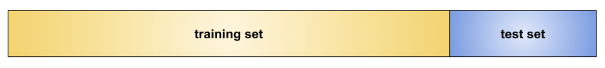
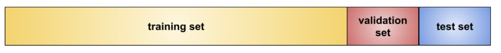
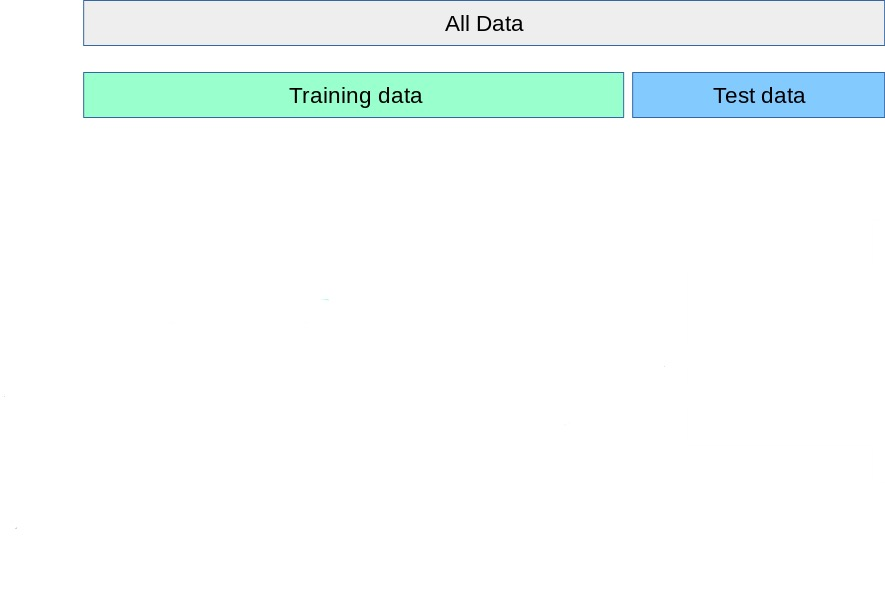
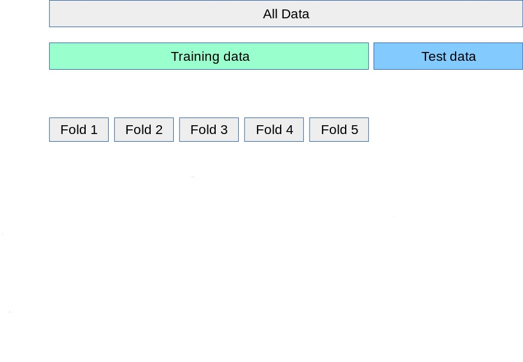
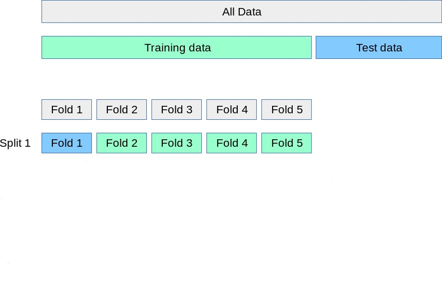
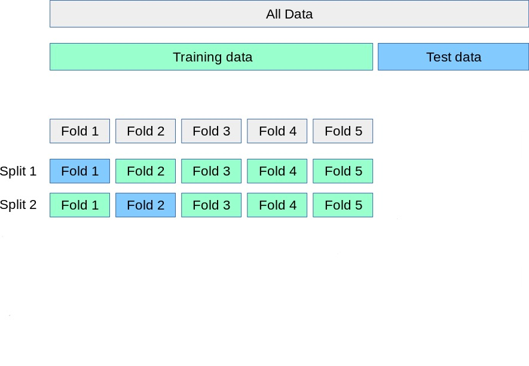
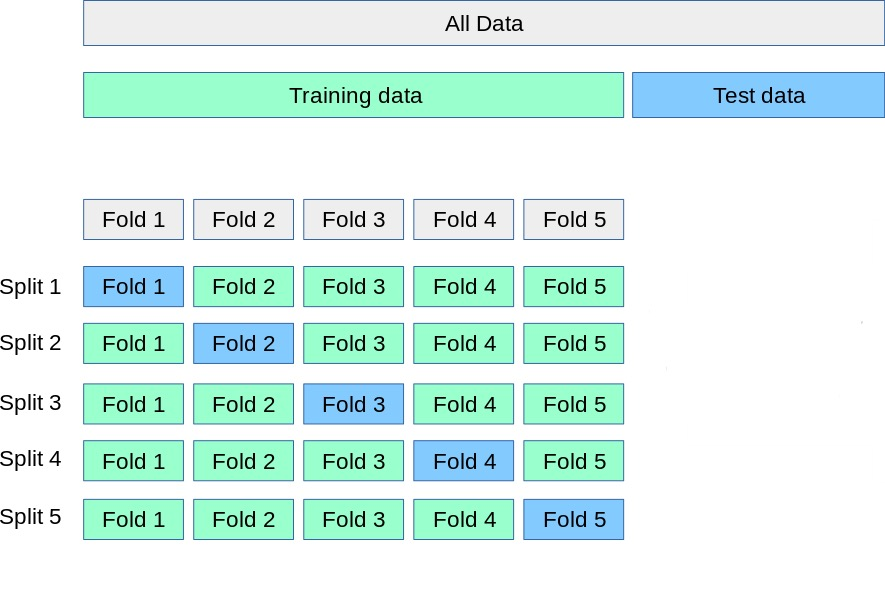
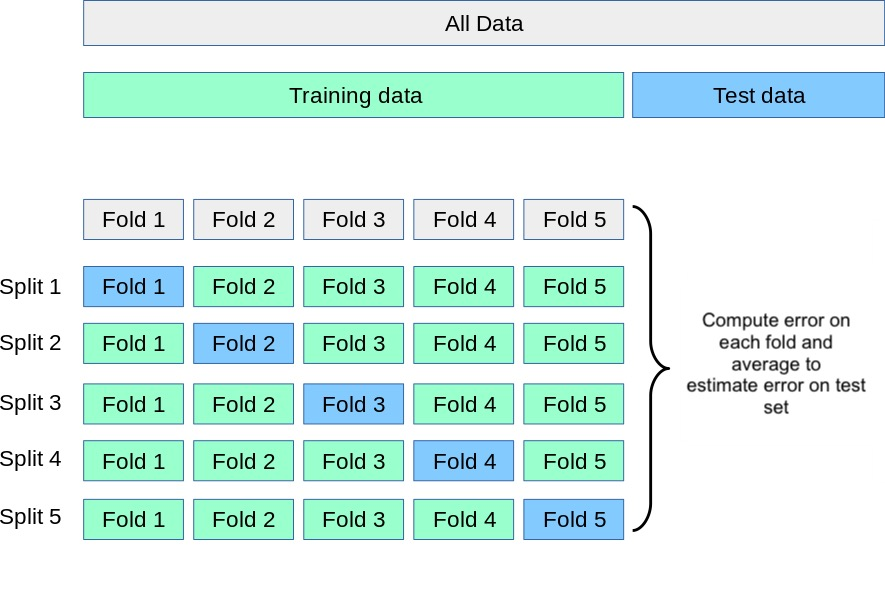
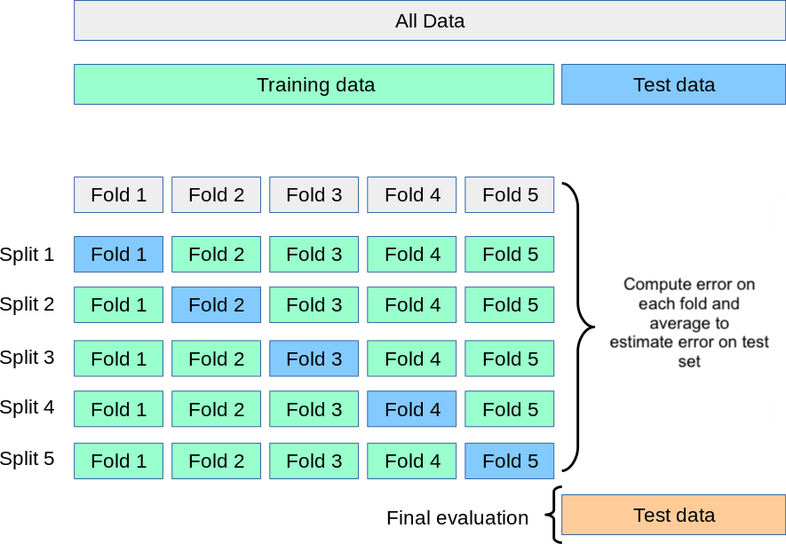
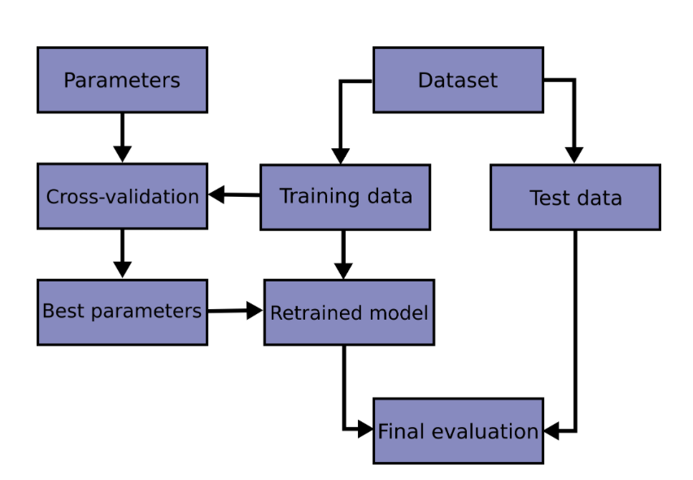

---
format:
    revealjs:
        theme: ../../styles/meds-slides-styles.scss
        slide-number: true
        chalkboard: true
        title-slide: false
jupyter: eds232-env
---

```{python}
#| echo: false
import numpy as np
import matplotlib.pyplot as plt
import pandas as pd
from sklearn.linear_model import LogisticRegression
from sklearn.neighbors import KNeighborsClassifier
from sklearn.model_selection import (train_test_split, cross_val_score,
                                      KFold, StratifiedKFold)
from sklearn.metrics import accuracy_score

plt.style.use('default')
fig_size_x = 8
fig_size_y = 4
plt.rcParams['font.size'] = 11
plt.rcParams['legend.fontsize'] = 'large'

# ── KelpWatch synthetic dataset ────────────────────────────────────────────────
np.random.seed(42)
n = 300

temp_anomaly = np.random.normal(0.4, 1.0, n)
nitrate      = np.random.normal(14, 4, n)
upwelling    = np.random.binomial(1, 0.5, n)

log_odds     = -0.8 + (-1.5 * temp_anomaly) + (0.10 * nitrate) + (1.8 * upwelling)
prob_healthy = 1 / (1 + np.exp(-log_odds))
status_num   = np.random.binomial(1, prob_healthy, n)
status       = np.where(status_num == 1, 'healthy', 'degraded')

df = pd.DataFrame({
    'temp_anomaly': temp_anomaly,
    'nitrate':      nitrate,
    'upwelling':    upwelling,
    'status':       status,
    'status_num':   status_num,
})

X = df[['temp_anomaly', 'nitrate']].values
y = df['status'].values

X_train, X_test, y_train, y_test = train_test_split(
    X, y, test_size=0.3, random_state=42, stratify=y
)

col_map = {'healthy': 'steelblue', 'degraded': 'tomato'}

# ── Precomputed values ─────────────────────────────────────────────────────────

# 1. Threshold naive selection
lr_thresh        = LogisticRegression(max_iter=1000)
lr_thresh.fit(X_train, (y_train == 'healthy').astype(int))
y_prob_test      = lr_thresh.predict_proba(X_test)[:, 1]
y_test_num       = (y_test == 'healthy').astype(int)
thresholds_naive = np.linspace(0.01, 0.99, 100)
test_accs_naive  = [accuracy_score(y_test_num, (y_prob_test >= t).astype(int))
                    for t in thresholds_naive]
best_naive_idx   = int(np.argmax(test_accs_naive))
best_naive_t     = thresholds_naive[best_naive_idx]
best_naive_acc   = test_accs_naive[best_naive_idx]
default_acc      = test_accs_naive[int(np.argmin(np.abs(thresholds_naive - 0.5)))]

# 2. CV accuracy curve for leakage illustration
cv5           = StratifiedKFold(n_splits=5, shuffle=True, random_state=42)
y_train_num   = (y_train == 'healthy').astype(int)
cv_accs_naive = []
for t in thresholds_naive:
    fold_accs = []
    for tr_idx, val_idx in cv5.split(X_train, y_train_num):
        lr_cv = LogisticRegression(max_iter=1000)
        lr_cv.fit(X_train[tr_idx], y_train_num[tr_idx])
        fold_accs.append(accuracy_score(
            y_train_num[val_idx],
            (lr_cv.predict_proba(X_train[val_idx])[:, 1] >= t).astype(int)
        ))
    cv_accs_naive.append(np.mean(fold_accs))
best_cv_naive_idx = int(np.argmax(cv_accs_naive))
best_cv_naive_t   = thresholds_naive[best_cv_naive_idx]
actual_test_at_cv = test_accs_naive[best_cv_naive_idx]

# 3. Validation set variability
np.random.seed(0)
val_errors = []
for _ in range(30):
    seed = np.random.randint(0, 10000)
    X_tr, X_val, y_tr, y_val = train_test_split(
        X_train, y_train, test_size=0.3, random_state=seed
    )
    lr_v = LogisticRegression(max_iter=1000)
    lr_v.fit(X_tr, (y_tr == 'healthy').astype(int))
    y_hat_label = np.where(lr_v.predict(X_val) == 1, 'healthy', 'degraded')
    val_errors.append(1 - accuracy_score(y_val, y_hat_label))

# 4. K-fold example (5-fold, accuracy / precision / recall)
kf_5        = KFold(n_splits=5, shuffle=True, random_state=42)
lr_kf       = LogisticRegression(max_iter=1000)
acc_scores  = cross_val_score(lr_kf, X_train, y_train, cv=kf_5, scoring='accuracy')
prec_scores = cross_val_score(lr_kf, X_train, y_train, cv=kf_5, scoring='precision_weighted')
rec_scores  = cross_val_score(lr_kf, X_train, y_train, cv=kf_5, scoring='recall_weighted')
kfold_results = pd.DataFrame({
    'Fold':      range(1, 6),
    'Accuracy':  np.round(acc_scores,  4),
    'Precision': np.round(prec_scores, 4),
    'Recall':    np.round(rec_scores,  4),
})

# 5. KNN CV selection (10-fold)
k_values  = range(1, 51)
kf_10     = KFold(n_splits=10, shuffle=True, random_state=42)
cv_errors = []
for k in k_values:
    knn    = KNeighborsClassifier(n_neighbors=k)
    scores = cross_val_score(knn, X_train, y_train, cv=kf_10, scoring='accuracy')
    cv_errors.append(1 - scores.mean())
best_k   = list(k_values)[int(np.argmin(cv_errors))]
best_err = min(cv_errors)

# 6. KNN final test evaluation
knn_final      = KNeighborsClassifier(n_neighbors=best_k)
knn_final.fit(X_train, y_train)
test_error_knn = 1 - accuracy_score(y_test, knn_final.predict(X_test))

# 7. Model comparison (10-fold)
kf_10b       = KFold(n_splits=10, shuffle=True, random_state=42)
knn_cv_sc    = cross_val_score(KNeighborsClassifier(n_neighbors=best_k),
                                X_train, y_train, cv=kf_10b, scoring='accuracy')
lr_single_sc = cross_val_score(LogisticRegression(max_iter=1000),
                                X_train[:, [0]], y_train, cv=kf_10b, scoring='accuracy')
lr_multi_sc  = cross_val_score(LogisticRegression(max_iter=1000),
                                X_train, y_train, cv=kf_10b, scoring='accuracy')
comparison_df = pd.DataFrame({
    'Model':    [f'KNN (K={best_k})', 'Logistic (temp only)', 'Logistic (temp + nitrate)'],
    'CV error': [f'{1 - knn_cv_sc.mean():.3f}',
                 f'{1 - lr_single_sc.mean():.3f}',
                 f'{1 - lr_multi_sc.mean():.3f}'],
})
```

## {#title-slide data-menu-title="Title Slide" background="#053660"}

[EDS 232]{.custom-title}

<hr class="hr-teal">

[Lesson 7]{.custom-subtitle}

[*Cross-validation*]{.custom-subtitle}

---

## {#in-this-lesson data-menu-title="In this lesson"}

[In this lesson]{.slide-title}

<hr>

<br>

- The validation set approach
- K-fold cross-validation and how to compute fold errors
- Using cross-validation to select hyperparameters
- Using cross-validation to compare models

---

## {#section-example data-menu-title="# A guiding example #" background="#047C90"}

<div class="page-center vertical-center">
<p class="custom-subtitle bottombr">A guiding example</p>
</div>

---

## {#kelpwatch data-menu-title="The KelpWatch dataset"}

[Our example dataset]{.slide-title}

<hr>

The same synthetic dataset from the previous lessons — 300 coastal monitoring stations:

<br>

::: {.body-text-m}
- **`temp_anomaly`** — sea surface temperature anomaly (°C)
- **`nitrate`** — nitrate concentration (μmol/L)
- **`status`** — kelp forest condition: *healthy* or *degraded*
:::

<br>

::: {.center-text .teal-text .body-text-m}
*Previous lesson: used logistic regression to predict kelp forest status.*

*Today: how to make that process more rigorous.*
:::

---

## {#kelpwatch-plot data-menu-title="KelpWatch: data overview"}

[Data overview]{.slide-title}

<hr>

```{python}
#| label: example-data-plot
#| echo: false
#| fig-align: center
#| out-width: "100%"

colors = {'healthy': 'steelblue', 'degraded': 'tomato'}
fig, ax = plt.subplots(figsize=(fig_size_x * 1.5, fig_size_y + 1.5))

for status_val, col in colors.items():
    mask = df['status'] == status_val
    ax.scatter(df.loc[mask, 'temp_anomaly'], df.loc[mask, 'nitrate'],
               c=col, s=25, alpha=0.6, edgecolors='none')

counts = df['status'].value_counts()
legend_labels = {s: f'{s} (n={counts[s]})' for s in colors}
handles = [plt.scatter([], [], c=col, s=50, label=legend_labels[s]) for s, col in colors.items()]
ax.legend(handles=handles, title='Status', fontsize=10, loc='upper left')
ax.set_xlabel('Temp. anomaly (°C)')
ax.set_ylabel('Nitrate (μmol/L)')
ax.grid(True, alpha=0.3)
plt.tight_layout()
plt.show()
plt.close()
```

::: {.center-text .body-text-s}
*Synthetic data generated for educational purposes only*
:::


---

## {#section-why-cv data-menu-title="# Why cross-validation? #" background="#047C90"}

<div class="page-center vertical-center">
<p class="custom-subtitle bottombr">Why cross-validation?</p>
</div>

---

## {#threshold-problem data-menu-title="Motivating example: threshold selection"}

[A motivating example]{.slide-title}

<hr>

Recall: we classify a site as healthy if $p(X) \geq \alpha$, degraded otherwise.


The default is $\alpha = 0.5$, but the best threshold for our data may be different.

. . .

<br>

**Idea:** try many values of $\alpha$, measure accuracy on the test set, pick the best.

```{python}
#| echo: false

print(f"Accuracy at default  α = 0.50:        {default_acc:.3f}")
print(f"Best threshold found on test set: α = {best_naive_t:.2f}")
print(f"Accuracy at that threshold:           {best_naive_acc:.3f}")
```

. . .

<br>

::: {.teal-text .body-text-m}
We found a threshold that beats the default: but is there something wrong with this process?
:::

---

## {#data-leakage data-menu-title="Data leakage"}

[Data leakage]{.slide-title}

<hr>

We **used the test set to make a modeling decision**: we examined the test set outcomes to figure out which threshold works best, then reported accuracy on those same observations.

<br>

We selected $\alpha$ *because* it happened to work well on these 90 test observations — not because it generalizes well.

. . .

<br>


This is called **data leakage**: information from the test set leaked into our modeling process. The reported accuracy is no longer an honest estimate of performance on truly new data.

---

## {#previous-workflow data-menu-title="The workflow so far"}

[The workflow we have been using]{.slide-title}

<hr>


1. Split data into a **training set** and a **test set**.
2. Fit the model on the training set.
3. Evaluate performance on the test set.



::: {.body-text-s}
Diagram from [Google's ML Concepts Crash Course.](https://developers.google.com/machine-learning/crash-course/overfitting/dividing-datasets)
:::

<br>

This works well to report metrics for a **single, already-decided model**, but breaks down when we need to make any modeling decision.


---

## {#cv-fix data-menu-title="The fix: cross-validation"}

[A fix: cross-validation]{.slide-title}

<hr>

We would want to:

- make all modeling decisions using only the training data,
- estimate the test set's accuracy metrics, and
- keep the test set sealed until the very final evaluation.

. . .

**Cross-validation** is a standard tool for doing this:

- splits the training data into temporary training and validation subsets, 
- fits the model on each split, and 
- averages the resulting errors to produce an estimate of test performance.


::: {.center-text .teal-text .body-text-m}
The test set is only used once, for the final reported result.
:::

---

## {#section-validation data-menu-title="# The validation set approach #" background="#047C90"}

<div class="page-center vertical-center">
<p class="custom-subtitle bottombr">The validation set approach</p>
</div>

---

## {#validation-approach data-menu-title="The validation set approach"}

[The validation set approach]{.slide-title}

<hr>

The simplest resampling method:

1. Randomly divide the training observations into a **training set** and a **validation set**.
2. Fit the model on the (smaller) training set.
3. Compute the error on the validation set.
4. The validation error **estimates the test error**.

<br>

{width=85%}

::: {.body-text-s}
Diagram from [Google's ML Concepts Crash Course.](https://developers.google.com/machine-learning/crash-course/overfitting/dividing-datasets)
:::

---

## {#validation-variability data-menu-title="Validation set: variability"}

[Drawback 1: high variance]{.slide-title}

<hr>

```{python}
#| echo: false
#| fig-align: center
#| out-width: "90%"

fig, ax = plt.subplots(figsize=(fig_size_x * 1.4, fig_size_y + 0.5))
ax.plot(range(1, 31), val_errors, 'o-', color='steelblue', linewidth=1.5, markersize=5)
ax.axhline(np.mean(val_errors), color='tomato', linestyle='--', linewidth=1.5,
           label=f'Mean error = {np.mean(val_errors):.3f}')
ax.set_xlabel('Validation split (different random seed each time)')
ax.set_ylabel('Validation error rate')
ax.set_title('Validation error varies across different random splits (63 pts in validation set) \n(logistic regression, two predictors on kelp data)')
ax.set_ylim(0, 0.5)
ax.legend()
ax.grid(True, alpha=0.3)
plt.tight_layout()
plt.show()
plt.close()
```

::: {.body-text-s .center-text}
Same model, same data, only the split changes. The error estimate varies substantially across splits.
:::

---

## {#validation-checkin data-menu-title="Check-in: validation set"}

[Check-in]{.slide-title}

<hr>

::: {.teal-text .body-text-m}
The training set for the kelp data has 210 points. 

If you used a 50/50 split (105 points for training / 105 for validation), 

what would be a bigger concern: 

the validation error being much higher or much lower than the test error?
:::

. . .

**The concern would be that the validation error is higher than the test error** the validation error estimates performance of a model trained on only 105 observations, but the final model will be trained on all 210. 

More training data almost always produces a better model, so the validation error *overestimates* the true test error. 

---

## {#validation-drawback2 data-menu-title="Validation set: drawback 2"}

[Drawback 2: missing training data]{.slide-title}

<hr>

<br>

Setting aside part of the training data for validation means the model is **fit on fewer observations than we will ultimately use**.

<br>


Models fit on less data tend to perform worse, so the validation error will tend to **overestimate** the true test error of the final model (which will be trained on all the data). This could lead to us selecting a sub-optimal model. 

<br>

. . .

::: {.center-text .teal-text .body-text-m}
K-fold cross-validation addresses both of these drawbacks.
:::

---

## {#section-kfold data-menu-title="# K-fold cross-validation #" background="#047C90"}

<div class="page-center vertical-center">
<p class="custom-subtitle bottombr">$k$-fold cross-validation</p>
</div>

---

## {#kfold-approach-1 data-menu-title="K-fold CV: approach"}

[$k$-fold cross-validation]{.slide-title}

<hr>


::: {.body-text-s}
Diagram adapted from [`scikit-learn`'s documentation on cross-validation](https://scikit-learn.org/stable/modules/cross_validation.html)
:::

---

## {#kfold-approach-2 data-menu-title="K-fold CV: approach"}

[$k$-fold cross-validation]{.slide-title}

<hr>



::: {.body-text-s}
Diagram adapted from [`scikit-learn`'s documentation on cross-validation](https://scikit-learn.org/stable/modules/cross_validation.html)
:::

---

## {#kfold-approach-3 data-menu-title="K-fold CV: approach"}

[$k$-fold cross-validation]{.slide-title}

<hr>



::: {.body-text-s}
Diagram adapted from [`scikit-learn`'s documentation on cross-validation](https://scikit-learn.org/stable/modules/cross_validation.html)
:::

---

## {#kfold-approach-4 data-menu-title="K-fold CV: approach"}

[$k$-fold cross-validation]{.slide-title}

<hr>



::: {.body-text-s}
Diagram adapted from [`scikit-learn`'s documentation on cross-validation](https://scikit-learn.org/stable/modules/cross_validation.html)
:::

---

## {#kfold-approach-5 data-menu-title="K-fold CV: approach"}

[$k$-fold cross-validation]{.slide-title}

<hr>



::: {.body-text-s}
Diagram adapted from [`scikit-learn`'s documentation on cross-validation](https://scikit-learn.org/stable/modules/cross_validation.html)
:::

---

## {#kfold-approach-6 data-menu-title="K-fold CV: approach"}

[$k$-fold cross-validation]{.slide-title}

<hr>



::: {.body-text-s}
Diagram adapted from [`scikit-learn`'s documentation on cross-validation](https://scikit-learn.org/stable/modules/cross_validation.html)
:::

---

## {#kfold-approach-7 data-menu-title="K-fold CV: approach"}

[$k$-fold cross-validation]{.slide-title}

<hr>



::: {.body-text-s}
Diagram adapted from [`scikit-learn`'s documentation on cross-validation](https://scikit-learn.org/stable/modules/cross_validation.html)
:::

---

## {#kfold-approach-8 data-menu-title="K-fold CV: approach"}

[$k$-fold cross-validation]{.slide-title}

<hr>



::: {.body-text-s}
Diagram adapted from [`scikit-learn`'s documentation on cross-validation](https://scikit-learn.org/stable/modules/cross_validation.html)
:::

---

## {#kfold-approach data-menu-title="K-fold CV: approach"}

[$k$-fold cross-validation]{.slide-title}

<hr>

A standard **resampling method**. We use the following steps:

1. Randomly divide the training set into $k$ roughly equal-sized **folds**.
2. Hold out fold 1 as the validation set; fit the model on the remaining $k - 1$ folds.
3. Compute the error $\text{Err}_1$ on the held-out fold.
4. Repeat for each of the $k$ folds.
5. Average the $k$ fold errors to get an estimate of the test error:

$$\text{CV}_{(k)} = \frac{1}{k} \sum_{i=1}^{k} \text{Err}_i$$

. . .

In practice, use **$k = 5$ or $k = 10$**: each fold trains on 80–90% of the data, fitting only 5 or 10 models.

---

## {#kfold-checkin data-menu-title="Check-in: K-fold CV"}

[Check-in]{.slide-title}

<hr>

::: {.teal-text .body-text-m}
Our dataset has 210 observations in the training set and 90 in the test set. By using 5-fold CV on our workflow:

1. How many observations are in each fold?
2. How many observations are used to train the model in each iteration?
:::

. . .

1. $210 / 5 = 42$ observations per fold.
2. $210 - 42 = 168$ observations for training in each iteration.

---

## {#fold-error data-menu-title="Computing the fold error"}

[Computing the fold error]{.slide-title}

<hr>

::: {.body-text-s}

We have:

- $(x_1, y_1), ... (x_n, y_n)$ = the training set which will be split into folds
- $n_i$ = number of observations in the $i$-th fold
- $\hat{y}_j$ = the prediction made on $y_j$ by the corresponding CV model

:::

. . .

How we measure $\text{Err}_i$ on the $i$-th fold depends on the type of problem.

**Regression**: typically use the Mean Squared Error (MSE):

$$\text{Err}_i = \frac{1}{n_i} \sum_{j \in \text{fold } i} (y_j - \hat{y}_j)^2$$

. . .

**Classification**: typically use the  error rate:

$$\text{Err}_i = \frac{\text{number of misclassified observations in $i$-th fold }}{\text{number of observations in $i$-th fold}}$$

---

## {#cv-caveats data-menu-title="Two caveats for practice"}

[Two caveats for implementation]{.slide-title}

<hr>

**Caveat 1: feature scaling must happen inside the CV loop**

Models that rely on distances (e.g., KNN) are sensitive to feature scale. If you standardize the full training set *before* splitting into folds, the validation fold's statistics were computed using the whole dataset (data leakage). The **scaler must be fit on the training folds only** and then applied to the validation fold.

. . .

<br>

**Caveat 2: use stratified folds for classification**

Plain k-fold shuffles without regard to class labels. For classification — especially with class imbalance — this can produce folds where one class is barely represented, making error estimates noisy. **Stratified K-fold** preserves the class proportion of the full training set in each fold and is the standard practice.

---

## {#section-hyperparameter data-menu-title="# Using CV to select a hyperparameter #" background="#047C90"}

<div class="page-center vertical-center">
<p class="custom-subtitle bottombr">Using CV to select a hyperparameter</p>
</div>

---

## {#hyperparameter-def data-menu-title="Hyperparameters"}

[Hyperparameters]{.slide-title}

<hr>

A **hyperparameter** is any setting chosen by the analyst that **cannot be learned from the training data** during model fitting. For example, the number of neighbors $K$ in the $K$-Nearest neihbors model

<br>

. . .

::: {.teal-text .body-text-m}
Choosing a hyperparameter by optimizing against the test set is  another example of data leakage.
:::

---

## {#hyperparameter-procedure data-menu-title="Hyperparameter selection procedure"}

[Selecting a hyperparameter with CV]{.slide-title}

<hr>

<br>

0. Identify the hyperparameter to tune.
1. For each hyperparameter candidate value, compute the $k$-fold CV error on the training set.
2. Select the hyperparameter value with the lowest CV error.
3. Refit the model using the selected hyperparameter on the full training set.
4. Evaluate the final model once on the test set to report the accuracy metrics.

<br>

. . .

::: {.center-text .teal-text .body-text-m}
The test set never influences the selection, so we are not inadvertently tuning our model to perform on the test set. 
:::

---

## {#knn-cv-plot data-menu-title="KNN: CV error vs K"}

[KNN hyperparameter selection: kelp data]{.slide-title}

<hr>

We decide to tune the hyperparameter $K$ using CV. 

For each value of $K$ we  estimate the test error rate using 10-fold CV. 

```{python}
#| echo: false
#| fig-align: center
#| out-width: "90%"

fig, ax = plt.subplots(figsize=(fig_size_x * 1.4, fig_size_y + 0.5))
ax.plot(k_values, cv_errors, color='steelblue', linewidth=2, label='10-fold CV error')
ax.scatter(best_k, best_err, color='tomato', s=90, zorder=5,
           label=f'Best K = {best_k}  (CV error = {best_err:.3f})')
ax.set_xlabel('K (number of neighbors)')
ax.set_ylabel('10-fold CV error rate')
ax.set_title('KNN: 10-fold CV error vs. K  (kelp training data, 210 observations)')
ax.legend()
ax.grid(True, alpha=0.3)
plt.tight_layout()
plt.show()
plt.close()
```

---

## {#knn-checkin-q data-menu-title="Check-in: KNN selection (Q)"}

[Check-in]{.slide-title}

<hr>

:::: {.columns}

::: {.column width="55%"}

```{python}
#| echo: false
#| fig-align: center
#| out-width: "100%"

fig, ax = plt.subplots(figsize=(fig_size_x * 0.95, fig_size_y + 0.5))
ax.plot(k_values, cv_errors, color='steelblue', linewidth=2, label='10-fold CV error')
ax.scatter(best_k, best_err, color='tomato', s=90, zorder=5,
           label=f'Best K = {best_k}  (CV error = {best_err:.3f})')
ax.set_xlabel('K (number of neighbors)')
ax.set_ylabel('10-fold CV error rate')
ax.legend(fontsize=9)
ax.grid(True, alpha=0.3)
plt.tight_layout()
plt.show()
plt.close()
```

:::

::: {.column width="45%"}

::: {.teal-text}
1. Once $K$ is selected, on what data would you fit the final model?

2. Why is using the test set to select $K$ not the best practice?
:::

:::

::::

---

## {#knn-checkin-a data-menu-title="Check-in: KNN selection (A)"}

[Check-in]{.slide-title}

<hr>

:::: {.columns}

::: {.column width="55%"}

```{python}
#| echo: false
#| fig-align: center
#| out-width: "100%"

fig, ax = plt.subplots(figsize=(fig_size_x * 0.95, fig_size_y + 0.5))
ax.plot(k_values, cv_errors, color='steelblue', linewidth=2, label='10-fold CV error')
ax.scatter(best_k, best_err, color='tomato', s=90, zorder=5,
           label=f'Best K = {best_k}  (CV error = {best_err:.3f})')
ax.set_xlabel('K (number of neighbors)')
ax.set_ylabel('10-fold CV error rate')
ax.legend(fontsize=9)
ax.grid(True, alpha=0.3)
plt.tight_layout()
plt.show()
plt.close()
```

:::

::: {.column width="45%"}

::: {.teal-text}
1. Once $K$ is selected, on what data would you fit the final model?

2. Why is using the test set to select $K$ not the best practice?
:::

1. On the full training set (all 210 obs). CV only informs the choice of $K$.

2. The test set would influence the modeling decision. The reported accuracy would reflect optimization for the specific test set observations, not true generalization.

:::

::::

---

## {#knn-test-eval data-menu-title="KNN: final test evaluation"}

[Final evaluation on the test set]{.slide-title}

<hr>

Once $K$ is selected via CV, refit on the full training set and evaluate once on the test set.

. . .

<br>

In our example data we obtain the following:

```{python}
#| echo: false

print(f"Selected K (via CV):   {best_k}")
print(f"CV error estimate:     {best_err:.4f}")
print(f"Actual test error:     {test_error_knn:.4f}")
```

<br>

If the CV error and test error are in a similar range, cross-validation gave us a reliable estimate of generalization before we ever touched the test set.

---

## {#model-comparison-q data-menu-title="Check-in: model comparison (Q)"}

[Comparing models with CV]{.slide-title}

<hr>

CV can be used to **compare different model types on the same training data before touching the test set**. 

Once a model is selected using CV, we can **refit on the full training set** and report its performance on the test set once, as a final evaluation. 

We **use the same folds for all models** so that differences in CV error reflect the model, not randomness in how the data was split.

. . .

:::: {.columns}

::: {.column width="50%"}

::: {.teal-text}
**Check-in**
:::

10-fold CV error for three candidate models on the kelp training data:

```{python}
#| echo: false

print(comparison_df.to_string(index=False))
```
:::

::: {.column width="50%"}

::: {.teal-text}
1. Which model would you select and why? What other considerations would you take into account to decide?

2. Earlier we saw that selecting the classification threshold using the test set leads to data leakage. How is using CV to compare these three models solving the same underlying problem?
:::

:::

::::

---

## {#cv-workflow data-menu-title="CV workflow diagram"}

[The full modeling workflow]{.slide-title}

<hr>

{width=70% fig-align="center"}

::: {.body-text-s}
Diagram from [`scikit-learn`'s documentation on cross-validation](https://scikit-learn.org/stable/modules/cross_validation.html)
:::

::: {.center-text}
CV guides decisions made during model development. 
:::