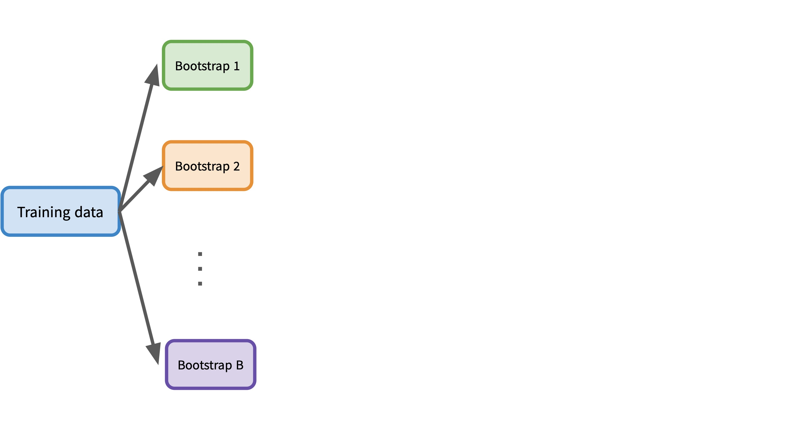
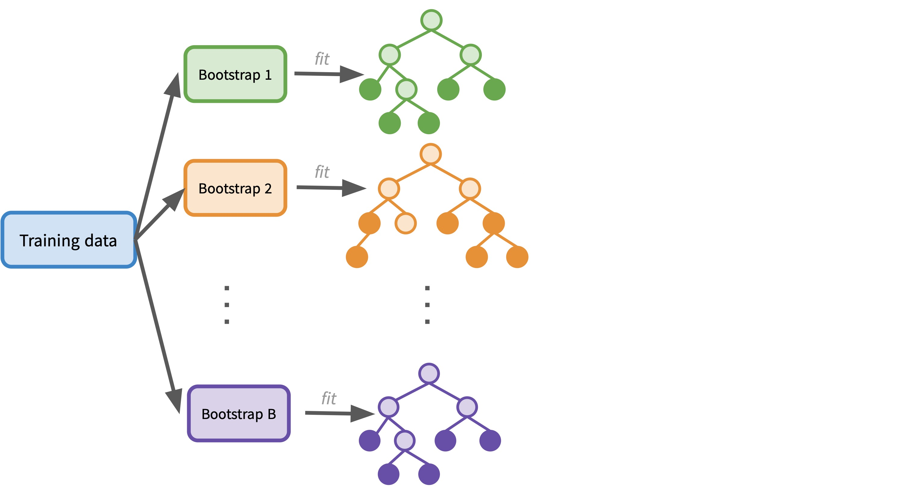
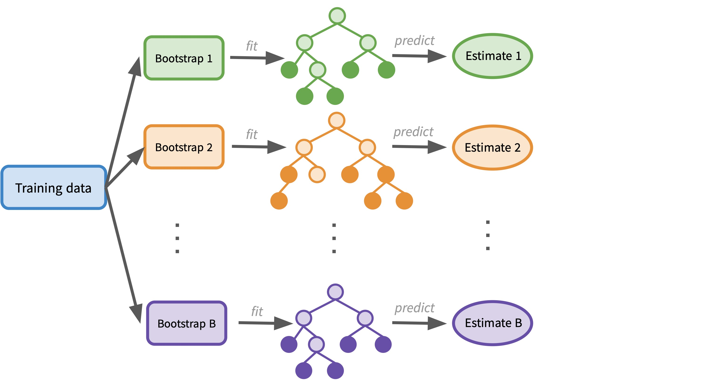
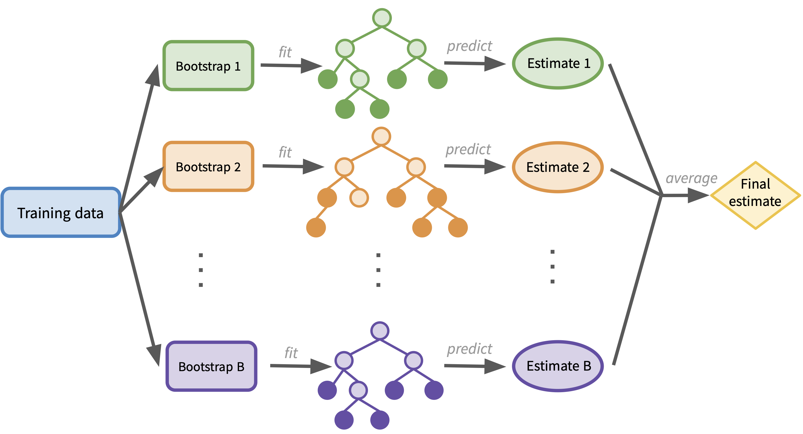
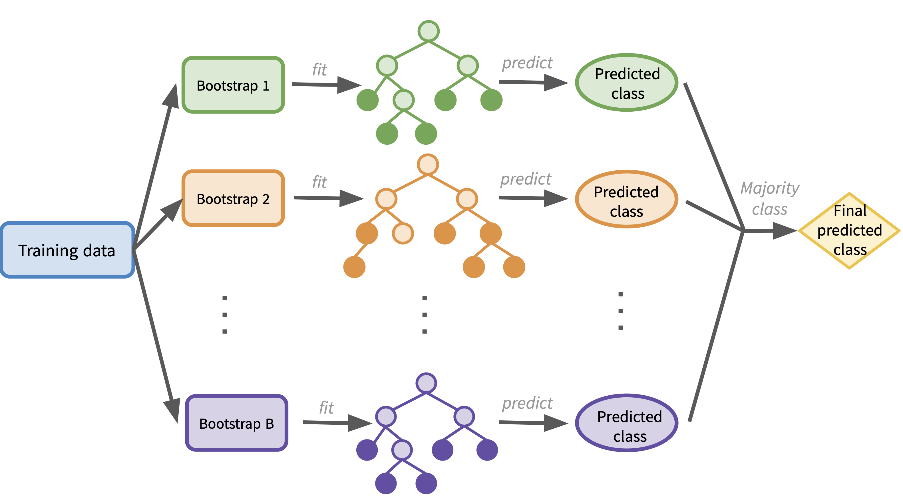
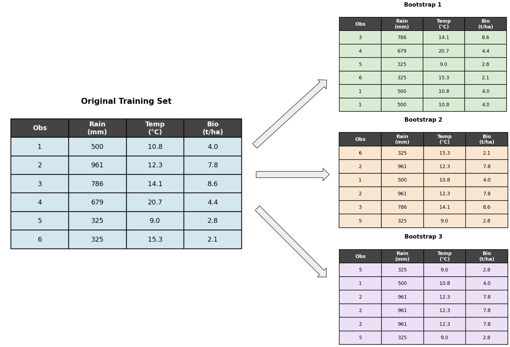

---
format:
    revealjs:
        theme: ../../styles/meds-slides-styles.scss
        slide-number: true
        chalkboard: true
        title-slide: false
jupyter: eds232-env
---

```{python}
#| echo: false
import numpy as np
import matplotlib.pyplot as plt
import matplotlib.patches as mpatches
from matplotlib.patches import FancyBboxPatch
import pandas as pd
from sklearn.tree import DecisionTreeRegressor
from sklearn.ensemble import BaggingRegressor, RandomForestRegressor
from sklearn.model_selection import train_test_split
import warnings

warnings.filterwarnings("ignore")

plt.style.use('default')
fig_size_x = 8
fig_size_y = 4
plt.rcParams['font.size'] = 11
plt.rcParams['legend.fontsize'] = 'large'

# ── EcoSite regression dataset (same as decision tree notes) ───────────────────
np.random.seed(42)
n = 22

rainfall    = np.random.uniform(200, 1000, n)
temperature = np.random.uniform(5,   25,   n)

biomass_base = np.where(
    rainfall > 600,
    np.where(temperature < 18, 8.5, 5.5),
    np.where(temperature < 15, 3.5, 2.0)
)
biomass = np.round(biomass_base + np.random.normal(0, 0.55, n), 1)
biomass = np.clip(biomass, 0.5, 12.0)

df = pd.DataFrame({'rainfall': rainfall, 'temperature': temperature, 'biomass': biomass})
X  = df[['rainfall', 'temperature']].values
y  = df['biomass'].values

# ── Train/test split (used in rf-vs-bagging) ───────────────────────────────────
X_train, X_test, y_train, y_test = train_test_split(X, y, test_size=0.25, random_state=42)

# ── Pre-fit models used across multiple slides ─────────────────────────────────
rf_vi = RandomForestRegressor(n_estimators=200, oob_score=True, random_state=42)
rf_vi.fit(X, y)

single_tree = DecisionTreeRegressor(random_state=42).fit(X_train, y_train)
single_tree_mse = np.mean((y_test - single_tree.predict(X_test))**2)

def draw_box(ax, x, y_pos, w, h, text, facecolor='#d0e8f1', fontsize=9):
    box = FancyBboxPatch((x - w/2, y_pos - h/2), w, h,
                         boxstyle='round,pad=0.08',
                         facecolor=facecolor, edgecolor='#555', linewidth=1.0)
    ax.add_patch(box)
    ax.text(x, y_pos, text, ha='center', va='center', fontsize=fontsize,
            multialignment='center')

def arrow(ax, x0, y0, x1, y1):
    ax.annotate('', xy=(x1, y1), xytext=(x0, y0),
                arrowprops=dict(arrowstyle='->', color='#555', lw=1.2))
```

## {#title-slide data-menu-title="Title Slide" background="#053660"}

[EDS 232]{.custom-title}

<hr class="hr-teal">

[Lesson 9]{.custom-subtitle}

[*Bagging and Random Forests*]{.custom-subtitle}

---

## {#in-this-lesson data-menu-title="In this lesson"}

[In this lesson]{.slide-title}

<hr>

<br>

::: {.body-text-m}
- **Ensemble methods** 
- **Bagging**: fitting many trees on bootstrap samples and averaging predictions
- **Out-of-bag error estimation**: an alternative to cross-validation
- **Random forests**: decorrelating trees by using a random subset of predictors at each split
:::

---

## {#section-variance data-menu-title="# The variance problem #" background="#047C90"}

<div class="page-center vertical-center">
<p class="custom-subtitle bottombr">The variance problem in decision trees</p>
</div>

---

## {#variance-problem data-menu-title="The variance problem"}

[The variance problem in decision trees]{.slide-title}

<hr>

::: {.body-text-m}
A single decision tree suffers from **high variance**: small changes in the training data can lead to very different trees and very different predictions. Deep trees are prone to overfitting.
:::

. . .

One general strategy for reducing variance:

::: {.body-text-m}
1. Take **many training sets** from the same population
2. Fit a separate model on each training set
3. Average the resulting predictions
:::

. . .

::: {.teal-text }
Core idea: The more uncorrelated the individual predictions are, the more variance reduction we get from averaging.
:::

. . .

**The challenge:** in practice we only have a single training set. **Bootstrapping** is a way around this.

---

## {#section-bagging data-menu-title="# Bagging #" background="#047C90"}

<div class="page-center vertical-center">
<p class="custom-subtitle bottombr">Bootsrapping & bagging</p>
</div>

---

## {#bootstrap-intro data-menu-title="What is bagging?"}

[Bootsrap]{.slide-title}

<hr>

**Bootstrapping:** generate a new training set by **sampling with replacement** from the original training set

- Each bootstrapped sample is the **same size** as the original
- Some observations appear **more than once**
- Some observations are **left out entirely**

. . .


```{python}
#| label: bootstrap-example-slide
#| echo: false
#| fig-align: center
#| out-width: "100%"

np.random.seed(0)
n_show = 6
df_show = df.iloc[:n_show].reset_index(drop=True)
df_show.index = df_show.index + 1

boots = []
for seed in [1, 2, 3]:
    rng  = np.random.default_rng(seed)
    idx  = rng.choice(n_show, size=n_show, replace=True)
    boot = df.iloc[idx].reset_index(drop=True)
    boot.index = boot.index + 1
    boots.append((idx + 1, boot))

col_colors = ['#d0e8f1', '#d6ecd2', '#fce5cd', '#ede0f7']
titles = ['Original', 'Bootstrap 1', 'Bootstrap 2', 'Bootstrap 3']

fig, axes = plt.subplots(1, 4, figsize=(fig_size_x * 1.9, fig_size_y * 0.95))

for ax_i, (ax, title, color) in enumerate(zip(axes, titles, col_colors)):
    if ax_i == 0:
        data = df_show
        obs_col = [str(i) for i in df_show.index]
    else:
        idx_list, boot_df = boots[ax_i - 1]
        data = boot_df
        obs_col = [str(i) for i in idx_list]

    rows = [[o, f'{r:.0f}', f'{t:.1f}', f'{b:.1f}']
            for o, (_, r), (_, t), (_, b)
            in zip(obs_col,
                   data['rainfall'].items(),
                   data['temperature'].items(),
                   data['biomass'].items())]

    col_labels = ['Obs', 'Rain\n(mm)', 'Temp\n(°C)', 'Bio\n(t/ha)']
    tbl = ax.table(cellText=rows, colLabels=col_labels,
                   loc='center', cellLoc='center')
    tbl.auto_set_font_size(False)
    tbl.set_fontsize(9)
    tbl.scale(1, 1.6)
    for j in range(4):
        tbl[(0, j)].set_facecolor('#444')
        tbl[(0, j)].set_text_props(color='white', fontweight='bold')
    for i in range(1, n_show + 1):
        for j in range(4):
            tbl[(i, j)].set_facecolor(color)
    ax.set_title(title, fontsize=11, fontweight='bold', pad=4)
    ax.axis('off')

plt.tight_layout()
plt.show()
plt.close()
```

---

## {#bagging-intro data-menu-title="What is bagging?"}

[Bagging — Bootstrap AGGregatING]{.slide-title}

<hr>

::: {.body-text-m}
**Bagging** is a method to generate an ensemble model by:

1. Generating many training sets from the single one we have by bootstrapping
2. Fitting a model on each bootstrapped sample
3. Then aggregate predictions to get a final prediction from the ensemble
:::
---

## {#bagging-regression-1 data-menu-title="Bagging for regression"}

[Bagging for regression]{.slide-title}

<hr>


---

## {#bagging-regression-2 data-menu-title="Bagging for regression"}

[Bagging for regression]{.slide-title}

<hr>



---

## {#bagging-regression-3 data-menu-title="Bagging for regression"}

[Bagging for regression]{.slide-title}

<hr>



---

## {#bagging-regression-4 data-menu-title="Bagging for regression"}

[Bagging for regression]{.slide-title}

<hr>



---

## {#bagging-regression-5 data-menu-title="Bagging for regression"}

[Bagging for regression]{.slide-title}

<hr>




---

## {#bagging-regression-6 data-menu-title="Bagging for regression"}

[Bagging for regression]{.slide-title}

<hr>

1. Generate $B$ bootstrapped training sets
2. Fit a decision tree on each bootstrapped training set
3. Obtain $B$ estimates $\hat{f}^{*1}(x), \ldots, \hat{f}^{*B}(x)$, one for each tree
4. Average the predictions:

$$\hat{f}_{\text{bag}}(x) = \frac{1}{B} \sum_{b=1}^{B} \hat{f}^{*b}(x)$$


::: {.teal-text .body-text-m}
**Check-in**

How would you modify the bagging workflow for a **classification** problem? What changes? Create the corresponding diagram.
:::

---

## {#bagging-classification data-menu-title="Bagging for regression"}

[Bagging for classification]{.slide-title}

<hr>

In the case of classification, the workflow is the same as the regression case, but the final aggregation step changes:

- Instead of **averaging** numerical predictions, take a **majority vote** across all $B$ trees
- The final prediction is the most commonly occurring class:



---

## {#section-oob data-menu-title="# OOB error estimation #" background="#047C90"}

<div class="page-center vertical-center">
<p class="custom-subtitle bottombr">Out-of-bag error estimation</p>
</div>

---

## {#oob-concept data-menu-title="OOB observations"}

[Out-of-bag observations]{.slide-title}

<hr>

When fitting each bootstrapped tree, some of the training observations are left out of that bootstrap sample. These are called the **out-of-bag (OOB) observations** for that tree.

. . .

:::: {.columns}

::: {.column width="55%"}



:::

::: {.column width="45%"}

::: {.teal-text .body-text-m}
Suppose your model has three trees fit on Bootstrap samples 1, 2, and 3 shown here. For which trees would observation 4 be an OOB observation?
:::

:::

::::

---

## {#oob-concept-2 data-menu-title="OOB observations"}

[Out-of-bag observations]{.slide-title}

<hr>

When fitting each bootstrapped tree, some of the training observations are left out of that bootstrap sample. These are called the **out-of-bag (OOB) observations** for that tree.

. . .

:::: {.columns}

::: {.column width="55%"}


:::

::: {.column width="45%"}

::: {.teal-text .body-text-m}
Suppose your model has three trees fit on Bootstrap samples 1, 2, and 3 shown here. For which trees would observation 4 be an OOB observation?
:::

Observation 4 does **not appear** in Bootstrap samples 2 and 3, so it is an OOB observation for those two trees.

:::

::::


---

## {#oob-error data-menu-title="OOB observations"}

[Out-of-bag error]{.slide-title}

<hr>

This gives us a way to estimate test error without cross-validation:

1. For each observation $(x_i, y_i)$, identify all trees for which it was OOB
2. Use only those trees to predict $x_i$ (average for regression, majority vote for classification)
3. Repeat for all $n$ training observations: get one OOB prediction per observation
4. Compute **MSE** (regression) or **classification error** from these OOB predictions

. . .

The OOB error is valid because each observation is predicted **only by trees that were not trained on it** — analogous to leave-one-out cross-validation, at no extra cost.

---

## {#choosing-b data-menu-title="Choosing B"}

[Choosing the number of trees B]{.slide-title}

<hr>

::: {.body-text-m}
Unlike tree depth, $B$ is **not a regularization parameter** — a very large $B$ does not cause overfitting. Pick a $B$ large enough that the OOB error stabilizes.
:::

```{python}
#| label: oob-error-vs-b-slide
#| echo: false
#| fig-align: center
#| out-width: "72%"

B_range = list(range(1, 201))
oob_mse_bag = []

for B in B_range:
    bag = BaggingRegressor(
        estimator=DecisionTreeRegressor(random_state=42),
        n_estimators=B, oob_score=True, bootstrap=True, random_state=42
    )
    bag.fit(X, y)
    preds = bag.oob_prediction_
    mask  = ~np.isnan(preds)
    oob_mse_bag.append(np.mean((y[mask] - preds[mask])**2) if mask.sum() >= 2 else np.nan)

oob_mse_bag = np.array(oob_mse_bag)

fig, ax = plt.subplots(figsize=(fig_size_x * 1.1, fig_size_y))
ax.plot(B_range, oob_mse_bag, color='steelblue', linewidth=1.8)
ax.set_xlabel('Number of trees B')
ax.set_ylabel('OOB MSE')
ax.set_title('OOB error as a function of the number of trees B')
ax.grid(True, alpha=0.3)
plt.tight_layout()
plt.show()
plt.close()
```

---

## {#section-varimp data-menu-title="# Variable importance #" background="#047C90"}

<div class="page-center vertical-center">
<p class="custom-subtitle bottombr">Variable importance</p>
</div>

---

## {#varimp-concept data-menu-title="Variable importance"}

[Variable importance]{.slide-title}

<hr>

::: {.body-text-m}
With $B$ trees we lose the direct interpretability of a single tree diagram. But we can still extract a useful summary of **which predictors matter most**.
:::

. . .

For each predictor, record the **total reduction in RSS** (regression) or **Gini impurity** (classification) achieved by splits on that predictor, averaged over all $B$ trees.

. . .

::: {.teal-text .body-text-m}
Predictors with larger average reductions are more important to the model's predictions.
:::

---

## {#checkin-varimp-q data-menu-title="Check-in: variable importance (question)"}

[Check-in]{.slide-title}

<hr>

:::: {.columns}

::: {.column width="57%"}

```{python}
#| label: variable-importance-slide-q
#| echo: false
#| fig-align: center
#| out-width: "100%"

importances = rf_vi.feature_importances_
feat_names  = ['Rainfall (mm)', 'Temperature (°C)']
order       = np.argsort(importances)

fig, ax = plt.subplots(figsize=(fig_size_x * 0.9, fig_size_y * 0.75))
colors_vi = ['steelblue', '#e07b39']
ax.barh([feat_names[i] for i in order], importances[order],
        color=[colors_vi[i] for i in order], edgecolor='white', height=0.5)
ax.set_xlabel('Mean decrease in RSS (normalized)')
ax.set_title('Variable importance — bagged regression trees')
ax.set_xlim(0, 1)
ax.grid(True, axis='x', alpha=0.3)
plt.tight_layout()
plt.show()
plt.close()
```

:::

::: {.column width="43%"}

::: {.teal-text .body-text-m}
1. Which predictor is most important for predicting biomass?
2. When creating the trees for the ensemble, which predictor would you expect to be used in the first split for most of them?
:::

:::

::::

---

## {#checkin-varimp-a data-menu-title="Check-in: variable importance (answer)"}

[Check-in]{.slide-title}

<hr>

:::: {.columns}

::: {.column width="57%"}

```{python}
#| label: variable-importance-slide-a
#| echo: false
#| fig-align: center
#| out-width: "100%"

fig, ax = plt.subplots(figsize=(fig_size_x * 0.9, fig_size_y * 0.75))
ax.barh([feat_names[i] for i in order], importances[order],
        color=[colors_vi[i] for i in order], edgecolor='white', height=0.5)
ax.set_xlabel('Mean decrease in RSS (normalized)')
ax.set_title('Variable importance — bagged regression trees')
ax.set_xlim(0, 1)
ax.grid(True, axis='x', alpha=0.3)
plt.tight_layout()
plt.show()
plt.close()
```

:::

::: {.column width="43%"}

::: {.teal-text .body-text-m}
1. Which predictor is most important for predicting biomass?
2. When creating the trees for the ensemble, which predictor would you expect to be used in the first split for most of them?
:::

1. **Rainfall** — it has the largest average RSS reduction across all trees.
2. **Rainfall** — consistent with the decision tree lesson, where the root node always split on rainfall first.

:::

::::

---

## {#section-rf data-menu-title="# Random forests #" background="#047C90"}

<div class="page-center vertical-center">
<p class="custom-subtitle bottombr">Random forests</p>
</div>

---

## {#rf-concept data-menu-title="Random forests: the idea"}

[Random forests: decorrelating the trees]{.slide-title}

<hr>

::: {.body-text-m}
**Problem with bagging:** if one predictor is very strongly associated with the response, nearly every tree will use it as the top split → the $B$ trees look similar → they are **correlated** → averaging correlated predictions does not reduce variance much.
:::

. . .

**Random forests** fix this by introducing randomness **at each split**:

::: {.body-text-m}
- At each split, randomly select a subset of $m < p$ predictors as candidates
- A **fresh random subset** is drawn at every split
- Typical defaults: $m = \sqrt{p}$ (classification), $m = p/3$ (regression)
:::

. . .

::: {.teal-text .body-text-m}
No single strong predictor can dominate every tree → trees are more diverse → averaging produces a larger reduction in variance.
:::

---

## {#checkin-rf-split data-menu-title="Check-in: fresh subset at each split"}

[Check-in]{.slide-title}

<hr>

::: {.teal-text .body-text-m}
Suppose you are building one tree in a random forest with predictors {`rainfall`, `temperature`, `elevation`, `soil moisture`} ($p = 4$, $m = 2$).

At the root node the algorithm randomly selects {`rainfall`, `elevation`} and splits on `rainfall`. At the **next node**, which predictors are available to split on?
:::

. . .

A **new** random sample of 2 predictors is drawn independently — it could be any pair, including ones used before. The previous split does **not** restrict future splits.

---

## {#rf-vs-bagging-slide data-menu-title="RF vs. bagging vs. single tree"}

[Random forest vs. bagging vs. single tree]{.slide-title}

<hr>

```{python}
#| label: rf-vs-bagging-slide
#| echo: false
#| fig-align: center
#| out-width: "78%"

B_range  = list(range(1, 201))
mse_bag  = []
mse_rf   = []

for B in B_range:
    bag = BaggingRegressor(
        estimator=DecisionTreeRegressor(random_state=42),
        n_estimators=B, bootstrap=True, random_state=42
    )
    bag.fit(X_train, y_train)
    mse_bag.append(np.mean((y_test - bag.predict(X_test))**2))

    rf = RandomForestRegressor(n_estimators=B, random_state=42)
    rf.fit(X_train, y_train)
    mse_rf.append(np.mean((y_test - rf.predict(X_test))**2))

mse_bag = np.array(mse_bag)
mse_rf  = np.array(mse_rf)

fig, ax = plt.subplots(figsize=(fig_size_x * 1.2, fig_size_y))
ax.axhline(single_tree_mse, color='#888', linewidth=1.4, linestyle='--',
           label=f'Single decision tree (test MSE = {single_tree_mse:.2f})')
ax.plot(B_range, mse_bag, color='steelblue', linewidth=1.8, label='Bagging')
ax.plot(B_range, mse_rf,  color='#e07b39',  linewidth=1.8, label='Random forest')
ax.set_xlabel('Number of trees B')
ax.set_ylabel('Test MSE')
ax.set_title('Test MSE: single tree vs. bagging vs. random forest')
ax.legend(fontsize=10)
ax.grid(True, alpha=0.3)
plt.tight_layout()
plt.show()
plt.close()
```

---

## {#checkin-m-equals-p data-menu-title="Check-in: m = p"}

[Check-in]{.slide-title}

<hr>

::: {.teal-text .body-text-m}
If $m = p$ (we use all predictors at every split), how does a random forest relate to bagging?
:::

. . .

When $m = p$, random forests **reduce to bagging exactly** — there is no restriction on which predictors can be considered, so every tree is built the same way as a bagged tree.

. . .

<br>

::: {.teal-text .body-text-m}
When would you expect a random forest to outperform bagging the most?
:::

. . .

When there are **one or a few dominant predictors**: bagged trees become too similar to each other, while random forests force diversity by sometimes excluding the dominant predictor from consideration.
