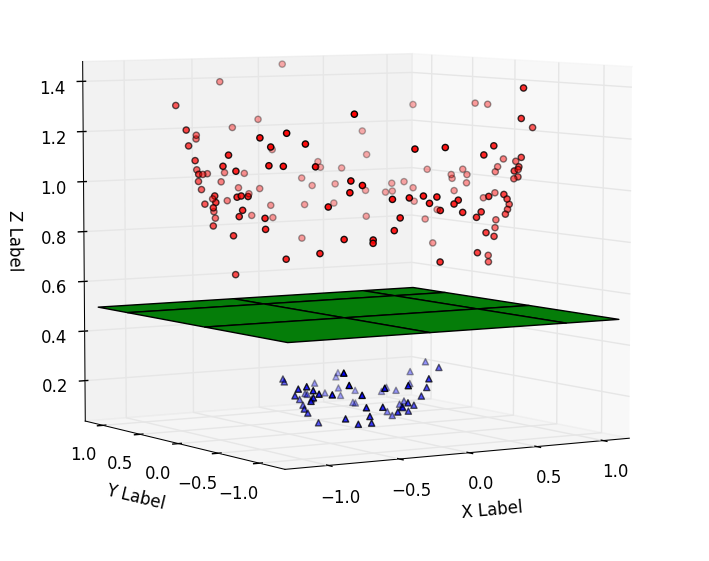

---
format:
    revealjs:
        theme: ../../../styles/meds-slides-styles.scss
        slide-number: true
        chalkboard: true
        title-slide: false
jupyter: eds232-env
---

```{python}
#| echo: false
import numpy as np
import matplotlib.pyplot as plt
import pandas as pd
from sklearn.svm import SVC
from sklearn.datasets import make_blobs
from mpl_toolkits.mplot3d import Axes3D

plt.style.use('default')
fig_size_x = 8
fig_size_y = 4
plt.rcParams['font.size'] = 10

col_map   = {1: 'tomato', -1: 'steelblue'}
label_map = {1: 'Class 1',   -1: 'Class −1'}

# ── Linearly separable dataset (maximal margin classifier) ────────────────────
np.random.seed(42)
X_sep, y_raw = make_blobs(n_samples=30,
                           centers=[[2, 1], [-2, -1]],
                           cluster_std=0.75, random_state=42)
y_sep = np.where(y_raw == 0, 1, -1)

# Hard-margin SVM (large C ≈ maximal margin classifier)
svc_hard = SVC(kernel='linear', C=1e6)
svc_hard.fit(X_sep, y_sep)

# ── Simple 4-point dataset for the check-in ──────────────────────────────────
X_4pt = np.array([[2, 1], [3, 4], [-2, -1], [-3, -4]], dtype=float)
y_4pt = np.array([1, 1, -1, -1])
svc_4pt = SVC(kernel='linear', C=1e6)
svc_4pt.fit(X_4pt, y_4pt)

# ── Overlapping dataset (support vector classifier) ───────────────────────────
np.random.seed(7)
X_soft, y_raw2 = make_blobs(n_samples=60,
                              centers=[[1.5, 0.5], [-1.5, -0.5]],
                              cluster_std=1.2, random_state=7)
y_soft = np.where(y_raw2 == 0, 1, -1)

# ── Shared helper: draw linear SVC boundary ───────────────────────────────────
def plot_svc_boundary(ax, svc, X, show_margin=True, show_sv=True, x_pad=0.8):
    w = svc.coef_[0]
    b = svc.intercept_[0]
    x_min = X[:, 0].min() - x_pad
    x_max = X[:, 0].max() + x_pad
    xx = np.linspace(x_min, x_max, 300)

    def line(offset=0):
        return -(w[0] * xx + b - offset) / w[1]

    ax.plot(xx, line(0), 'k-', lw=2, label='Decision boundary')
    if show_margin:
        ax.plot(xx, line(1),  'k--', lw=1.2, alpha=0.5)
        ax.plot(xx, line(-1), 'k--', lw=1.2, alpha=0.5, label='Margin boundary')
        ax.fill_between(xx, line(1), line(-1),
                        alpha=0.08, color='gray', label='Margin')
    if show_sv:
        sv = svc.support_vectors_
        ax.scatter(sv[:, 0], sv[:, 1], s=150,
                   facecolors='none', edgecolors='black',
                   linewidths=1.8, zorder=5, label='Support vectors')
    ax.set_xlim(x_min, x_max)
    return xx, line
```

## {#title-slide data-menu-title="Title Slide" background="#053660"}

[EDS 232]{.custom-title}

<hr class="hr-teal">

[Lesson 9]{.custom-subtitle}

[*Support vector classifier*]{.custom-subtitle}

---

## {#in-this-lesson data-menu-title="In this lesson"}

[In this lesson]{.slide-title}

<hr>

<br>

- **Separating hyperplanes** as linear decision boundaries for binary classification
- The **maximal margin classifier** and the concept of the **margin**
- **Support vectors** and why they uniquely determine the classifier
- The **support vector classifier** as a soft-margin generalization
- The hyperparameter $C$ and the resulting bias–variance tradeoff

---

## {#section-mmc data-menu-title="# Maximal margin classifier #" background="#047C90"}

<div class="page-center vertical-center">
<p class="custom-subtitle bottombr">Maximal margin classifier</p>
</div>

---

## {#separable-scatter-slide data-menu-title="Separating lines"}

[Two linearly separable classes]{.slide-title}

<hr>

Consider a dataset with two predictors $X_1$, $X_2$ and a binary response with classes $+1$ and $-1$.

```{python}
#| label: separable-scatter
#| echo: false
#| fig-align: center
#| out-width: "55%"

fig, ax = plt.subplots(figsize=(fig_size_x * 0.7, fig_size_y + 0.5))
for cls in [1, -1]:
    mask = y_sep == cls
    ax.scatter(X_sep[mask, 0], X_sep[mask, 1],
               c=col_map[cls], s=40, alpha=0.8,
               edgecolors='none', label=label_map[cls])
ax.set_xlabel('$X_1$')
ax.set_ylabel('$X_2$')
ax.set_xlim(-4, 4)
ax.set_ylim(-4, 4)
ax.grid(True, alpha=0.3)
ax.legend(loc='upper center', bbox_to_anchor=(0.5, -0.20), ncol=2, fontsize=9)
plt.tight_layout(rect=[0, 0.18, 1, 1])
plt.show()
plt.close()
```

::: {.body-text-s .center-text}
Assume for now that the two classes can be **perfectly separated** by a line. Any such line is called a **separating line**.
:::

---

## {#multiple-lines-slide data-menu-title="Infinitely many separating lines"}

[Infinitely many separating lines]{.slide-title}

<hr>

Whenever the classes are perfectly separable, there are **infinitely many** valid separating lines.

```{python}
#| label: multiple-lines
#| echo: false
#| fig-align: center
#| out-width: "55%"

w = svc_hard.coef_[0]
b = svc_hard.intercept_[0]

x_plt = np.linspace(-4, 4, 300)

def line_from_ab(a, c):
    return a * x_plt + c

lines = [
    (line_from_ab(-2.0,  0.0),  'solid',   'steelblue', 'Line A'),
    (line_from_ab(-2.0,  1.8),  'dashed',  'seagreen',  'Line B'),
    (line_from_ab(-0.5,  0.0),  'dotted',  'darkorange','Line C'),
]

fig, ax = plt.subplots(figsize=(fig_size_x * 0.7, fig_size_y + 0.5))
for cls in [1, -1]:
    mask = y_sep == cls
    ax.scatter(X_sep[mask, 0], X_sep[mask, 1],
               c=col_map[cls], s=40, alpha=0.8, edgecolors='none',
               label=label_map[cls])
for y_line, ls, color, lbl in lines:
    ax.plot(x_plt, y_line, color=color, linestyle=ls, lw=1.8, label=lbl)
ax.set_xlim(-4, 4)
ax.set_ylim(-4, 4)
ax.set_xlabel('$X_1$')
ax.set_ylabel('$X_2$')
ax.grid(True, alpha=0.3)
plt.tight_layout(rect=[0, 0.18, 1, 1])
plt.show()
plt.close()
```

::: {.body-text-s .center-text}
All three lines correctly separate every Class 1 observation from every Class −1 observation.
:::

::: {.center-text}
**How do we select the "best" one?**
:::

---

## {#margin-slide data-menu-title="The margin"}

[The margin]{.slide-title}

<hr>

The **margin** is the smallest perpendicular distance from the separating line to *any* training observation.

```{python}
#| label: margin-comparison
#| echo: false
#| fig-align: center
#| out-width: "95%"

def draw_margin_panel(ax, slope, intercept, title, show_legend=False):
    norm = np.sqrt(slope**2 + 1)
    sd = (slope * X_sep[:, 0] - X_sep[:, 1] + intercept) / norm
    pos_cls, neg_cls = (1, -1) if sd[y_sep == 1].mean() > 0 else (-1, 1)
    d_pos  = sd[y_sep == pos_cls].min()
    d_neg  = sd[y_sep == neg_cls].max()
    margin = min(d_pos, -d_neg)
    yint_pos = intercept - d_pos * norm
    yint_neg = intercept - d_neg * norm
    xx = np.linspace(-4, 4, 300)
    for cls in [1, -1]:
        mask = y_sep == cls
        ax.scatter(X_sep[mask, 0], X_sep[mask, 1],
                   c=col_map[cls], s=30, alpha=0.8, edgecolors='none',
                   label=label_map[cls] if show_legend else '_nolegend_')
    ax.plot(xx, slope * xx + intercept, 'k-', lw=1.8,
            label='Separating line' if show_legend else '_nolegend_')
    ax.plot(xx, slope * xx + yint_pos, 'k--', lw=1.0, alpha=0.5,
            label='Margin boundary' if show_legend else '_nolegend_')
    ax.plot(xx, slope * xx + yint_neg, 'k--', lw=1.0, alpha=0.5)
    ax.fill_between(xx, slope * xx + yint_pos, slope * xx + yint_neg,
                    alpha=0.12, color='gray',
                    label='Margin region' if show_legend else '_nolegend_')
    ax.set_xlim(-4, 4)
    ax.set_ylim(-4, 4)
    ax.set_xlabel('$X_1$')
    ax.set_title(f'{title}\nMargin = {margin:.2f}', fontsize=9)
    ax.grid(True, alpha=0.3)

fig, axes = plt.subplots(1, 3,
                          figsize=(fig_size_x * 1.3, fig_size_y + 1.3),
                          sharey=True)
fig.subplots_adjust(wspace=0.06)
draw_margin_panel(axes[0], -2.0,  0.0, 'Line A', show_legend=True)
draw_margin_panel(axes[1], -2.0,  1.8, 'Line B')
draw_margin_panel(axes[2], -0.5,  0.0, 'Line C')
axes[0].set_ylabel('$X_2$')
handles, labels_leg = axes[0].get_legend_handles_labels()
fig.legend(handles, labels_leg, loc='lower center', ncol=4, fontsize=9,
           bbox_to_anchor=(0.5, -0.03))
plt.tight_layout(rect=[0, 0.15, 1, 1])
plt.show()
plt.close()
```

::: {.body-text-s .center-text}
The **maximal margin classifier** selects the separating line that **maximizes the margin**.
:::

---

## {#maximal-margin-slide data-menu-title="Maximal margin classifier"}

[Maximal margin classifier]{.slide-title}

<hr>

:::: {.columns}

::: {.column width="50%"}

```{python}
#| label: maximal-margin
#| echo: false
#| fig-align: center
#| out-width: "100%"

fig, ax = plt.subplots(figsize=(fig_size_x * 0.7, fig_size_y + 0.5))
for cls in [1, -1]:
    mask = y_sep == cls
    ax.scatter(X_sep[mask, 0], X_sep[mask, 1],
               c=col_map[cls], s=40, alpha=0.8, edgecolors='none',
               label=label_map[cls])
_, line_fn = plot_svc_boundary(ax, svc_hard, X_sep,
                                show_margin=True, show_sv=False)
ax.set_xlabel('$X_1$')
ax.set_ylabel('$X_2$')
ax.set_xlim(-4, 4)
ax.set_ylim(-4, 4)
ax.set_title('Maximal margin classifier')
ax.grid(True, alpha=0.3)
ax.legend(loc='upper center', bbox_to_anchor=(0.5, -0.20), ncol=3, fontsize=9)
plt.tight_layout(rect=[0, 0.18, 1, 1])
plt.show()
plt.close()
```

:::

::: {.column width="50%"}

::: {.body-text-m}
The **maximal margin classifier** selects the line **furthest away from all training observations**.

<br>

A wider margin signals greater classification confidence: the space between the two classes is as wide as possible.
:::

:::

::::

---

## {#classification-regions-slide data-menu-title="Classification regions"}

[Classification regions]{.slide-title}

<hr>

Once we have the maximal margin line, it defines two **classification regions**:

```{python}
#| label: classification-regions
#| echo: false
#| fig-align: center
#| out-width: "55%"

np.random.seed(13)
X_test_cls, y_test_raw_cls = make_blobs(n_samples=30,
                                          centers=[[2, 1], [-2, -1]],
                                          cluster_std=1.8, random_state=13)
y_test_cls = np.where(y_test_raw_cls == 0, 1, -1)

xx_cr, yy_cr = np.meshgrid(np.linspace(-4, 4, 300), np.linspace(-4, 4, 300))
Z_cr = svc_hard.predict(np.c_[xx_cr.ravel(), yy_cr.ravel()]).reshape(xx_cr.shape)

fig, ax = plt.subplots(figsize=(fig_size_x * 0.7, fig_size_y + 0.5))
ax.contourf(xx_cr, yy_cr, Z_cr, levels=[-1.5, 0, 1.5],
            colors=['steelblue', 'tomato'], alpha=0.2)
ax.contour(xx_cr, yy_cr, Z_cr, levels=[0], colors='gray', linewidths=1.5)
for cls in [1, -1]:
    mask = y_test_cls == cls
    ax.scatter(X_test_cls[mask, 0], X_test_cls[mask, 1],
               c=col_map[cls], s=30, alpha=0.8, edgecolors='none',
               label=label_map[cls])
ax.set_xlim(-4, 4)
ax.set_ylim(-4, 4)
ax.set_xlabel('$X_1$')
ax.set_ylabel('$X_2$')
ax.set_title('Test data — classification regions')
ax.grid(True, alpha=0.3)
ax.legend(loc='upper center', bbox_to_anchor=(0.5, -0.20), ncol=2, fontsize=9)
plt.tight_layout(rect=[0, 0.18, 1, 1])
plt.show()
plt.close()
```

::: {.body-text-s .center-text}
Observations far from the boundary are classified with high certainty. Points near the boundary are more ambiguous.

Observations in the **wrong-colored region** are misclassified.
:::

---

## {#support-vectors-slide data-menu-title="Support vectors"}

[Support vectors]{.slide-title}

<hr>

:::: {.columns}

::: {.column width="50%"}

```{python}
#| label: support-vectors
#| echo: false
#| fig-align: center
#| out-width: "100%"

fig, ax = plt.subplots(figsize=(fig_size_x * 0.7, fig_size_y + 0.5))
for cls in [1, -1]:
    mask = y_sep == cls
    ax.scatter(X_sep[mask, 0], X_sep[mask, 1],
               c=col_map[cls], s=40, alpha=0.8, edgecolors='none',
               label=label_map[cls])
_, line_fn = plot_svc_boundary(ax, svc_hard, X_sep,
                                show_margin=True, show_sv=True)
ax.set_xlim(-4, 4)
ax.set_ylim(-4, 4)
ax.set_xlabel('$X_1$')
ax.set_ylabel('$X_2$')
ax.set_title('Maximal margin classifier')
ax.grid(True, alpha=0.3)
ax.legend(loc='upper center', bbox_to_anchor=(0.5, -0.20), ncol=3, fontsize=9)
plt.tight_layout(rect=[0, 0.18, 1, 1])
plt.show()
plt.close()
```

:::

::: {.column width="50%"}

::: {.body-text-m}
**Support vectors** are the training observations that lie exactly on the margin boundary (circled).

<br>

The maximal margin classifier **depends only on the support vectors** — moving any other observation (while keeping it on the same side of the margin) has no effect on the classifier.
:::

:::

::::

---

## {#checkin-svc-q data-menu-title="Check-in: margin & support vectors"}

[Check-in]{.slide-title}

<hr>

We have two training datasets. For each one:

::: {.teal-text .body-text-m}
1. Draw the maximal margin line and identify the support vectors.
2. How does the line change when we go from the 2-point to the 5-point dataset?
3. Find the equation of the maximal margin line for the 2-point dataset.
4. For a point above the maximal margin line, is $x_1 - x_2$ positive or negative? What about below?
5. How does the sign of $x_1 - x_2$ relate to the classification regions?
:::

| Obs | $X_1$ | $X_2$ | Class |
|:---:|:---:|:---:|:---:|
| 1 | 0 | 1 | +1 |
| 2 | 1 | 0 | −1 |

| Obs | $X_1$ | $X_2$ | Class |
|:---:|:---:|:---:|:---:|
| 1 | 0 | 1 | +1 |
| 2 | 1 | 0 | −1 |
| 3 | 2 | −1 | −1 |
| 4 | −1 | −3 | −1 |
| 5 | −1 | 2 | +1 |

---

## {#checkin-svc-a data-menu-title="Check-in: margin & support vectors (answers)"}

[Check-in]{.slide-title}

<hr>

:::: {.columns}

::: {.column width="55%"}

```{python}
#| label: checkin-margin-plot
#| echo: false
#| fig-align: center
#| out-width: "100%"

X_2pt = np.array([[0.0, 1.0], [1.0, 0.0]])
y_2pt = np.array([1, -1])
svc_2pt = SVC(kernel='linear', C=1e6)
svc_2pt.fit(X_2pt, y_2pt)

X_5pt = np.array([[0.0, 1.0], [1.0, 0.0], [2.0, -1.0], [-1.0, -3.0], [-1.0, 2.0]])
y_5pt = np.array([1, -1, -1, -1, 1])
svc_5pt = SVC(kernel='linear', C=1e6)
svc_5pt.fit(X_5pt, y_5pt)

ann_2pt = [(-0.22, 0.22), ( 0.22, -0.22)]
ann_5pt = [(-0.30, 0.22), ( 0.22, -0.22), ( 0.22, -0.24),
           (-0.28, -0.30), (-0.34,  0.22)]

fig, axes = plt.subplots(1, 2, figsize=(fig_size_x * 1.1, fig_size_y + 0.5))
fig.subplots_adjust(wspace=0.30)

datasets_ci = [
    (axes[0], X_2pt, y_2pt, svc_2pt, ann_2pt,
     (-2.5, 2.5), (-2.5, 2.5),
     '2-observation set\nBoth are support vectors'),
    (axes[1], X_5pt, y_5pt, svc_5pt, ann_5pt,
     (-2.5, 3.5), (-4.5, 3.5),
     '5-observation set\nOnly obs 1 and 2 are SVs'),
]

for i, (ax, X_d, y_d, svc_d, offsets, xlim, ylim, title) in enumerate(datasets_ci):
    for cls in [1, -1]:
        mask = y_d == cls
        ax.scatter(X_d[mask, 0], X_d[mask, 1],
                   c=col_map[cls], s=80, alpha=0.9, edgecolors='none',
                   label=label_map[cls])
    for j, (dx, dy) in enumerate(offsets):
        ax.text(X_d[j, 0] + dx, X_d[j, 1] + dy, str(j + 1),
                fontsize=9, ha='center', va='center', fontweight='bold')
    w_d = svc_d.coef_[0]; b_d = svc_d.intercept_[0]
    xx_d = np.linspace(xlim[0], xlim[1], 300)
    ax.plot(xx_d, -(w_d[0]*xx_d + b_d) / w_d[1],
            'k-', lw=2, label='Decision boundary')
    ax.plot(xx_d, -(w_d[0]*xx_d + b_d - 1) / w_d[1],
            'k--', lw=1.2, alpha=0.5)
    ax.plot(xx_d, -(w_d[0]*xx_d + b_d + 1) / w_d[1],
            'k--', lw=1.2, alpha=0.5, label='Margin boundary')
    ax.fill_between(xx_d,
                    -(w_d[0]*xx_d + b_d - 1) / w_d[1],
                    -(w_d[0]*xx_d + b_d + 1) / w_d[1],
                    alpha=0.08, color='gray', label='Margin')
    sv = svc_d.support_vectors_
    ax.scatter(sv[:, 0], sv[:, 1], s=220, facecolors='none',
               edgecolors='black', linewidths=1.8, zorder=5, label='Support vectors')
    ax.set_xlim(xlim); ax.set_ylim(ylim)
    ax.set_xlabel('$X_1$')
    ax.set_title(title, fontsize=9)
    ax.grid(True, alpha=0.3)

axes[0].set_ylabel('$X_2$')
handles_ci, labels_ci = axes[0].get_legend_handles_labels()
fig.legend(handles_ci, labels_ci, loc='lower center', ncol=5, fontsize=9,
           bbox_to_anchor=(0.5, -0.03))
plt.tight_layout(rect=[0, 0.15, 1, 1])
plt.show()
plt.close()
```

:::

::: {.column width="45%"}

::: {.body-text-s}
**Q2.** The boundary does **not** change — it depends only on the support vectors. Obs 1 and 2 remain the only SVs.

**Q3.** $x_1 - x_2 = 0$

**Q4.** Above the line: $x_1 < x_2 \Rightarrow x_1 - x_2 < 0$

Below the line: $x_1 > x_2 \Rightarrow x_1 - x_2 > 0$

**Q5.** The **sign** of $x_1 - x_2$ determines the predicted class:

- $x_1 - x_2 < 0$ → Class $+1$
- $x_1 - x_2 > 0$ → Class $-1$

In general, we classify using the sign of $\beta_0 + \beta_1 x_1^* + \beta_2 x_2^*$.
:::

:::

::::

---

## {#zooming-out-slide data-menu-title="Zooming out"}

[Zooming out]{.slide-title}

<hr>

The maximal margin line is defined by all $(x_1, x_2)$ such that

$$\beta_0 + \beta_1 x_1 + \beta_2 x_2 = 0.$$

. . .

It divides the plane into two classification regions:

$$\beta_0 + \beta_1 x_1 + \beta_2 x_2 > 0 \quad \text{and} \quad \beta_0 + \beta_1 x_1 + \beta_2 x_2 < 0.$$

. . .

To classify a new observation $x^* = (x_1^*, x_2^*)$, we check the **sign** of $\beta_0 + \beta_1 x_1^* + \beta_2 x_2^*$ and assign the corresponding class.

. . .

The **magnitude** $|\beta_0 + \beta_1 x_1^* + \beta_2 x_2^*|$ reflects how far the point is from the boundary — larger values indicate greater classification confidence.

---

## {#section-hyperplanes data-menu-title="# Hyperplanes #" background="#047C90"}

<div class="page-center vertical-center">
<p class="custom-subtitle bottombr">Higher dimensions: hyperplanes</p>
</div>

---

## {#hyperplane-slide data-menu-title="Separating hyperplanes"}

[Separating hyperplanes]{.slide-title}

<hr>

:::: {.columns}

::: {.column width="50%"}

{width=95%}

::: {.body-text-s .center-text}
In 3D, classes can be separated by a **flat plane**.
:::

:::

::: {.column width="50%"}

::: {.body-text-m}
In $p$ dimensions the separating boundary is a **hyperplane**: a $(p-1)$-dimensional flat subspace.

<br>

- $p = 2$: hyperplane is a **line**
- $p = 3$: hyperplane is a **plane**
- $p > 3$: we can't visualize it — we describe it algebraically

<br>

The hyperplane consists of all $(x_1, \ldots, x_p)$ for which

$$\beta_0 + \beta_1 X_1 + \cdots + \beta_p X_p = 0.$$
:::

:::

::::

---

## {#hyperplane-sign-slide data-menu-title="Sign determines class"}

[Classification in $p$ dimensions]{.slide-title}

<hr>

The hyperplane divides the space into two half-spaces. For a new point $(x_1, \ldots, x_p)$, the **sign** of $\beta_0 + \beta_1 x_1 + \cdots + \beta_p x_p$ determines which class it is assigned to:

<br>

- **= 0**: the point is on the hyperplane
- **< 0**: the point is on one side → assigned to one class
- **> 0**: the point is on the other side → assigned to the other class

<br>

. . .

The coefficients $\beta_0, \beta_1, \ldots, \beta_p$ are found by solving the **maximal margin optimization problem**, and the classifier still depends only on the **support vectors**.

---

## {#section-svc data-menu-title="# Support vector classifier #" background="#047C90"}

<div class="page-center vertical-center">
<p class="custom-subtitle bottombr">Support vector classifier</p>
</div>

---

## {#soft-data-slide data-menu-title="Not linearly separable"}

[Classes that are not linearly separable]{.slide-title}

<hr>

The maximal margin classifier requires **perfectly linearly separable** classes. In practice, this is rarely satisfied.

```{python}
#| label: soft-data-scatter
#| echo: false
#| fig-align: center
#| out-width: "55%"

np.random.seed(10)
X_illus, y_illus_raw = make_blobs(n_samples=12,
                                   centers=[[1.2, 0.4], [-1.2, -0.4]],
                                   cluster_std=1.3, random_state=3)
y_illus = np.where(y_illus_raw == 0, 1, -1)

fig, ax = plt.subplots(figsize=(fig_size_x * 0.7, fig_size_y + 0.5))
for cls in [1, -1]:
    mask = y_illus == cls
    ax.scatter(X_illus[mask, 0], X_illus[mask, 1],
               c=col_map[cls], s=90, alpha=0.85, edgecolors='none',
               label=label_map[cls])
ax.set_xlabel('$X_1$')
ax.set_ylabel('$X_2$')
ax.set_title('Overlapping classes — not linearly separable')
ax.legend(fontsize=9)
ax.grid(True, alpha=0.3)
plt.tight_layout()
plt.show()
plt.close()
```

::: {.body-text-s .center-text}
No line can perfectly separate these two classes.
:::

---

## {#svc-slide data-menu-title="Support vector classifier"}

[Support vector classifier]{.slide-title}

<hr>

The **support vector classifier** (soft-margin classifier) relaxes perfect separability. It allows some observations to violate the margin by being:

- **within the margin** (correct side of the hyperplane, but inside the margin), or
- **on the wrong side of the hyperplane** (misclassified).

```{python}
#| label: svc-regions
#| echo: false
#| fig-align: center
#| out-width: "50%"

svc_demo = SVC(kernel='linear', C=1.0)
svc_demo.fit(X_illus, y_illus)

x_pad_d = 0.8
x_min_d = X_illus[:, 0].min() - x_pad_d
x_max_d = X_illus[:, 0].max() + x_pad_d
y_min_d = X_illus[:, 1].min() - x_pad_d
y_max_d = X_illus[:, 1].max() + x_pad_d

xx_cr, yy_cr = np.meshgrid(np.linspace(x_min_d, x_max_d, 300),
                             np.linspace(y_min_d, y_max_d, 300))
Z_cr = svc_demo.predict(np.c_[xx_cr.ravel(), yy_cr.ravel()]).reshape(xx_cr.shape)

fig, ax = plt.subplots(figsize=(fig_size_x * 0.9, fig_size_y + 1.5))
ax.contourf(xx_cr, yy_cr, Z_cr, levels=[-1.5, 0, 1.5],
            colors=['steelblue', 'tomato'], alpha=0.12)
for cls in [1, -1]:
    mask = y_illus == cls
    ax.scatter(X_illus[mask, 0], X_illus[mask, 1],
               c=col_map[cls], s=90, alpha=0.85, edgecolors='none',
               label=label_map[cls])
plot_svc_boundary(ax, svc_demo, X_illus, show_margin=True, show_sv=True)
ax.set_ylim(y_min_d, y_max_d)
ax.set_xlabel('$X_1$')
ax.set_ylabel('$X_2$')
ax.set_title('Support vector classifier\nDecision boundary, margin, and classification regions')
ax.grid(True, alpha=0.3)
ax.legend(loc='upper center', bbox_to_anchor=(0.5, -0.20), ncol=3, fontsize=9)
plt.tight_layout(rect=[0, 0.18, 1, 1])
plt.show()
plt.close()
```

::: {.body-text-s .center-text}
Support vectors (circled) lie on the margin boundary or on the wrong side. They are the only observations that affect the fitted classifier.
:::

---

## {#c-parameter-slide data-menu-title="The hyperparameter C"}

[The hyperparameter $C$]{.slide-title}

<hr>

The SVC is controlled by a hyperparameter $C > 0$ that sets the **penalty for each margin violation** (the `C` parameter in scikit-learn's `SVC`).

<br>

- **Large $C$**: each violation is heavily penalized → the classifier tries hard to keep observations on the correct side → **narrow margin**, fewer support vectors, tighter fit to training data.

- **Small $C$**: violations are tolerated → the classifier accepts some misclassifications in exchange for a **wider margin**, more support vectors, and a smoother, more stable boundary.

<br>

$C$ is selected using **cross-validation**.

. . .

::: {.callout-note}
The ISLP book defines $C$ as a **budget** for violations — a larger budget means more violations are allowed. This is the **inverse** of the sklearn convention: a large ISLP budget = a small sklearn $C$, and vice versa.
:::

---

## {#c-comparison-slide data-menu-title="Effect of C"}

[Effect of $C$ on the decision boundary]{.slide-title}

<hr>

```{python}
#| label: c-comparison
#| echo: false
#| fig-align: center
#| out-width: "85%"

svc_illus_wide   = SVC(kernel='linear', C=0.05).fit(X_illus, y_illus)
svc_illus_narrow = SVC(kernel='linear', C=10**6.0).fit(X_illus, y_illus)

fig, axes = plt.subplots(1, 2, figsize=(fig_size_x * 1.5, fig_size_y + 1.5), sharey=True)
fig.subplots_adjust(wspace=0.12)

configs = [
    (svc_illus_wide,   'Small $C$ — low penalty\nWide margin, violations tolerated'),
    (svc_illus_narrow, 'Large $C$ — high penalty\nNarrow margin, few violations'),
]

for ax, (svc_c, title) in zip(axes, configs):
    for cls in [1, -1]:
        mask = y_illus == cls
        ax.scatter(X_illus[mask, 0], X_illus[mask, 1],
                   c=col_map[cls], s=90, alpha=0.85,
                   edgecolors='none', label=label_map[cls])
    plot_svc_boundary(ax, svc_c, X_illus,
                      show_margin=True, show_sv=True, x_pad=0.8)
    ax.set_xlim(x_min_d, x_max_d)
    ax.set_ylim(y_min_d, y_max_d)
    ax.set_xlabel('$X_1$')
    ax.set_title(title, fontsize=10)
    ax.grid(True, alpha=0.3)
    n_sv = svc_c.support_vectors_.shape[0]
    ax.text(0.97, 0.03, f'{n_sv} support vectors',
            transform=ax.transAxes, ha='right', va='bottom', fontsize=8,
            bbox=dict(boxstyle='round,pad=0.3', fc='white', ec='gray', alpha=0.8))

axes[0].set_ylabel('$X_2$')
handles_c, labels_c = axes[0].get_legend_handles_labels()
fig.legend(handles_c, labels_c, loc='lower center', ncol=4, fontsize=9,
           bbox_to_anchor=(0.5, -0.04))
plt.tight_layout(rect=[0, 0.09, 1, 1])
plt.show()
plt.close()
```

---

## {#bv-tradeoff-slide data-menu-title="Bias-variance tradeoff"}

[Bias–variance tradeoff]{.slide-title}

<hr>

Changing $C$ creates a classic bias–variance tradeoff:

<br>

| | Small $C$ | Large $C$ |
|---|:---:|:---:|
| Penalty for violations | Low | High |
| Margin width | Wide | Narrow |
| Number of support vectors | More | Fewer |
| Bias | Higher | Lower |
| Variance | Lower | Higher |

<br>

::: {.body-text-s .center-text}
A **small $C$** produces a boundary that is less sensitive to individual training points (lower variance) but may misclassify more observations (higher bias).

A **large $C$** fits the training data tightly (lower bias) but is sensitive to small changes in the training set and may overfit (higher variance).
:::

---

## {#checkin-bv-slide data-menu-title="Check-in: bias-variance"}

[Check-in]{.slide-title}

<hr>

::: {.teal-text .body-text-m}
1. Explain why a small $C$ corresponds to higher bias and lower variance, and why a large $C$ corresponds to lower bias and higher variance.

2. Suppose you train with a very large $C$ and find that the model performs well on the training set but poorly on a held-out test set. What does this suggest, and how would you adjust $C$?
:::

. . .

<br>

1. A **small $C$** tolerates violations → wide margin → boundary is less sensitive to individual training points (lower variance) but may misclassify more observations (higher bias). A **large $C$** penalizes violations heavily → narrow margin that fits training data tightly (lower bias) but is sensitive to small changes in the training set and may overfit (higher variance).

. . .

2. Good training performance with poor test performance is a classic sign of **overfitting** — the large $C$ is penalizing violations so heavily that the boundary memorizes the training data. **Decreasing $C$** would widen the margin, reduce variance, and likely improve generalization.
