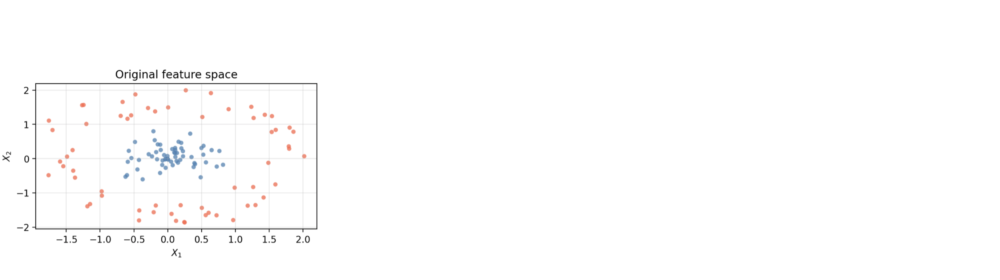
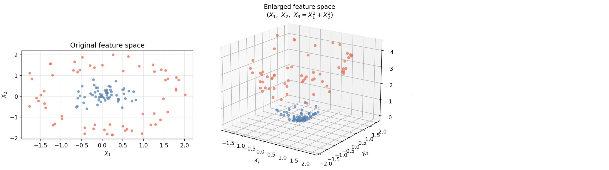
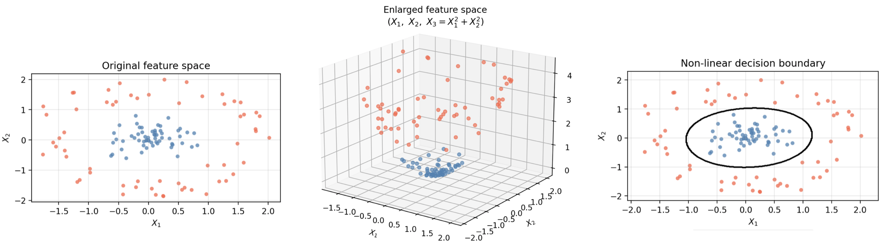

---
format:
    revealjs:
        theme: ../../../styles/meds-slides-styles.scss
        slide-number: true
        chalkboard: true
        title-slide: false
jupyter: eds232-env
---

```{python}
#| label: setup
#| echo: false
import numpy as np
import matplotlib.pyplot as plt
import pandas as pd
from sklearn.svm import SVC

plt.style.use('default')
fig_size_x = 8
fig_size_y = 4
plt.rcParams['font.size'] = 11

col_map   = {1: 'steelblue', -1: 'tomato'}
label_map = {1: 'Class 1',   -1: 'Class −1'}

# ── 1D feature-augmentation example ──────────────────────────────────────────
x1_pts = np.array([-3.0, -1.5, -0.5,  0.5,  1.5,  3.0])
y_pts  = np.array([  -1,   -1,    1,    1,   -1,   -1])

X_aug = np.column_stack([x1_pts, x1_pts ** 2])
svc_aug = SVC(kernel='linear', C=1e6)
svc_aug.fit(X_aug, y_pts)
x1_boundary = np.sqrt(-svc_aug.intercept_[0] / svc_aug.coef_[0][1])

# ── Circular (concentric) dataset ─────────────────────────────────────────────
np.random.seed(42)
n_half = 60

theta_i = np.random.uniform(0, 2 * np.pi, n_half)
theta_o = np.random.uniform(0, 2 * np.pi, n_half)
r_i = np.random.uniform(0.0, 0.85, n_half)
r_o = np.random.uniform(1.3,  2.1, n_half)

X_circ = np.vstack([
    np.column_stack([r_i * np.cos(theta_i), r_i * np.sin(theta_i)]),
    np.column_stack([r_o * np.cos(theta_o), r_o * np.sin(theta_o)]),
])
y_circ = np.array([1] * n_half + [-1] * n_half)

svc_lin  = SVC(kernel='linear', C=1.0)
svc_poly = SVC(kernel='poly',   degree=3, C=1.0, coef0=1.0)
svc_rbf  = SVC(kernel='rbf',    C=1.0, gamma='scale')
_svc_poly_coef0 = SVC(kernel='poly', degree=3, C=1.0)

svc_lin.fit(X_circ, y_circ)
svc_poly.fit(X_circ, y_circ)
svc_rbf.fit(X_circ, y_circ)
_svc_poly_coef0.fit(X_circ, y_circ)

# ── Helper: plot 2D decision regions ─────────────────────────────────────────
def plot_decision_regions(ax, svc, X, y, title, pad=0.4, n_grid=350):
    x0_min, x0_max = X[:, 0].min() - pad, X[:, 0].max() + pad
    x1_min, x1_max = X[:, 1].min() - pad, X[:, 1].max() + pad
    xx, yy = np.meshgrid(np.linspace(x0_min, x0_max, n_grid),
                          np.linspace(x1_min, x1_max, n_grid))
    Z = svc.predict(np.c_[xx.ravel(), yy.ravel()]).reshape(xx.shape)
    ax.contourf(xx, yy, Z, levels=[-1.5, 0, 1.5],
                colors=['tomato', 'steelblue'], alpha=0.18)
    ax.contour(xx, yy, Z, levels=[0], colors='black', linewidths=1.5)
    for cls in [1, -1]:
        mask = y == cls
        ax.scatter(X[mask, 0], X[mask, 1],
                   c=col_map[cls], s=22, alpha=0.75,
                   edgecolors='none', label=label_map[cls])
    ax.set_xlabel('$X_1$')
    ax.set_ylabel('$X_2$')
    ax.set_title(title, fontsize=11)
    ax.grid(True, alpha=0.3)
    ax.set_xlim(x0_min, x0_max)
    ax.set_ylim(x1_min, x1_max)
```

```{python}
#| label: exercise-setup
#| echo: false
from sklearn.linear_model import LogisticRegression
from sklearn.neighbors import KNeighborsClassifier
from sklearn.ensemble import RandomForestClassifier
from sklearn.model_selection import train_test_split, cross_val_score
from sklearn.metrics import accuracy_score

_cluster_specs = [
    (-1.6, -1.6, 0, 55, 20),
    ( 0.0,  0.0, 1, 90, 21),
    ( 1.6,  1.6, 0, 55, 22),
]
_X_parts, _y_parts = [], []
for _cx, _cy, _cls, _n, _seed in _cluster_specs:
    _rng = np.random.RandomState(_seed)
    _X_parts.append(_rng.randn(_n, 2) * 0.55 + np.array([_cx, _cy]))
    _y_parts.append(np.full(_n, _cls))

_X_diag = np.vstack(_X_parts)
_y_diag = np.concatenate(_y_parts)

_col_ex = {1: 'tomato', 0: 'steelblue'}
_lbl_ex = {1: 'Re-burned', 0: 'Did not re-burn'}

_X_tr, _X_te, _y_tr, _y_te = train_test_split(
    _X_diag, _y_diag, test_size=0.3, random_state=42, stratify=_y_diag)

_cv_kw = dict(cv=5, scoring='accuracy')
_acc_lr  = cross_val_score(LogisticRegression(),                     _X_tr, _y_tr, **_cv_kw).mean()
_acc_knn = cross_val_score(KNeighborsClassifier(n_neighbors=5),      _X_tr, _y_tr, **_cv_kw).mean()
_acc_lin = cross_val_score(SVC(kernel='linear', C=1.0),              _X_tr, _y_tr, **_cv_kw).mean()
_acc_rbf = cross_val_score(SVC(kernel='rbf', C=1.0, gamma='scale'),  _X_tr, _y_tr, **_cv_kw).mean()
_acc_rf  = cross_val_score(RandomForestClassifier(n_estimators=500, random_state=0), _X_tr, _y_tr, **_cv_kw).mean()

_svc_g_low  = SVC(kernel='rbf', C=1.0, gamma=0.1).fit(_X_tr, _y_tr)
_svc_g_mid  = SVC(kernel='rbf', C=1.0, gamma=1.5).fit(_X_tr, _y_tr)
_svc_g_high = SVC(kernel='rbf', C=1.0, gamma=20.0).fit(_X_tr, _y_tr)

def _plot_diag_regions(ax, svc, title):
    pad = 0.4
    x0min, x0max = _X_tr[:, 0].min()-pad, _X_tr[:, 0].max()+pad
    x1min, x1max = _X_tr[:, 1].min()-pad, _X_tr[:, 1].max()+pad
    xx, yy = np.meshgrid(np.linspace(x0min, x0max, 300),
                          np.linspace(x1min, x1max, 300))
    Z = svc.predict(np.c_[xx.ravel(), yy.ravel()]).reshape(xx.shape)
    ax.contourf(xx, yy, Z, levels=[-0.5, 0.5, 1.5],
                colors=['steelblue', 'tomato'], alpha=0.18)
    ax.contour(xx, yy, Z, levels=[0.5], colors='black', linewidths=1.5)
    for cls in [1, 0]:
        mask = _y_tr == cls
        ax.scatter(_X_tr[mask, 0], _X_tr[mask, 1],
                   c=_col_ex[cls], s=18, alpha=0.7, edgecolors='none',
                   label=_lbl_ex[cls])
    ax.set_xlabel('$X_1$')
    ax.set_ylabel('$X_2$')
    ax.set_title(title, fontsize=9)
    ax.grid(True, alpha=0.3)
```

## {#title-slide data-menu-title="Title Slide" background="#053660"}

[EDS 232]{.custom-title}

<hr class="hr-teal">

[Lesson 9.2]{.custom-subtitle}

[*Support vector machines*]{.custom-subtitle}

---

## {#in-this-lesson data-menu-title="In this lesson"}

[In this lesson]{.slide-title}

<hr>

<br>

- **Feature-space augmentation** as a strategy for non-linear classification
- The **kernel trick** as a computationally efficient way to enlarge the feature space
- The **linear, polynomial, and radial kernels** and the tuning parameters that control them

---

## {#section-augmentation data-menu-title="# Augmenting the feature space #" background="#047C90"}

<div class="page-center vertical-center">
<p class="custom-subtitle bottombr">Augmenting the feature space</p>
</div>

---

## {#non-sep-problem data-menu-title="The problem: non-linear data"}

[The problem]{.slide-title}

<hr>

The support vector classifier finds the best **linear** boundary.

What if no straight line can adequately separate the classes?

```{python}
#| label: slides-non-sep-scatter
#| echo: false
#| fig-align: center
#| out-width: "65%"

fig, ax = plt.subplots(figsize=(fig_size_x * 0.75, fig_size_y + 0.5))
for cls in [1, -1]:
    mask = y_circ == cls
    ax.scatter(X_circ[mask, 0], X_circ[mask, 1],
               c=col_map[cls], s=25, alpha=0.75,
               edgecolors='none', label=label_map[cls])
ax.set_xlabel('$X_1$')
ax.set_ylabel('$X_2$')
ax.set_title('Classes that cannot be separated by a straight line')
ax.grid(True, alpha=0.3)
ax.legend(loc='upper center', bbox_to_anchor=(0.5, -0.18), ncol=2, fontsize=10)
plt.tight_layout(rect=[0, 0.15, 1, 1])
plt.show()
plt.close()
```

---

## {#augmentation-idea data-menu-title="Enlarging the feature space"}

[Enlarging the feature space]{.slide-title}

<hr>

One strategy: **add new features** constructed from the original predictors.

Instead of fitting an SVC with $p$ features $X_1, \ldots, X_p$, use $2p$ features including squared terms:

$$X_1,\; X_1^2,\; X_2,\; X_2^2,\; \ldots,\; X_p,\; X_p^2.$$

. . .

<br>

1. The SVC still fits a **linear hyperplane** to separate the classes, but now in the *enlarged* space
2. This produces a **non-linear** boundary in the *original* space
- We can use not only squared terms, but any functions of the predictors!


---

## {#1d-example-data data-menu-title="1D example: data"}

[A one-dimensional example]{.slide-title}

<hr>

:::: {.columns}

::: {.column width="45%"}

| Obs | $X$ | Class |
|:---:|----:|:-----:|
| 1 | −3.0 | −1 |
| 2 | −1.5 | −1 |
| 3 | −0.5 | +1 |
| 4 |  0.5 | +1 |
| 5 |  1.5 | −1 |
| 6 |  3.0 | −1 |

:::

::: {.column width="55%"}

```{python}
#| label: slides-numberline-before
#| echo: false
#| fig-align: center
#| out-width: "100%"

fig, ax = plt.subplots(figsize=(fig_size_x * 0.9, 2.8))
for cls in [1, -1]:
    mask = y_pts == cls
    ax.scatter(x1_pts[mask], np.zeros(mask.sum()),
               c=col_map[cls], s=100,
               marker='o' if cls == 1 else 'X',
               edgecolors='black', linewidths=0.7,
               zorder=5, label=label_map[cls])
ax.set_xlabel('$X$')
ax.set_yticks([])
ax.set_xlim(-4, 4)
ax.set_ylim(-0.1, 0.5)
ax.spines[['top', 'right', 'left']].set_visible(False)
ax.spines['bottom'].set_position(('data', 0))
ax.legend(loc='upper center', bbox_to_anchor=(0.5, -0.28), ncol=2, fontsize=10)
plt.tight_layout(rect=[0, 0.20, 1, 1])
plt.show()
plt.close()
```

:::

::::

. . .

<br>

::: {.teal-text .center-text}
Is there a single cut point on the $X$ axis that separates the two classes?
:::

---

## {#augmented-table data-menu-title="Adding X²"}

[Add $X^2$ as a feature]{.slide-title}

<hr>

Adding $X^2$ as a feature makes this data 2-dimensional instead, of 1-dimensional. 

Each observation is now a point $(x, x^2)$ in a 2-dimensional space.


:::: {.columns}

::: {.column width="45%"}

| Obs | $X$ | $X^2$ | Class |
|:---:|----:|------:|:-----:|
| 1 | −3.0 |  9.00 | −1 |
| 2 | −1.5 |  2.25 | −1 |
| 3 | −0.5 |  0.25 | +1 |
| 4 |  0.5 |  0.25 | +1 |
| 5 |  1.5 |  2.25 | −1 |
| 6 |  3.0 |  9.00 | −1 |


:::

::: {.column width="55%"}

:::

::::


---

## {#augmented-table-2 data-menu-title="Adding X²"}

[Add $X^2$ as a feature]{.slide-title}

<hr>

Adding $X^2$ as a feature makes this data 2-dimensional instead, of 1-dimensional. 

Each observation is now a point $(x, x^2)$ in a 2-dimensional space.


:::: {.columns}

::: {.column width="45%"}

| Obs | $X$ | $X^2$ | Class |
|:---:|----:|------:|:-----:|
| 1 | −3.0 |  9.00 | −1 |
| 2 | −1.5 |  2.25 | −1 |
| 3 | −0.5 |  0.25 | +1 |
| 4 |  0.5 |  0.25 | +1 |
| 5 |  1.5 |  2.25 | −1 |
| 6 |  3.0 |  9.00 | −1 |


:::

::: {.column width="55%"}

```{python}
#| label: slides-augmented-2d-2
#| echo: false
#| fig-align: center
#| out-width: "100%"

fig, ax = plt.subplots(figsize=(fig_size_x * 0.9, fig_size_y + 0.5))
for cls in [1, -1]:
    mask = y_pts == cls
    ax.scatter(x1_pts[mask], x1_pts[mask] ** 2,
               c=col_map[cls], s=90,
               marker='o' if cls == 1 else 'X',
               edgecolors='black', linewidths=0.7,
               zorder=5, label=label_map[cls])
ax.set_xlim(-3.8, 3.8)
ax.set_ylim(-0.5, 10.5)
ax.set_xlabel('$X$')
ax.set_ylabel('$X^2$')
ax.set_title('Augmented feature space $(X,\\ X^2)$')
ax.grid(True, alpha=0.3)
ax.legend(loc='upper center', bbox_to_anchor=(0.5, -0.18), ncol=2, fontsize=10)
plt.tight_layout(rect=[0, 0.15, 1, 1])
plt.show()
plt.close()
```

:::

::::

. . .


::: {.teal-text .center-text}
Can the two classes now be separated by a line in the augmented space? 

Where would you draw it?
:::


---

## {#checkin-aug-a data-menu-title="Check-in: separable in 2D? (answer)"}

[SVC finds a linear boundary to separate the classes in augmented space]{.slide-title}

<hr>

When we embed our data into a higher dimensional space (from 1D to 2D), the SVC now has enough room to separate the classes with a linear boundary.

```{python}
#| label: slides-augmented-2d-svc
#| echo: false
#| fig-align: center
#| out-width: "100%"

w_aug = svc_aug.coef_[0]
b_aug = svc_aug.intercept_[0]
x1_grid = np.linspace(-3.5, 3.5, 300)
x2_boundary = (-w_aug[0] * x1_grid - b_aug) / w_aug[1]
x2_margin_p = (-w_aug[0] * x1_grid - b_aug + 1) / w_aug[1]
x2_margin_n = (-w_aug[0] * x1_grid - b_aug - 1) / w_aug[1]
xx_g, yy_g = np.meshgrid(np.linspace(-3.8, 3.8, 300), np.linspace(-0.5, 10.5, 300))
Z_g = svc_aug.predict(np.c_[xx_g.ravel(), yy_g.ravel()]).reshape(xx_g.shape)

fig, ax = plt.subplots(figsize=(fig_size_x * 0.9, fig_size_y + 0.5))
ax.contourf(xx_g, yy_g, Z_g, levels=[-1.5, 0, 1.5],
            colors=['tomato', 'steelblue'], alpha=0.12)
for cls in [1, -1]:
    mask = y_pts == cls
    ax.scatter(x1_pts[mask], x1_pts[mask] ** 2,
               c=col_map[cls], s=90,
               marker='o' if cls == 1 else 'X',
               edgecolors='black', linewidths=0.7,
               zorder=5, label=label_map[cls])
ax.plot(x1_grid, x2_boundary, 'k-',  lw=2,   label='Decision boundary')
ax.plot(x1_grid, x2_margin_p, 'k--', lw=1.2, alpha=0.5, label='Margin')
ax.plot(x1_grid, x2_margin_n, 'k--', lw=1.2, alpha=0.5)
sv_aug = svc_aug.support_vectors_
ax.scatter(sv_aug[:, 0], sv_aug[:, 1], s=180,
           facecolors='none', edgecolors='black', linewidths=1.8, zorder=6,
           label='Support vectors')
ax.set_xlim(-3.8, 3.8); ax.set_ylim(-0.5, 10.5)
ax.set_xlabel('$X$'); ax.set_ylabel('$X^2$')
ax.set_title('Augmented space — SVC decision boundary')
ax.grid(True, alpha=0.3)
ax.legend(loc='upper center', bbox_to_anchor=(0.5, -0.18), ncol=2, fontsize=9)
plt.tight_layout(rect=[0, 0.15, 1, 1])
plt.show()
plt.close()
```


---

## {#numberline-after-slide data-menu-title="Decision rule in original space"}

[Classifications translate back to the original space]{.slide-title}

<hr>

:::: {.columns}

::: {.column width="50%"}
```{python}
#| label: slides-augmented-2d-svc-2
#| echo: false
#| fig-align: center
#| out-width: "100%"

w_aug = svc_aug.coef_[0]
b_aug = svc_aug.intercept_[0]
x1_grid = np.linspace(-3.5, 3.5, 300)
x2_boundary = (-w_aug[0] * x1_grid - b_aug) / w_aug[1]
x2_margin_p = (-w_aug[0] * x1_grid - b_aug + 1) / w_aug[1]
x2_margin_n = (-w_aug[0] * x1_grid - b_aug - 1) / w_aug[1]
xx_g, yy_g = np.meshgrid(np.linspace(-3.8, 3.8, 300), np.linspace(-0.5, 10.5, 300))
Z_g = svc_aug.predict(np.c_[xx_g.ravel(), yy_g.ravel()]).reshape(xx_g.shape)

fig, ax = plt.subplots(figsize=(fig_size_x * 0.9, fig_size_y + 0.5))
ax.contourf(xx_g, yy_g, Z_g, levels=[-1.5, 0, 1.5],
            colors=['tomato', 'steelblue'], alpha=0.12)
for cls in [1, -1]:
    mask = y_pts == cls
    ax.scatter(x1_pts[mask], x1_pts[mask] ** 2,
               c=col_map[cls], s=90,
               marker='o' if cls == 1 else 'X',
               edgecolors='black', linewidths=0.7,
               zorder=5, label=label_map[cls])
ax.plot(x1_grid, x2_boundary, 'k-',  lw=2,   label='Decision boundary')
sv_aug = svc_aug.support_vectors_
ax.set_xlim(-3.8, 3.8); ax.set_ylim(-0.5, 10.5)
ax.set_xlabel('$X$'); ax.set_ylabel('$X^2$')
ax.set_title('Augmented space — SVC decision boundary')
ax.grid(True, alpha=0.3)
plt.tight_layout(rect=[0, 0.15, 1, 1])
plt.show()
plt.close()
```
:::


::: {.column width="50%"}

:::

:::


---

## {#numberline-after-slide-2 data-menu-title="Decision rule in original space"}

[Classifications translate back to the original space]{.slide-title}

<hr>

:::: {.columns}

::: {.column width="50%"}
```{python}
#| label: slides-augmented-2d-svc-3
#| echo: false
#| fig-align: center
#| out-width: "100%"

w_aug = svc_aug.coef_[0]
b_aug = svc_aug.intercept_[0]
x1_grid = np.linspace(-3.5, 3.5, 300)
x2_boundary = (-w_aug[0] * x1_grid - b_aug) / w_aug[1]
x2_margin_p = (-w_aug[0] * x1_grid - b_aug + 1) / w_aug[1]
x2_margin_n = (-w_aug[0] * x1_grid - b_aug - 1) / w_aug[1]
xx_g, yy_g = np.meshgrid(np.linspace(-3.8, 3.8, 300), np.linspace(-0.5, 10.5, 300))
Z_g = svc_aug.predict(np.c_[xx_g.ravel(), yy_g.ravel()]).reshape(xx_g.shape)

fig, ax = plt.subplots(figsize=(fig_size_x * 0.9, fig_size_y + 0.5))
ax.contourf(xx_g, yy_g, Z_g, levels=[-1.5, 0, 1.5],
            colors=['tomato', 'steelblue'], alpha=0.12)
for cls in [1, -1]:
    mask = y_pts == cls
    ax.scatter(x1_pts[mask], x1_pts[mask] ** 2,
               c=col_map[cls], s=90,
               marker='o' if cls == 1 else 'X',
               edgecolors='black', linewidths=0.7,
               zorder=5, label=label_map[cls])
ax.plot(x1_grid, x2_boundary, 'k-',  lw=2,   label='Decision boundary')
sv_aug = svc_aug.support_vectors_
ax.set_xlim(-3.8, 3.8); ax.set_ylim(-0.5, 10.5)
ax.set_xlabel('$X$'); ax.set_ylabel('$X^2$')
ax.set_title('Augmented space — SVC decision boundary')
ax.grid(True, alpha=0.3)
plt.tight_layout(rect=[0, 0.15, 1, 1])
plt.show()
plt.close()
```
:::


::: {.column width="50%"}
```{python}
#| label: slides-numberline-after-2
#| echo: false
#| fig-align: center
#| out-width: "80%"

fig, ax = plt.subplots(figsize=(fig_size_x * 1.0, 3.2))
for cls in [1, -1]:
    mask = y_pts == cls
    ax.scatter(x1_pts[mask], np.zeros(mask.sum()),
               c=col_map[cls], s=100,
               marker='o' if cls == 1 else 'X',
               edgecolors='black', linewidths=0.7,
               zorder=5, label=label_map[cls])
ax.axhline(0, color='black', linewidth=0.8, zorder=1)
for sign in [-1, 1]:
    ax.axvline(sign * x1_boundary, color='black', lw=1.8, linestyle='--', zorder=4,
               label='Decision boundary' if sign == 1 else '_nolegend_')
ax.axvspan(-4, -x1_boundary, alpha=0.10, color='tomato')
ax.axvspan(-x1_boundary, x1_boundary, alpha=0.10, color='steelblue')
ax.axvspan(x1_boundary, 4, alpha=0.10, color='tomato')
ax.set_xlabel('$X$')
ax.set_yticks([])
ax.set_xlim(-4, 4)
ax.spines[['top', 'right', 'left']].set_visible(False)
ax.set_title('Decision rule in the original feature space')
plt.tight_layout(rect=[0, 0.18, 1, 1])
plt.show()
plt.close()
```
:::

:::


::: {.body-text-s .center-text}
Augmenting the feature space produces a **non-linear boundary** in the original space (two cut points instead of one) even though the SVC is entirely linear in the enlarged space.
:::

---

## {#2d-extension-1 data-menu-title="Extending to 2D"}

[Extending to higher dimensions]{.slide-title}

<hr>

The same idea applies with two or more predictors: we can add new features to embed the data in an enlarged feature space.

With our initial data, for example: 



---

## {#2d-extension-2 data-menu-title="Extending to 2D"}

[Extending to higher dimensions]{.slide-title}

<hr>

The same idea applies with two or more predictors: we can add new features to embed the data in an enlarged feature space.

With our initial data, for example: 



---

## {#2d-extension-3 data-menu-title="Extending to 2D"}

[Extending to higher dimensions]{.slide-title}

<hr>

The same idea applies with two or more predictors: we can add new features to embed the data in an enlarged feature space.

With our initial data, for example: 



---

## {#core-idea data-menu-title="Core idea and challenge"}

[Core idea — and the challenge]{.slide-title}

<hr>

::: {.body-text-m}
**Core idea:** enlarge the feature space so that a linear SVC in the enlarged space produces a non-linear boundary in the original space. We can use any functions of the predictors, not just squared terms.
:::

. . .

::: {.body-text-m}
**The challenge:** as the number of predictors $p$ grows, deciding which additional features to add becomes intractable, and computing them for every observation is expensive.
:::

. . .

::: {.teal-text .body-text-m}
**The solution:** the **kernel** approach computes what we need without ever explicitly constructing the enlarged features.
:::

---

## {#section-svm data-menu-title="# The support vector machine #" background="#047C90"}

<div class="page-center vertical-center">
<p class="custom-subtitle bottombr">The support vector machine</p>
</div>

---

## {#svm-intro data-menu-title="The SVM"}

[The support vector machine]{.slide-title}

<hr>

The **support vector machine (SVM)** extends the SVC by using a **kernel function** $K(x_i, x_j)$ to enlarge the feature space in a computationally efficient way.

. . .

<br>

- An SVM with a **linear kernel** is exactly the SVC: no feature augmentation
- Using a **non-linear kernel** is equivalent to fitting an SVC in an enlarged feature space, but **without ever explicitly computing the new features**
- This gives us the benefit of the enlarged space at a fraction of the computational cost

. . .

::: {.teal-text .body-text-m .center-text}
*Choosing a kernel = choosing how to augment the feature space, but without needing to compute new features*
:::

---

## {#section-kernels data-menu-title="# Kernels #" background="#047C90"}

<div class="page-center vertical-center">
<p class="custom-subtitle bottombr">Popular kernels for the SVM</p>
</div>

---

## {#linear-kernel data-menu-title="Linear kernel"}

[Linear kernel]{.slide-title}

<hr>

Equivalent to the SVC with no feature augmentation.

<br>

:::: {.columns}

::: {.column width="50%"}
| Parameter | What it controls | Default |
|:----------|:----------------|:-------:|
| `C` | Penalty for margin violations | `1.0` |

:::

::: {.column width="50%"}

```{python}
#| label: slides-linear-svm
#| echo: false
#| fig-align: center
#| out-width: "45%"

fig, ax = plt.subplots(figsize=(fig_size_x * 0.65, fig_size_y + 0.3))
plot_decision_regions(ax, svc_lin, X_circ, y_circ, title='Linear kernel SVM')
ax.legend(loc='upper center', bbox_to_anchor=(0.5, -0.18), ncol=2, fontsize=10)
plt.tight_layout(rect=[0, 0.15, 1, 1])
plt.show()
plt.close()
```
:::

:::


::: {.body-text-s .center-text}
The linear kernel cannot capture the circular structure: no straight line can separate an inner cluster from an outer ring.
:::

---

## {#polynomial-kernel data-menu-title="Polynomial kernel"}

[Polynomial kernel]{.slide-title}

<hr>

Captures interactions and powers of the original features. A higher degree $d$ allows the boundary to bend and curve more.

:::: {.columns}

::: {.column width="55%"}
| Parameter | What it controls | Default |
|:----------|:----------------|:-------:|
| `degree` | Polynomial degree; higher → more curved boundary → higher overfitting risk | `3` |
| `C` | Penalty for margin violations | `1.0` |
| `gamma` | scales the inner product | `scale` |
| `coef0` | Shifts the polynomial; `1.0` includes lower-degree terms, `0.0` gives a homogeneous polynomial | `0.0` |
:::


::: {.column width="45%"}
```{python}
#| label: slides-poly-svm-1
#| echo: false
#| fig-align: center
#| out-width: "55%"

fig, ax = plt.subplots(figsize=(fig_size_x * 0.75, fig_size_y + 0.5))
plot_decision_regions(ax, svc_poly, X_circ, y_circ,
                      title='Polynomial kernel SVM (d=3, C=1, coef0=1)')
ax.legend(loc='upper center', bbox_to_anchor=(0.5, -0.18), ncol=2, fontsize=10)
plt.tight_layout(rect=[0, 0.15, 1, 1])
plt.show()
plt.close()
```

:::

:::

`degree` and `C` are the main parameters to tune. 

---

## {#rbf-kernel data-menu-title="Radial (RBF) kernel"}

[Radial (RBF) kernel]{.slide-title}

<hr>

Measures proximity: nearby observations are considered similar and each training point's influence drops off with distance, producing very local and flexible boundaries.

:::: {.columns}

::: {.column width="55%"}
| Parameter | What it controls | Default |
|:----------|:----------------|:-------:|
| `C` | Penalty for margin violations | `1.0` |
| `gamma` | How quickly influence decays with distance; larger → more local fitting → higher overfitting risk | `'scale'` |
:::


::: {.column width="45%"}

```{python}
#| label: slides-rbf-svm
#| echo: false
#| fig-align: center
#| out-width: "55%"

fig, ax = plt.subplots(figsize=(fig_size_x * 0.75, fig_size_y + 0.5))
plot_decision_regions(ax, svc_rbf, X_circ, y_circ,
                      title='Radial kernel SVM (RBF)')
ax.legend(loc='upper center', bbox_to_anchor=(0.5, -0.18), ncol=2, fontsize=10)
plt.tight_layout(rect=[0, 0.15, 1, 1])
plt.show()
plt.close()
```
:::


:::


The RBF kernel is the most flexible of the three and often the **best default choice** when the boundary shape is unknown. `C` and `gamma` should be tuned together via cross-validation.

---

## {#section-exercise data-menu-title="# Exercise #" background="#047C90"}

<div class="page-center vertical-center">
<p class="custom-subtitle bottombr">Exercise</p>
</div>

---

## {#exercise-scenario data-menu-title="Exercise: scenario"}

[Scenario]{.slide-title}

<hr>

A research team monitored **200 chaparral shrubland sites** following a major wildfire. They recorded:

- **Stand age** ($X_1$, standardized): years since previous fire, proxy for accumulated fuel load
- **Mean annual precipitation** ($X_2$, standardized): proxy for moisture conditions

**Response**: did the site re-burn within a 10-year window? (classes: re-burned / did not re-burn)

**Goal**: build a classifier to predict re-burning risk at new, unmonitored sites to prioritize fuel treatments.

---

## {#exercise-scatter-slide data-menu-title="Exercise: scatter plot"}

[Fire re-occurrence data]{.slide-title}

<hr>

```{python}
#| label: slides-ex-fire-scatter
#| echo: false
#| fig-align: center
#| out-width: "100%"

fig, ax = plt.subplots(figsize=(fig_size_x * 0.75, fig_size_y + 0.5))
for cls in [1, 0]:
    mask = _y_diag == cls
    ax.scatter(_X_diag[mask, 0], _X_diag[mask, 1],
               c=_col_ex[cls], s=28, alpha=0.75,
               edgecolors='none', label=_lbl_ex[cls])
ax.set_xlabel('Stand age ($X_1$)')
ax.set_ylabel('Mean annual precipitation ($X_2$)')
ax.set_title('Fire re-occurrence at 200 chaparral shrubland sites')
ax.grid(True, alpha=0.3)
ax.legend(loc='upper center', bbox_to_anchor=(0.5, -0.18), ncol=2, fontsize=10)
plt.tight_layout(rect=[0, 0.15, 1, 1])
plt.show()
plt.close()
```

---

## {#exercise-q1 data-menu-title="Exercise 1"}

[Exercise 1]{.slide-title}

<hr>


:::: {.columns}

::: {.column width="50%"}
```{python}
#| label: slides-ex-fire-scatter-2
#| echo: false
#| fig-align: center
#| out-width: "100%"

fig, ax = plt.subplots(figsize=(fig_size_x * 0.75, fig_size_y + 0.5))
for cls in [1, 0]:
    mask = _y_diag == cls
    ax.scatter(_X_diag[mask, 0], _X_diag[mask, 1],
               c=_col_ex[cls], s=28, alpha=0.75,
               edgecolors='none', label=_lbl_ex[cls])
ax.set_xlabel('Stand age ($X_1$)')
ax.set_ylabel('Mean annual precipitation ($X_2$)')
ax.set_title('Fire re-occurrence at 200 chaparral shrubland sites')
ax.grid(True, alpha=0.3)
ax.legend(loc='upper center', bbox_to_anchor=(0.5, -0.18), ncol=2, fontsize=10)
plt.tight_layout(rect=[0, 0.15, 1, 1])
plt.show()
plt.close()
```
:::


::: {.column width="50%"}
::: {.teal-text .body-text-m}
Look at the scatter plot. Describe the pattern you see. Which combination of stand age and precipitation is most associated with re-burning? Which sites tend not to re-burn?
:::
:::


:::


---

## {#exercise-q1-A data-menu-title="Exercise 1"}

[Exercise 1]{.slide-title}

<hr>


:::: {.columns}

::: {.column width="50%"}
```{python}
#| label: slides-ex-fire-scatter-3
#| echo: false
#| fig-align: center
#| out-width: "100%"

fig, ax = plt.subplots(figsize=(fig_size_x * 0.75, fig_size_y + 0.5))
for cls in [1, 0]:
    mask = _y_diag == cls
    ax.scatter(_X_diag[mask, 0], _X_diag[mask, 1],
               c=_col_ex[cls], s=28, alpha=0.75,
               edgecolors='none', label=_lbl_ex[cls])
ax.set_xlabel('Stand age ($X_1$)')
ax.set_ylabel('Mean annual precipitation ($X_2$)')
ax.set_title('Fire re-occurrence at 200 chaparral shrubland sites')
ax.grid(True, alpha=0.3)
ax.legend(loc='upper center', bbox_to_anchor=(0.5, -0.18), ncol=2, fontsize=10)
plt.tight_layout(rect=[0, 0.15, 1, 1])
plt.show()
plt.close()
```
:::


::: {.column width="50%"}
::: {.teal-text .body-text-m}
Look at the scatter plot. Describe the pattern you see. Which combination of stand age and precipitation is most associated with re-burning? Which sites tend not to re-burn?
:::

Re-burning occurs at sites with *intermediate stand age and intermediate precipitation*. Sites at both extremes (young/dry AND old/wet) tend not to re-burn.

:::


:::


---

## {#exercise-table-slide data-menu-title="Exercise: accuracy table"}

[Exercise 2: model comparison]{.slide-title}

<hr>

The 200 sites were split 140/60 (train/test) and the following metrics were obtained:

:::: {.columns}

::: {.column width="50%"}
```{python}
#| label: slides-ex-fire-scatter-4
#| echo: false
#| fig-align: center
#| out-width: "100%"

fig, ax = plt.subplots(figsize=(fig_size_x * 0.75, fig_size_y + 0.5))
for cls in [1, 0]:
    mask = _y_diag == cls
    ax.scatter(_X_diag[mask, 0], _X_diag[mask, 1],
               c=_col_ex[cls], s=28, alpha=0.75,
               edgecolors='none', label=_lbl_ex[cls])
ax.set_xlabel('Stand age ($X_1$)')
ax.set_ylabel('Mean annual precipitation ($X_2$)')
ax.set_title('Fire re-occurrence at 200 chaparral shrubland sites')
ax.grid(True, alpha=0.3)
ax.legend(loc='upper center', bbox_to_anchor=(0.5, -0.18), ncol=2, fontsize=10)
plt.tight_layout(rect=[0, 0.15, 1, 1])
plt.show()
plt.close()
```
:::


::: {.column width="50%"}
```{python}
#| label: slides-ex-fire-table
#| echo: false

_results = pd.DataFrame({
    'Model': ['Logistic regression', 'Linear SVM', 'RBF SVM', 'Random forest'],
    'CV accuracy (5-fold)': [f'{_acc_lr:.0%}', f'{_acc_lin:.0%}',
                             f'{_acc_rbf:.0%}', f'{_acc_rf:.0%}']
})
_results
```

:::


:::


::: {.teal-text }
The linear SVM achieves nearly the same accuracy as logistic regression. What do they have in common that prevents them from capturing this pattern?
:::

. . .

::: {.body-text-s }
Both fit a **single linear boundary**. Isolating the middle cluster requires *two* parallel cuts along the diagonal, a single line cannot achieve this.

:::

---

## {#exercise-q3 data-menu-title="Exercise 3: random forest"}

[Exercise 3: random forest vs. RBF SVM]{.slide-title}

<hr>

The 200 sites were split 140/60 (train/test) and the following metrics were obtained:

:::: {.columns}

::: {.column width="50%"}
```{python}
#| label: slides-ex-fire-scatter-5
#| echo: false
#| fig-align: center
#| out-width: "100%"

fig, ax = plt.subplots(figsize=(fig_size_x * 0.75, fig_size_y + 0.5))
for cls in [1, 0]:
    mask = _y_diag == cls
    ax.scatter(_X_diag[mask, 0], _X_diag[mask, 1],
               c=_col_ex[cls], s=28, alpha=0.75,
               edgecolors='none', label=_lbl_ex[cls])
ax.set_xlabel('Stand age ($X_1$)')
ax.set_ylabel('Mean annual precipitation ($X_2$)')
ax.set_title('Fire re-occurrence at 200 chaparral shrubland sites')
ax.grid(True, alpha=0.3)
ax.legend(loc='upper center', bbox_to_anchor=(0.5, -0.18), ncol=2, fontsize=10)
plt.tight_layout(rect=[0, 0.15, 1, 1])
plt.show()
plt.close()
```
:::


::: {.column width="50%"}
```{python}
#| label: slides-ex-fire-table-2
#| echo: false

_results = pd.DataFrame({
    'Model': ['Logistic regression', 'Linear SVM', 'RBF SVM', 'Random forest'],
    'CV accuracy (5-fold)': [f'{_acc_lr:.0%}', f'{_acc_lin:.0%}',
                             f'{_acc_rbf:.0%}', f'{_acc_rf:.0%}']
})
_results
```

:::


:::


::: {.teal-text }
The random forest achieves similar accuracy to the RBF SVM. What is one practical advantage of the random forest for this application?
:::

. . .

::: {.body-text-s }
The random forest provides **feature importances**, a measure of how much each variable contributed to predictions. A manager can be told "stand age was the more important predictor," which is actionable and easy to communicate.

The random forest also usually performs well with minimal hyperparameter tuning.

:::


---

## {#exercise-gamma-slide data-menu-title="Exercise 4: gamma plots"}

[Exercise 4: effect of $\gamma$ on the RBF SVM]{.slide-title}

<hr>

RBF SVM decision boundaries fitted with three values of $\gamma$ (`C` = 1 in all cases):


```{python}
#| label: slides-ex-fire-gamma
#| echo: false
#| fig-align: center
#| out-width: "100%"

fig, axes = plt.subplots(1, 3, figsize=(fig_size_x * 1.3, fig_size_y + 0.5))
_plot_diag_regions(axes[0], _svc_g_low,  'RBF SVM ($\\gamma$ = 0.1)')
_plot_diag_regions(axes[1], _svc_g_mid,  'RBF SVM ($\\gamma$ = 1.5)')
_plot_diag_regions(axes[2], _svc_g_high, 'RBF SVM ($\\gamma$ = 20)')
handles, labels = axes[0].get_legend_handles_labels()
plt.tight_layout(rect=[0, 0.10, 1, 1])
plt.show()
plt.close()
```

::: {.teal-text .center-text}
As $\gamma$ increases, does variance increase or decrease? How would you select the best $\gamma$?
:::

. . .

::: {.body-text-s}
Variance **increases** with $\gamma$. Small $\gamma$ → nearly linear (underfitting). Large $\gamma$ → jagged boundary wrapping individual points (overfitting). Best $\gamma$ chosen via **cross-validation jointly with `C`**.
:::
