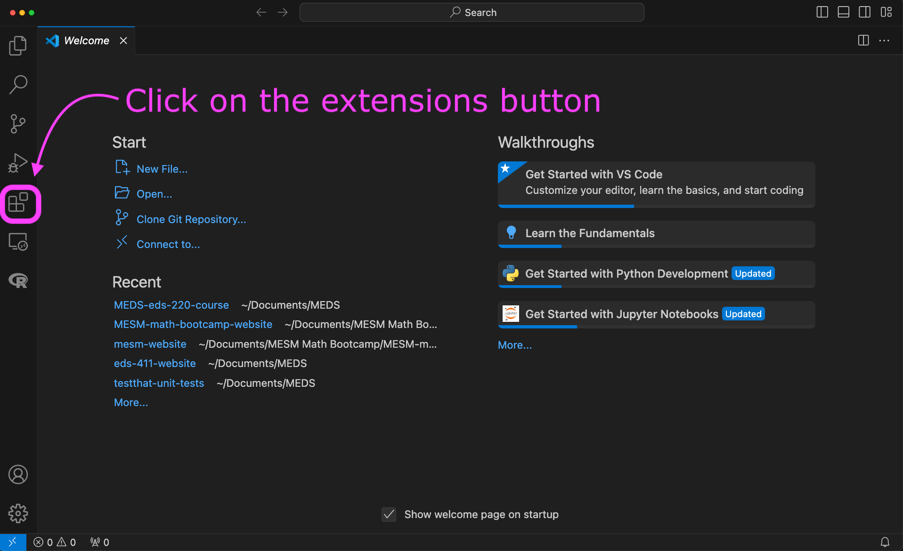
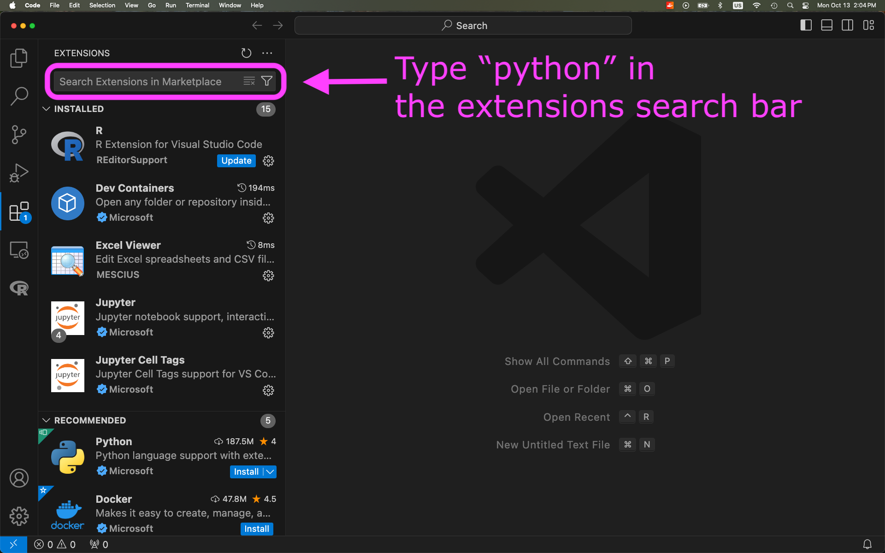
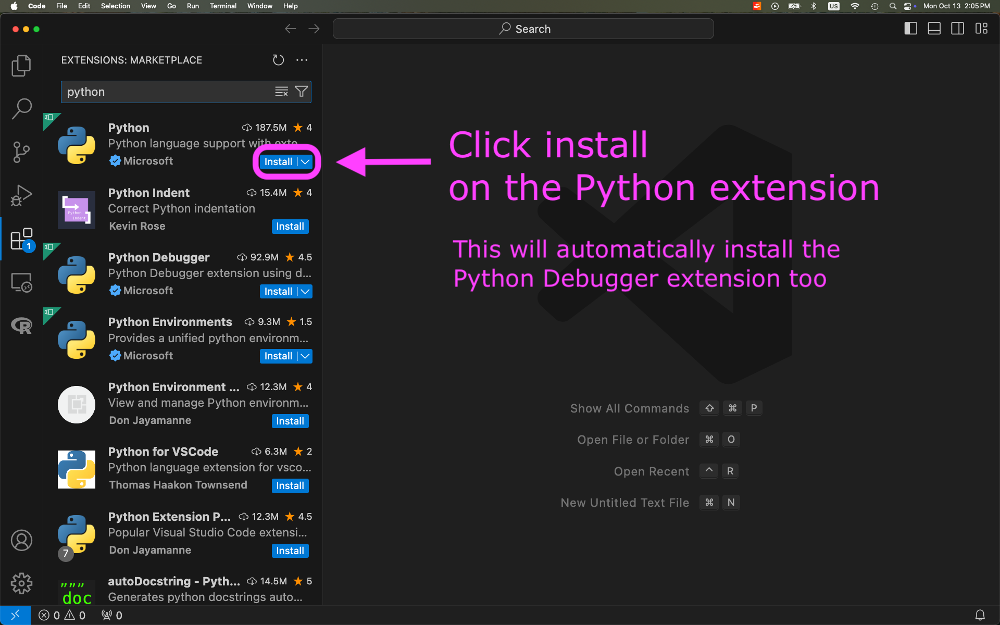
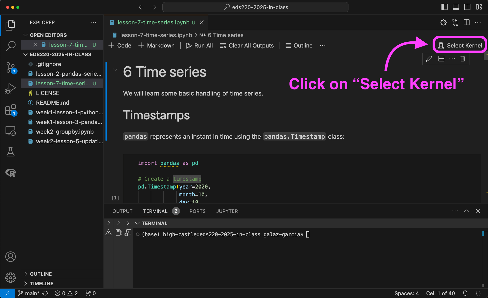
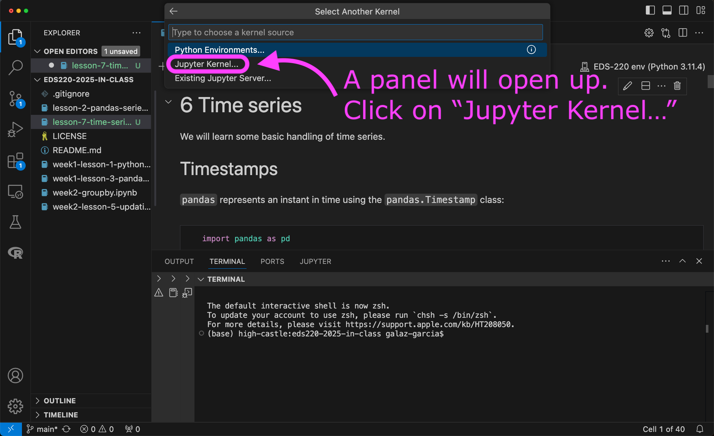
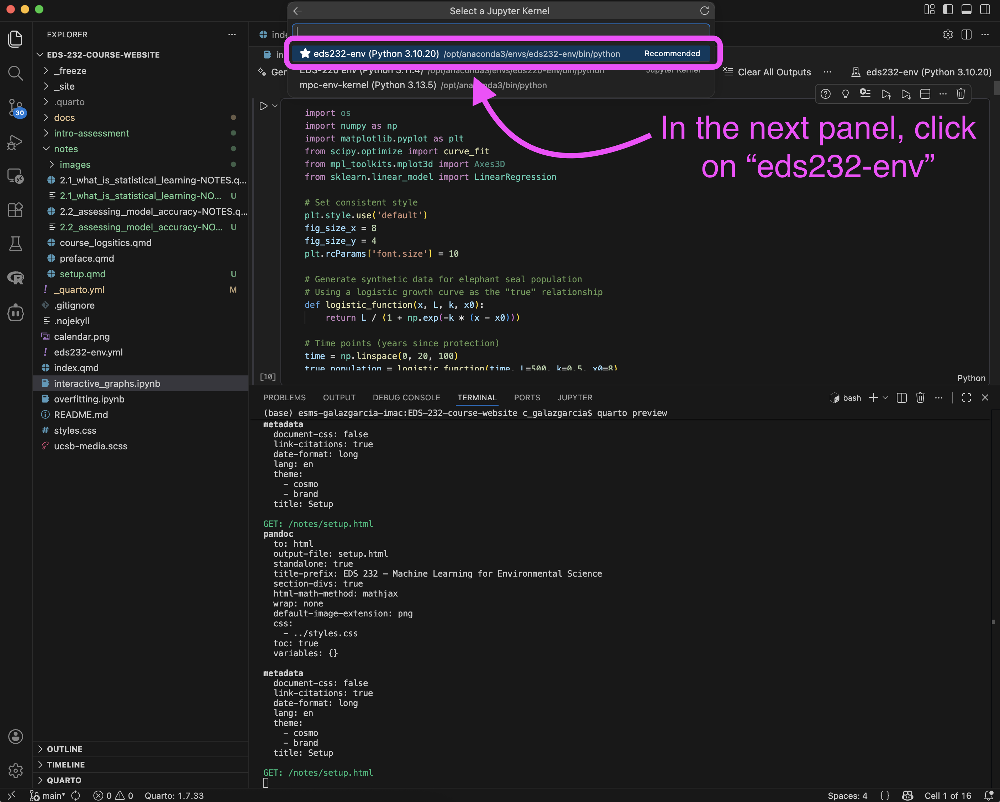

## Step 1: Create and clone course repositories

1. Create a `MEDS/EDS-232` directory in your personal computer.

2. Create two GitHub repositores named `eds232-in-class` and `eds232-labs`.

3. Open a terminal in your personal computer. 

4. Confirm git is installed by running `git version` in the terminal. If git is installed you will get something similar to

```bash
git version 2.33.1
```

5. *If you don't get a similar output, install git by following the [MEDS installation guide](https://ucsb-meds.github.io/MEDS-installation-guide/#check-git).*
  
6. Clone your `eds232-in-class` and `eds232-labs` repositories inside the `MEDS/EDS-232` directory. Make sure you don't end up cloning one inside the other!


## Step 2: VSCode set-up
*Make sure you have created and cloned the course repositories before doing the VSCode set-up.*

1. Open Visual Studio Code (VSCode). If you don't have this IDE in your computer, now is the moment to install it: [https://code.visualstudio.com/download](https://code.visualstudio.com/download).
  
2. Open a new **bash terminal** in VSCode. 
  
3. Confirm your conda installation by running `conda info` in the terminal. If conda is active you will get something similar to

```bash
active environment : base
active env location : /Users/galaz-garcia/opt/anaconda3
shell level : 1

[...]

UID:GID : 502:20
netrc file : None
offline mode : False
```

4. *If conda needs to be added to the shell profile, follow the [troubleshooting steps](https://ucsb-meds.github.io/MEDS-installation-guide/#install-Anaconda) in the MEDS installation guide within a **bash terminal** (not Powershell if you are on Windows).*
  
5. Install the Python extension to VSCode:

{width=80%}

{width=80%}

{width=80%}


## Step 3: Build conda environment for the course
*Make sure you have completed the VSCode set-up before creating the environment.*

1. Open VSCode on your computer.

2. Download the following YAML file and move it into your `eds232-in-class` directory: [https://github.com/MEDS-eds-232/EDS-232-course-website/blob/main/eds232-env.yml](https://github.com/MEDS-eds-232/EDS-232-course-website/blob/main/eds232-env.yml)

4. Open a bash terminal inside VSCode and in it:
  a. Verify you are in the `eds232-in-class` directory. 
  b. Verify that the `eds232-env.yml` file is in the directory.
  c. Run the following conda command to build the environment we will use for the course:
  ```default
  conda env create --name eds232-env --file eds232-env.yml
  ```
    
It may take a moment to build the environment. Once conda has finished, verify that the environment was created by running `conda env list`. 

:::{.callout-tip}
If you need a refresher on basic conda commands, check out the [table on the EDS 220 website](https://meds-eds-220.github.io/MEDS-eds-220-course/book/appendices/A-python-environments.html#conda-commands). 
:::

## Step 4: Add Jupyter kernel for the course environment
*Make sure you have built the eds232-env before creating the kernel.*

1. Open VSCode on your computer.

2. Add a new bash terminal in it. 

3. Verify you have the `eds232-env` conda environment available by running
```bash
conda env list
```

4. Activate the `eds232-env` by running
```bash
conda activate eds232-env
```

5. Verify the environment has been activated. 

6. Run
```bash
python -m ipykernel install --user --name eds232-env --display-name "eds232-env"
```
7. Verify that the kernel has been created by running
```bash
jupyter kernelspec list
```
The output should look similar to this:
```bash
Available kernels:
  eds232-env        /Users/galaz-garcia/Library/Jupyter/kernels/eds220-env
  python3           /Users/galaz-garcia/opt/anaconda3/share/jupyter/kernels/python3
```

8. Close and reopen VSCode. 

9. To use the new kernel, open a Jupyter notebook on VSCode and...

{width=90%}

{width=90%}

{width=90%}
